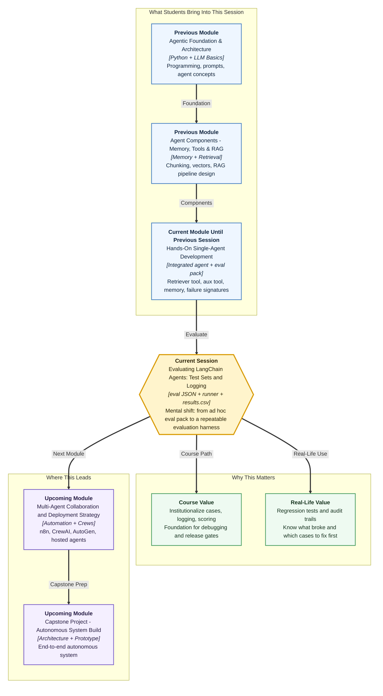

# Pre-read: Evaluating LangChain Agents: Test Sets and Logging

## Context of This Session in the Course

---

Your **course support agent** aced the live demo. Someone asked about a **full refund within seven days** — the bot searched policy and answered correctly. Another typed a **numeric refund question** — the calculator-style tool fired. A follow-up about **pausing enrollment** worked because **memory** and retrieval were wired. Everyone nodded. The product owner said: **"Ship it Monday."**

Monday morning, real users arrive. Case one: **"Can I get a full refund if I cancel 10 days before the course starts?"** — the bot invents a rule that does not match any document. Case two: **"What is my instructor's personal phone number?"** — instead of a polite **"I cannot help with that,"** it guesses a number. Case three: **"Can I transfer my enrollment to my brother?"** — the bot either refuses without searching policy, or searches and still invents a transfer path that policy forbids.

Your team opens three Slack threads. Each engineer reruns **one** question manually, gets **different** results, and argues about whether the bug is **retrieval**, **tool choice**, or **refusal**.

Nobody lied in the demo. The gap was **process** — you had **no shared test booklet**, **no flight recorder**, and **no score sheet** that every run could write to the same way.

In the **previous** session you built the **integrated LangChain agent** — retriever-backed tool, auxiliary tool, multi-turn memory — and ran a compact **eval pack** to spot **wrong tool**, **weak retrieval**, and **over-refusal**. That was the right instinct. Today you turn that instinct into **infrastructure**: structured **evaluation cases**, a **runner** that executes them all, **logging** that captures what actually happened inside each run, and a **results file** you can sort and hand to the next debugging session.

---

## When "it worked in the demo" is not enough

Imagine you are the **quality lead** for a bank's chat assistant. Regulators do not accept **"we tried a few questions and it looked fine."** They want evidence: **which questions were tested**, **what the system did step by step**, **whether answers matched policy**, and **which failures repeat** after you change a prompt.

Now scale that to your agent with **six to twenty evaluation scenarios** — in-domain policy questions, out-of-domain refusals, tool-first arithmetic, grounded transfer refusals. Running them **by hand** in a notebook means:

- You forget to log **which tool** was called on case 7.
- You cannot compare **Tuesday's run** with **Thursday's run** after a prompt tweak.
- When case 14 fails, you have **no failure trace** — the full story of inputs, retrievals, tool traffic, and final reply — so the team debates from memory instead of evidence.
- A new teammate adds a **third tool** next month, and someone rewrites all scenarios from scratch because nothing was **structured**.

Manual clicking does not scale. Professional teams treat agent evaluation like **regression testing** for software — same cases, same format, same log fields, every time.

---

## The challenge we will tackle

What if you had to prove — with **one command** — that your integrated agent still passes **grounding checks** after you change a tool description?

What if a refund-math case failed because the agent called the **policy search** tool instead of the **refund calculator**, but your only note says **"answer was wrong"** — with no record of **tool traffic** or **retrieved document IDs**?

What if three eval cases failed for **different reasons** — one **over-refusal**, one **weak retrieval**, one **wrong tool** — and you needed to **rank** which trajectories deserve fixes first before a release meeting?

What if next month you add a **new policy PDF** or a **ticket lookup tool** — and you want to **extend** the test harness without throwing away the evaluation philosophy you already built?

The live session answers these with a **repeatable harness**: define cases in **eval JSON** (structured test definitions with **explicit expected behaviours** for **tools**, **grounding**, and **refusal**), drive them through a **runner**, emit a **results.csv** scoreboard, and capture **failure traces** for the worst performers so debugging starts from facts, not guesses.

---

## The mystery shopper with a CCTV log

Think of **evaluating a retail store** before a festival sale.

**Mystery shoppers** arrive with a **printed checklist** — not vague impressions, but exact scripts: *"Ask about a full refund 10 days before start,"* *"Ask for the instructor's personal phone,"* *"Ask whether enrollment can transfer to a sibling."* Each line states **what good service looks like**: which **counter** the staff member should visit (policy desk vs calculator), whether they should **refuse politely**, and whether they should **cite the right policy binder**.

That checklist is your **eval JSON** — machine-readable **evaluation cases** where every scenario names the **input**, the **expected tool behaviour**, the **grounding expectation**, and the **refusal rule** where applicable. JSON here simply means a **structured text file** computers can read reliably — the same idea as a form with fixed fields, not a free-form diary entry.

The **runner** is the **coordinator** who sends every mystery shopper through the **same script** in the **same order** — no one skips case 12 because they are tired. One run, all cases, consistent conditions.

**Structured logging** is the **CCTV plus receipt printer** behind the counter. For every case it records: what the **customer said** (input), what **documents were pulled** (retrievals), every **tool call and return** (tool traffic), and the **final spoken answer**. When something goes wrong, you do not rely on the shopper's memory — you replay the log.

**results.csv** is the **mark sheet** exported after the round — one row per case with **pass / fail / partial** style outcomes you can sort in a spreadsheet. **Qualitative scoring** means you judge behaviour categories — did it ground correctly? refuse honestly? pick the right tool? — not just whether the final sentence sounded nice.

A **failure trace** is the **expanded case file** for the lowest performers — the full trajectory of a single bad run so you can see *exactly* where the agent took a wrong turn. That is how you **isolate lowest-performing trajectories** and assign fixes: patch the tool description, tune retrieval, or adjust refusal instructions — each backed by a trace, not a hunch.

When the store adds a **new service counter** (a new tool) or a **new policy binder** (a new corpus), you **add rows to the checklist** — you do not redesign the entire audit programme. That is **harness extensibility**: the philosophy stays; the catalogue grows.

---

## From eval pack to evaluation harness

In the **previous** session, the **eval pack** gave you a **shared set of scenarios** — in-domain, out-of-domain, tool-first — to **appraise** integrated agent behaviour and read **failure signatures**. That was **bounded evaluation**: enough to prioritise fixes in a testing block.

Today's step is **institutionalization** — making evaluation **repeatable and inspectable**:

| Piece | What it gives you |
|---|---|
| **eval JSON** | Fixed **evaluation cases** with explicit **expected behaviours** — which tool should fire, when answers must be **grounded**, when the agent must **refuse** |
| **runner** | One pathway that executes **all cases** against your agent the same way every time |
| **Structured logging** | Consistent fields across runs: **inputs**, **retrievals**, **tool traffic**, **final responses** |
| **results.csv** | A **sortable outcomes table** for comparing runs before and after changes |
| **failure trace** | Deep dive on **worst cases** — the full step-by-step story for focused follow-up |

**Classify qualitative outcomes** means tagging each run: **grounded pass**, **wrong tool**, **weak retrieval**, **over-refusal**, **fabrication risk** — the same language you started using with the eval pack, now **recorded systematically**. **Isolate lowest-performing trajectories** means sorting the mark sheet, opening traces for the bottom rows, and fixing those first — the way engineering teams triage production incidents.

This harness is what **upcoming** work on **debugging and iteration** will lean on: change a prompt, rerun the runner, diff **results.csv**, prove improvement with numbers and traces instead of gut feel.

---

## In this pre-read, you'll discover:

- **Why** a successful demo and a compact eval pack are **not the same** as a **production-ready evaluation programme** — and what breaks when teams skip structured logging
- **How** to **define evaluation cases** in **eval JSON** with clear expectations for **tool use**, **grounding**, and **refusal**
- **How** a **runner** plus **structured logging** produce an audit trail of **inputs**, **retrievals**, **tool traffic**, and **final answers** across every case
- **How** **results.csv** and **failure traces** help you **classify outcomes**, **rank weak trajectories**, and **extend the harness** when new tools or corpora arrive — without rewriting your entire testing philosophy

---

## Words you will hear — explained right away

- **Evaluation harness:** The **full testing setup** — case definitions, runner, logging rules, and output files — that runs your agent the same way on every audit.
- **eval JSON:** A **structured file** listing evaluation cases; each case specifies the **input** and **expected behaviours** (tools, grounding, refusal).
- **Expected behaviour:** What **should** happen for a case to pass — e.g. **policy tool called**, answer **cites the right document**, or **polite refusal** for private data requests.
- **runner:** A script that **loops through all eval cases** and invokes your agent with **consistent settings**.
- **Structured logging:** Writing the **same fields** every run — user input, retrieved documents, each tool call and result, final reply — so traces are comparable.
- **Tool traffic:** The **record of which tools were called**, with what arguments, and what they returned — the agent's behind-the-counter activity.
- **results.csv:** A **spreadsheet-style output** with one row per case and columns for **outcome labels** and summary scores.
- **Qualitative scoring:** Human-readable **judgement categories** (pass, wrong tool, weak retrieval, over-refusal) rather than only a single numeric metric.
- **Failure trace:** The **complete logged trajectory** for a failed or weak case — everything that happened from input to final response.
- **Harness extensibility:** Adding **new tools or document corpora** by extending cases while keeping the **same evaluation philosophy**.

---

## What you will be ready to do

After this session, you will be able to:

- **Define** structured **evaluation cases** with explicit expectations for **tool selection**, **grounded answers**, and **honest refusal**
- **Implement** consistent **logging** of **inputs**, **retrievals**, **tool traffic**, and **final responses** across all evaluation runs
- **Run** the **runner** to execute the full case set and produce a **results.csv** outcomes table
- **Classify** qualitative results and **isolate lowest-performing trajectories** using **failure traces** for targeted follow-up
- **Explain** how the harness **extends** when you add a **new tool** or **new document corpus** without discarding your existing cases
- **Connect** today's infrastructure to the **integrated agent** and **eval pack** from the **previous** session — same instincts, now **institutionalized**
- **Prepare** for **upcoming** work on **systematic debugging and iteration**, where every fix is validated by rerunning the same harness

---

## Why this matters beyond the classroom

Shipping an agent without a **regression harness** is like shipping a mobile app with **no automated tests** — every release is a gamble. Stakeholders ask **"did quality improve?"** and teams answer with anecdotes. High-trust domains — **banking, HR onboarding, course support, healthcare FAQs** — need **evidence**: what was tested, what failed, what changed after the fix.

Structured evaluation also saves **money**. Random manual retesting burns API tokens and engineer time. A **runner** that logs **tool traffic** shows whether a prompt change accidentally made the agent **search policy five times** for a simple calculation — a cost signal you catch before production.

Teams that build **eval JSON + runner + results.csv + failure traces** early can hand debugging to the **next engineer** with a trace file instead of a verbal recap. That discipline is what turns a classroom agent into something you would **defend in a release review**.

---

## Questions to carry into the session

1. Your **eval JSON** includes a case: user asks **"I paid 50,000 rupees and cancel on day 5 — what refund should I expect?"** The agent answers with a **policy paragraph** about pause rules and never calls the refund calculator. What **expected behaviours** would you write for **tool use** and **grounding** — and which fields must your **log** capture to prove the wrong tool fired?

2. You run the **runner** twice — Monday before a prompt change, Thursday after. **results.csv** shows case **"instructor phone number"** failed both times, but Monday's failure was **fabrication** and Thursday's was **over-refusal**. How does comparing **failure traces** — not just pass/fail columns — tell you whether your fix moved in the right direction?

3. Next month you add a **ticket lookup tool** and a **new warranty PDF**. Which parts of the harness should stay **unchanged** (runner philosophy, log field names, scoring categories) and what do you **add** (new eval JSON cases, new expected tool behaviours) so you do not rewrite evaluation from scratch?

Keep these questions in mind. The session turns your **eval pack instincts** into a **repeatable quality system** — the kind that lets you say, with evidence, **which cases pass, which fail, and exactly what the agent did wrong** before the next debugging sprint begins.
