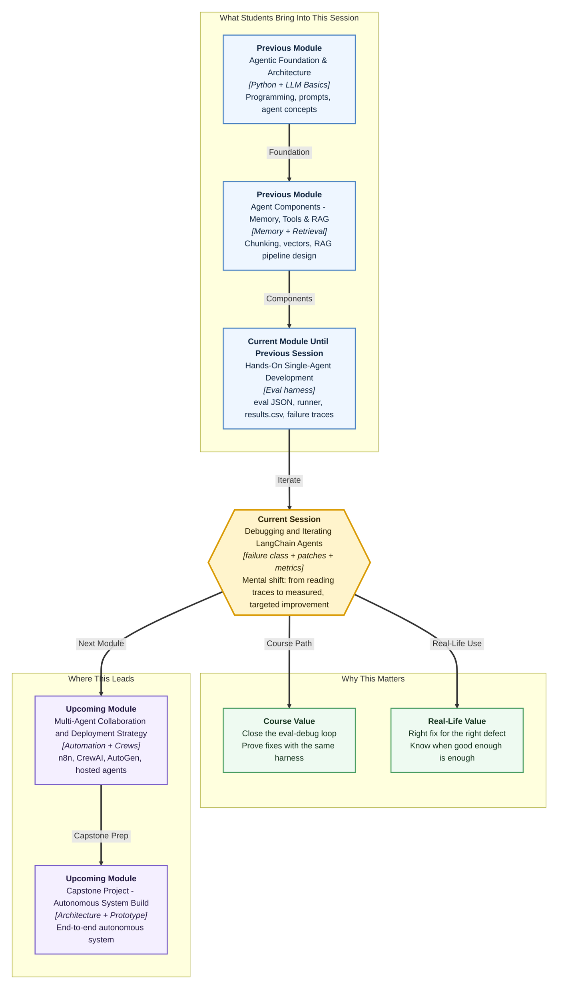

# Pre-read: Debugging and Iterating LangChain Agents

## Context of This Session in the Course

---

Your **course support agent** finally has a proper **evaluation harness**. The **runner** executes the case set. **results.csv** lands in the team channel: **twelve passes**, **eight failures**. Someone opens a **failure trace** for the refund-math case — the agent called the **policy search tool** instead of the **refund calculator**. Clear diagnosis. Everyone feels productive.

Then the week turns messy. One engineer **rewrites the system prompt** from scratch — *"be more helpful."* Another **renames every tool** without updating descriptions. A third **doubles chunk size** in the vector index because *"bigger chunks feel safer."* On Friday someone reruns the harness and announces **fifteen passes** — but nobody recorded which change mattered, **three cases that passed on Monday now fail**, and the agent takes **twice as long** per query because retrieval fires on questions that never needed it.

The team had **evidence of what broke**. They did not yet have a **disciplined way to fix it**.

In the **previous** session you built that evidence layer — **eval JSON** cases, a **runner**, **structured logging**, **results.csv**, and **failure traces** so you could classify outcomes like **wrong tool**, **weak retrieval**, and **over-refusal**. Today you close the loop: **match each defect to the right remedy**, **measure before and after** with the same harness, watch **cost and speed**, and know **when to stop iterating** instead of chasing perfect scores forever.

---

## When knowing the problem is not the same as fixing it

Picture a **clinic** after blood reports arrive. The report says **low iron** — not a mystery anymore. But if three doctors each prescribe something different — one says **more spinach**, one says **iron tablets**, one says **ignore it and exercise more** — the patient does not know what worked, and side effects pile up.

Agent debugging without a **failure class** (a **labelled defect category** that tells you *what kind* of mistake happened) feels the same. Your trace shows the **calculator never fired**. Is the fix a **prompt patch** (clearer instructions in the system message), a **tool description patch** (rewriting what the calculator tool claims it does), or **retrieval tuning** (smaller chunks so policy search stops drowning out arithmetic cases)? Pick wrong and you waste a sprint — or worse, **fix one case and break three others**.

Professional iteration means:

- **One controlled change at a time** — or at least knowing which change you are testing.
- **Same harness, two runs** — baseline **results.csv**, then post-fix **results.csv**.
- **Quality metrics** that move — pass count, failure-class counts, not gut feel.
- **Resource awareness** — did your prompt change make the agent **call retrieval five times** per question? That shows up in **token usage** and **latency** (how long each answer takes).

Random tweaking is the fastest way to turn an **eight-failure** agent into a **fifteen-failure** agent that **costs more** and **answers slower**.

---

## The challenge we will tackle

What if **results.csv** shows four **wrong-tool** failures and two **over-refusal** failures — and you need a **remediation plan** that addresses each **failure class** without a blanket prompt rewrite that harms passing cases?

What if you patch the **refund calculator tool description** and the math case passes — but the **instructor phone** refusal case starts **fabricating** because the new prompt says *"always try to help"*?

What if retrieval tuning fixes **weak retrieval** on electronics returns — but **latency doubles** because every question now triggers a **wide search** — and your **token bill** rises because the model reads huge chunks?

What if after two iteration rounds you hit **eighteen of twenty passes** — stakeholders ask **"are we done?"** — and you have no **stated quality bar** (a clear **minimum acceptable score** for this module) to justify **shipping** versus **one more week of tuning**?

The live session addresses **systematic iteration**: read **evaluation artifacts** (your traces and scoreboard), choose **targeted fixes** — **prompt patch**, **tool patch**, or **retrieval tune** — rerun the **same runner**, **quantify quality movement**, check **token usage and latency** for at least one workflow, and **decide when incremental gains are enough**.

---

## The mechanic with a before-and-after test drive

Think of your agent like a **car brought to a service centre** after a **diagnostic scan**.

The **failure trace** is the **scan report** — it shows which systems misfired: wrong part engaged (**wrong tool**), weak fuel mix (**weak retrieval**), safety cut-off too aggressive (**over-refusal**), or the engine guessing when it should stop (**fabrication**). Grouping traces into a **failure class** is the mechanic saying: *"These four complaints are all **electrical**, not **brake** issues — we fix electrical first."*

Each **remediation strategy** maps to a specific repair bay:

| Failure class | Typical fix (what you change) |
|---|---|
| **Wrong tool** | **Tool description patch** — rewrite the tool's name or description so the agent understands *when* to pick calculator vs policy search |
| **Weak retrieval** | **Retrieval tune** — adjust chunk size, overlap, number of passages retrieved, or search settings so the right policy text surfaces |
| **Over-refusal** | **Prompt patch** — clarify when the agent *should* search and answer vs when to refuse |
| **Fabrication / ungrounded answer** | **Prompt patch** plus **retrieval tune** — insist on evidence from retrieved text; improve what gets retrieved |

A **prompt patch** means a **small, controlled edit** to instructions the model sees — not rewriting the entire personality every time. A **tool patch** means sharpening how a tool is **described and registered** so arbitration improves without touching unrelated behaviour.

After each repair, the mechanic does a **test drive on the same route** — your **runner** on the **same eval JSON**. **Quantify quality movement** means comparing **results.csv** files: *"Wrong-tool failures dropped from four to one; over-refusal stayed at zero; pass rate went from 60% to 85%."* That is evidence, not optimism.

**Quality metrics** are the numbers and category counts you track across runs — overall pass rate, count per **failure class**, maybe average score on grounding cases. **Token usage** counts how much text the model processed (billed in real APIs). **Latency** measures response delay. A fix that wins two eval cases but **triples retrieval calls** might be a bad trade for production — you learn to read **quality and cost together**.

Finally, every service centre has a **release checklist**: *"Brakes within spec, lights working, no warning codes — good to hand back."* Your **quality bar** for this module might be: *"At least 90% pass on in-domain cases, zero fabrication on out-of-domain, wrong-tool failures below two."* **Deciding when to stop** means comparing your latest metrics to that bar — not endlessly polishing case 17 while case 3 regressed.

---

## From diagnosis to disciplined iteration

In the **previous** session, the harness answered: **what failed, and what did the agent do step by step?** Today's question is: **what do we change, did it help, and at what cost?**

The iteration loop looks like this:

1. **Open results.csv** — sort failures, group by **failure class** using traces.
2. **Pick one defect category** — e.g. all **wrong-tool** cases — and choose the matching remedy (**tool description patch** first, not a full prompt rewrite).
3. **Apply one controlled configuration change** — prompt, tool metadata, or retrieval parameter.
4. **Rerun the runner** — generate a fresh **results.csv** and compare to baseline.
5. **Check quality metrics** — did the target class improve? did any previously passing case break? (**regression**)
6. **Inspect resource consumption** — tokens and latency on a representative workflow; note if the fix bought quality at too high a price.
7. **Compare to the quality bar** — iterate again or **stop** and document residual risks.

**Select remediation strategies by defect category** means you never treat **over-refusal** and **weak retrieval** as the same problem — the first often needs **prompt clarity**, the second needs **index and chunk tuning**. **Evaluation artifacts** — traces, logs, scoreboards — are your only admissible evidence in that decision.

This loop is what makes **upcoming** multi-agent and deployment work credible: when you ship an assistant, you can say not only *"here are test cases"* but *"here is what we fixed, here is the before/after scoreboard, here is what we chose not to fix yet."*

---

## In this pre-read, you'll discover:

- **Why** having **failure traces** is only half the battle — and how **failure classes** point you to the **right fix** instead of random prompt edits
- **How** to apply **targeted changes** — **prompt patches**, **tool description patches**, and **retrieval tuning** — one category at a time
- **How** to **quantify quality movement** by rerunning the **same harness** and comparing **results.csv** before and after each change
- **How** to relate fixes to **token usage** and **latency**, and **decide when iteration should stop** against a clear **quality bar**

---

## Words you will hear — explained right away

- **Failure class:** A **defect category** — wrong tool, weak retrieval, over-refusal, fabrication — used to group failures and pick remedies.
- **Remediation strategy:** The **specific fix** you apply for a failure class — prompt edit, tool rewrite, or retrieval adjustment.
- **Prompt patch:** A **focused change** to system or agent instructions — not a full rewrite — to correct one behaviour pattern.
- **Tool patch:** Updating a tool's **name, description, or contract** so the agent **selects the right tool** more reliably.
- **Retrieval tune:** Adjusting **chunk size**, **overlap**, **top-k** (how many passages to fetch), or related search settings so retrieval returns **more useful context**.
- **Quality metrics:** **Measurable scores** from your harness — pass rate, per-class failure counts, grounding success — tracked across runs.
- **Quantify quality movement:** Proving improvement by **comparing the same metrics** before and after a configuration change.
- **Regression:** When a fix **breaks cases that previously passed** — why you always rerun the **full** eval set, not only the failures.
- **Token usage:** How much text the model **reads and writes** per run — a direct **cost** signal on paid APIs.
- **Latency:** **Response time** per query — important when users wait in a live chat.
- **Quality bar:** The **minimum standard** you agree to hit before stopping iteration — e.g. pass rate and zero fabrication on sensitive cases.
- **Controlled configuration change:** Changing **one knob** deliberately so you know what caused the next **results.csv** diff.

---

## What you will be ready to do

After this session, you will be able to:

- **Select remediation strategies** by **failure class** using **evaluation artifacts** — traces, logs, and **results.csv**
- **Apply prompt patches and tool patches** that target **wrong-tool** and **over-refusal** patterns without unnecessary rewrites
- **Tune retrieval parameters** to address **weak retrieval** failures with measurable impact on grounding cases
- **Rerun the harness** and **quantify quality movement** — pass rates and failure-class counts — before versus after each change
- **Relate configuration changes** to **token usage** and **latency** for at least one representative workflow
- **Detect regressions** when a fix helps some cases but harms others
- **Decide when to stop iterating** against the module **quality bar** and document **residual risks** for stakeholders
- **Connect** today's iteration loop to the **evaluation harness** from the **previous** session — same scoreboard, now used to **prove** improvement

---

## Why this matters beyond the classroom

Teams with eval harnesses but **no iteration discipline** often oscillate forever — two steps forward, three steps back, no one sure which prompt version shipped. Teams with **failure-class-driven fixes** and **before/after scoreboards** can explain releases to managers: *"We fixed calculator routing; refusal behaviour unchanged; cost per query rose 10% — acceptable for now."*

In production, **retrieval tuning** that ignores **latency** frustrates users. **Prompt patches** that ignore **regressions** break trust on cases that worked last week. **Knowing when to stop** prevents **analysis paralysis** — the difference between a shippable v1 and a team still tweaking adjectives in month three.

Today's session is the **engineering maturity layer** on top of evaluation. Debugging discipline is what makes later demos and deployments **defensible**, not just impressive.

---

## Questions to carry into the session

1. **results.csv** shows three failures labelled **wrong tool** — all arithmetic / refund-math questions routed to the **policy search tool**. Two teammates propose fixes: **A)** rewrite the entire system prompt to mention math more often; **B)** only patch the **calculator tool description** to say *"Use for refund amounts, percentages, and numeric calculations — not policy questions."* Which is the more **controlled configuration change**, and how would you prove it worked without breaking **in-domain policy** cases that already pass?

2. You **tune retrieval** — smaller chunks, higher top-k — and **weak retrieval** failures drop from five to one. **Latency** rises 40% and **token usage** per eval run doubles. The **quality bar** says *"fix grounding failures"* but also *"keep average response under two seconds in testing."* How do you **quantify** whether this trade-off is acceptable — and what is one **lighter retrieval tune** you might try next?

3. After two iteration rounds you reach **eighteen of twenty passes**. The two remaining failures are **edge-case out-of-domain** questions your product owner says are **low priority**. Your **quality bar** reads: *"90% overall pass, zero fabrication on out-of-domain, all tool-first cases pass."* Do you **stop** or **continue**? Which **quality metrics** from **results.csv** justify your decision to the stakeholder?

Keep these questions in mind. The session turns your **evaluation harness** into an **improvement engine** — measured fixes, visible progress, honest limits — so the agent you ship next is something you **iterated on purpose**, not something you **got lucky with on Friday afternoon**.
