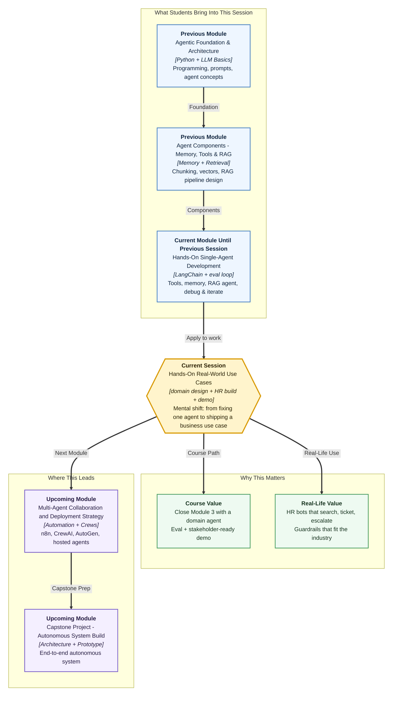

# Pre-read: Hands-On Real-World Use Cases

## Context of This Session in the Course

---

**Priya** joins a mid-size product company on Monday. By Wednesday she has asked HR the same kinds of questions fifty times over WhatsApp: *How many casual leaves?* *How do I set up VPN?* *Who heads Engineering?* *What is my CTC breakup?*

The HR team is kind — and drowning. They paste the same paragraphs from a handbook PDF. They create IT tickets by hand. When someone asks about **salary negotiation**, a junior intern guesses a soft answer and creates a mess. Priya feels lost. HR feels exhausted. The company already has the **policy documents**. What it lacks is a **careful assistant** that reads those documents, takes the right action, and **stops talking** when the topic is sensitive.

That is not a toy classroom problem. It is the kind of job a real company would pay for.

In the **previous** session you learned to **debug and iterate** a LangChain agent — classify failures, apply **prompt**, **tool**, and **retrieval** patches, and measure quality against **cost and latency**. Today you move from *fixing one agent* to *designing an agent for a real domain* — and you build an **HR onboarding assistant** end to end.

---

## Same chatbot shape, very different jobs

Think of a **Zomato** delivery status bot and a **Zerodha** portfolio helper. Both chat. Both look "AI." But the **data** they trust, the **tools** they call, and the **mistakes they must never make** are completely different.

What if you had to design three assistants this week — **finance due diligence**, **HR onboarding**, and **content creation** — and explain, without code, how their shelves of documents, their hands (tools), their memory, and their red lines differ?

| Domain | What it reads | What it does | What it must never do |
|---|---|---|---|
| **Finance** | Filings, ratios, market data | Search, calculate, cite | Give buy/sell advice; invent numbers |
| **HR onboarding** | Handbook, leave, IT, benefits | Search, raise tickets, escalate | Answer salary or discipline questions |
| **Content** | Style guide, past posts, SEO lists | Draft, check length/plagiarism | Publish off-brand or copied text |

A wrong leave-balance answer damages **employee trust**. A hallucinated financial number can create **legal liability**. Off-brand copy damages **reputation**. Building in a vacuum teaches mechanics. Building for **use cases** teaches **judgment**.

---

## The challenge we will tackle

What if a new joiner asks *"How many casual leaves do I get?"* and then follows up with *"Can I carry them forward?"* — and the assistant must remember that **"them"** means casual leaves?

What if the same person asks *"What is my salary package?"* and the assistant must **refuse politely** and **escalate to HR** instead of inventing a figure?

What if VPN steps in the guide are not enough, and the assistant must **create an IT ticket** rather than keep guessing?

What if your manager watches a live demo and asks you to prove — with **structured test cases** — that the agent answers from documents, picks the right tool, refuses dangerous topics, and survives multi-turn chat?

You will meet that challenge with one clear pattern: design the **architecture**, extend your **LangChain stack**, evaluate with an **eval harness**, then **demo** in-domain and out-of-corpus questions.

---

## The campus helpdesk analogy

Imagine a busy **college helpdesk** on admission week. On the wall hang four folders: leave rules, hostel Wi-Fi guide, scholarship FAQ, and department contacts.

A careful volunteer does four things:

1. **Opens the right folder first** before speaking  
2. **Raises a ticket** when Wi-Fi still fails after the guide  
3. **Calls a senior** for fees negotiation or discipline cases — never invents policy  
4. **Remembers the last question** when a student says *"and can I carry those forward?"*

Your **HR onboarding agent** is that volunteer — automated. The **corpus** is the wall of folders. The **retriever** finds the right pages. **Tools** create tickets or escalate. The **system prompt** is the desk rulebook: search first, cite sources, never discuss salary, escalate when unsure. **Multi-turn memory** keeps follow-ups coherent.

---

In this pre-read, you'll discover:

- **Why** finance, HR, and content agents need different data, tools, and guardrails — even when the LangChain skeleton looks the same  
- **How** to sketch an **HR onboarding architecture** — corpus, retrieval, action tools, escalation, and conversation memory — before writing anything  
- **What** a solid **evaluation set** covers — grounded answers, tool use, refusal paths, and multi-turn continuity  
- **How** a live demo contrasts **in-domain** policy questions with **out-of-corpus** traps — and why residual risks still matter after the first build  

---

## Words you will hear — explained right away

- **Use case:** The real job you hire the agent to do — not a toy demo, but something a company would value.  
- **Corpus / knowledge base:** The approved documents the agent may search (leave policy, IT setup, benefits, org chart).  
- **Guardrail:** A hard rule that blocks unsafe answers — for HR, no salary, appraisal, or disciplinary advice.  
- **Escalation:** Handing a question to a human when the agent should not or cannot answer.  
- **Groundedness:** Whether every important claim is supported by retrieved document text.  
- **Multi-turn continuity:** Remembering earlier messages so follow-ups like *"Can I carry them forward?"* still make sense.  
- **Evaluation harness:** A fixed pack of test questions, a runner, and a results sheet so you can prove behaviour systematically.  
- **Residual risk:** Known leftover weaknesses after the first build — stale documents, odd phrasing, memory limits, tool misrouting.  

---

## What's next

By the end of the session, you should be able to:

- **Compare** finance, HR, and content single-agent workflows across data, tools, memory, and guardrails  
- **Design** an HR onboarding assistant on paper — corpus, retriever, tools, escalation rules  
- **Implement** the agent by extending your integrated LangChain stack with HR documents and tooling  
- **Evaluate** with structured cases for grounded answers, tool use, refusal, and multi-turn continuity  
- **Demonstrate** live with in-domain and out-of-corpus queries, and name residual risks plus next improvements  
- **Reuse** the same pattern for another domain you care about — e-commerce, education, healthcare helpdesk, travel  

This session closes the module: you leave with a **domain agent you can show**, not only a bag of separate skills. **Upcoming** work moves toward multi-agent collaboration, automation platforms, and larger system design — built on the judgment you practise here.

---

## Questions to think about before class

1. A new joiner asks *"How many sick leaves do I get?"* then *"What is my CTC breakup?"* then *"VPN still fails after the guide — please raise a ticket."* For each question, which path should win — **document search**, **IT ticket**, or **escalate to HR** — and what goes wrong if the agent picks the wrong path?

2. Finance teams can wait **ten seconds** for a well-cited answer; HR joiners expect snappier replies in week one. How does that change which failures you fear most — **wrong numbers**, **slow answers**, or **over-confident guesses** — when you design guardrails?

3. Your first demo passes leave and VPN questions but invents an answer about **city transfer** that is not in the corpus. Which residual risk is showing up, and what is **one** improvement you would prioritise before showing the agent to a real HR manager?

Bring these questions to class. The session turns debugging skills into a **business-ready HR onboarding agent** — with evidence, guardrails, and a demo story stakeholders can trust.
