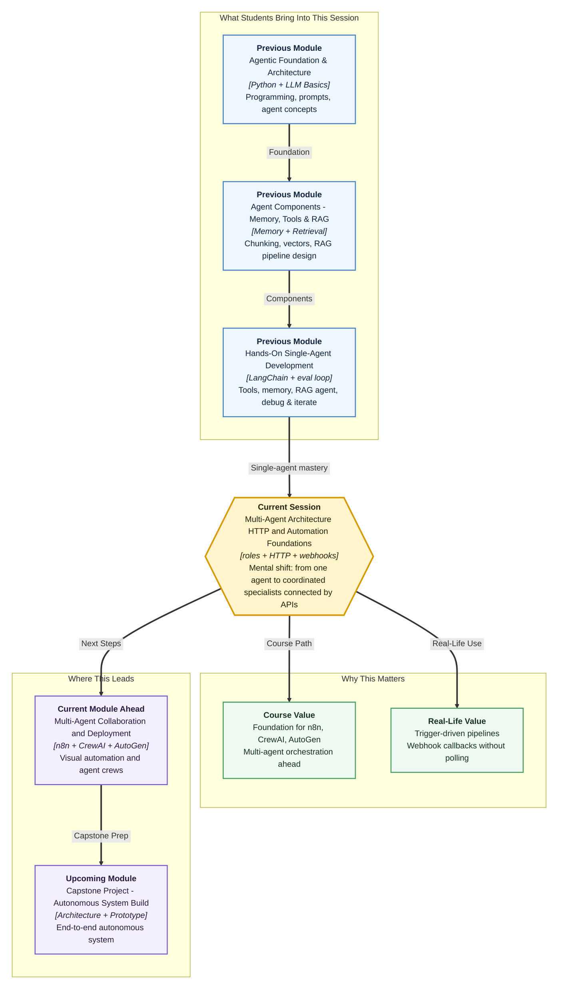

# Pre-read: Multi-Agent Architecture HTTP and Automation Foundations

## Context of This Session in the Course

---

**Rahul** runs a small digital marketing agency in Pune. A client wants a **weekly industry brief** — researched from trusted sources, written in plain English, edited for clarity, and published every Monday morning. Rahul tries to do everything himself: he reads articles at midnight, drafts at 2 a.m., proofreads at 4 a.m., and still sends something with a wrong statistic or a confusing paragraph. His client notices. Rahul notices. The work is not hard — but doing **research, writing, and editing** as one tired person creates **rework, missed facts, and late nights**.

What if Rahul hires three part-time helpers — one who only researches, one who only writes from approved notes, and one who only edits? Suddenly each person has a **clear job**, a **clear handoff**, and mistakes become easier to spot. That is the everyday logic behind **multi-agent systems** — not magic, just **specialised roles working in sequence**.

In the **previous** session you built and evaluated a **single-agent** HR onboarding assistant — with corpus, tools, guardrails, and a demo story. You learned to **debug and iterate** when one agent gets things wrong. Now you take the next step: when one agent is asked to do **too many different kinds of work**, how do you **split the job**, **assign roles**, and **connect the pipeline to the outside world** using **HTTP APIs**, **triggers**, and **webhooks**?

---

## One brain vs a coordinated team

Think of a busy **restaurant kitchen** during dinner rush. One chef trying to take orders, cook biryani, bake naan, plate desserts, and serve tables will burn out and mix things up. A working kitchen has **specialists** — tandoor, main course, plating — and a **head chef** who coordinates timing. Each person does one thing well. The food reaches the table in the right order.

The same idea applies to AI workflows:

| Approach | What it feels like | When it works | When it struggles |
|---|---|---|---|
| **Single agent** | One person doing research, writing, editing, and tool calls alone | Simple, bounded tasks with one clear goal | Complex goals needing different skills, tools, or safety checks at each stage |
| **Multi-agent** | A team with defined roles and handoff points | Research → draft → edit pipelines; tasks needing isolation and quality gates | Very small tasks where coordination overhead is not worth it |

A **multi-agent system** is simply a setup where **multiple AI agents coordinate** to achieve one goal — each with a **role**, a **boundary**, and a **handoff** to the next stage.

---

## The challenge we will tackle

What if your company wants an automated pipeline that turns a **user goal** into **polished lecture notes** — but no single agent should both **invent facts** and **publish final text** without a review stage?

What if the pipeline must **start automatically** when someone submits a form — not wait for a human to click "run" every time?

What if, when the pipeline finishes at 3 a.m., your system must **get notified instantly** — instead of checking every five minutes like refreshing a delivery app screen?

What if the same notification arrives **twice** because the network retried — and your system must stay safe instead of creating duplicate work?

These are real design questions. They sit at the intersection of **multi-agent architecture** and **automation plumbing** — the invisible pipes that connect agents to forms, databases, notification systems, and other services.

You will meet that challenge with a practical pattern: **decompose the goal**, assign **researcher → writer → editor** roles, then wire the pipeline using **HTTP methods**, **triggers** (start signals), and **webhooks** (push-back notifications).

---

## The newspaper desk analogy

Imagine a **newsroom desk** preparing tomorrow's front-page story.

1. The **researcher** collects verified facts and sources — nothing goes forward without evidence.  
2. The **writer** turns those facts into a clear draft — no new claims without checking back.  
3. The **editor** polishes language and catches inconsistencies — if a fact must change, the editor sends work back, not guesses.  
4. A **desk manager** (the **orchestrator**) decides when each stage runs and what gets passed forward.

Now imagine the newsroom is not in one building — it is spread across services on the internet. **HTTP APIs** are the **standard language** those services use to ask and reply: "Show me status" (**GET**), "Start this job" (**POST**), "Update this record" (**PATCH**), "Remove this entry" (**DELETE**). A **trigger** is the **start button** — like pressing Submit on a form. A **webhook** is the **callback** — like Swiggy pushing *"Your order is out for delivery"* to your phone instead of you refreshing the app every thirty seconds.

That is the core logic of this session: **specialised agents in sequence**, connected to the real world through **HTTP-based automation**.

---

In this pre-read, you'll discover:

- **Why** some goals need **multiple specialised agents** instead of one agent doing everything — and how to decide between single-agent and multi-agent designs  
- **How** to **decompose a complex goal** into sub-tasks with clear **role ownership** and **handoff points**  
- **What** separates a **sequential pipeline** (research → write → edit) from a **collaborative workflow** where agents refine each other's work  
- **How** **HTTP APIs**, **triggers**, and **webhooks** let agent pipelines **start automatically**, **talk to external systems**, and **report back** when work is done  

---

## Words you will hear — explained right away

- **Multi-agent system:** Multiple AI agents working together, each with a defined role, to achieve one larger goal.  
- **Task decomposition:** Breaking a big goal into smaller sub-tasks — like splitting "submit assignment" into read, plan, write, proofread.  
- **Role-based agent:** An agent constrained to one responsibility (researcher, writer, editor) with clear boundaries.  
- **Orchestrator:** The coordinator that decides when each agent runs and what gets passed to the next stage — like a stage manager or desk head.  
- **Sequential workflow:** Stages run in strict order — editing starts only after writing finishes.  
- **Collaborative workflow:** Agents interact with feedback loops — a writer drafts, a researcher critiques sources, an editor refines.  
- **HTTP API:** A standard way for programs to send requests and receive responses over the internet — like service counters in a government office, each handling one type of request.  
- **Trigger:** An event or signal that **starts** an automation — form submit, new file upload, job state change.  
- **Webhook:** An HTTP **callback** where an external system **pushes an event** to your endpoint when something happens — no repeated polling needed.  
- **Idempotency:** Repeating the same operation twice should not create duplicate damage — important when networks retry webhooks or trigger calls.  

---

## What's next

By the end of the session, you should be able to:

- **Distinguish** single-agent and multi-agent systems and explain when distributed specialised agents are the better choice  
- **Decompose** a complex goal into sub-tasks with clear inputs, outputs, and handoff points  
- **Compare** sequential and collaborative multi-agent patterns using a **researcher–writer–editor** example  
- **Explain** how **HTTP-based APIs** let agents and automation tools read from and write to external systems  
- **Relate** triggers, events, and webhooks to starting and chaining automation and agent workflows  
- **Describe** how reliability ideas — status codes, idempotency, and retries — keep production pipelines safe  

This session opens **Module 4** — the shift from building one capable agent to designing **connected multi-agent systems** that plug into real automation platforms. **Upcoming** work in this module brings tools like **n8n**, **CrewAI**, and **AutoGen** into the picture — built on the architecture and HTTP foundations you establish here.

---

## Questions to think about before class

1. A startup wants an AI pipeline that researches a topic, writes a blog draft, and edits it — but **must never publish unverified claims**. Would you use one agent or three role-based agents? What would each role's **input** and **output** look like at each handoff?

2. A user submits a form at midnight to start a content pipeline. The system should run in the background and **notify the team when finished** — without anyone refreshing a status page every few minutes. Which concept fits the "start" action, and which fits the "notify when done" action — **trigger**, **HTTP GET**, or **webhook**?

3. The same "pipeline completed" notification arrives **twice** because the network retried. What could go wrong if your receiver processes both blindly — and what is **one field** you would add to make repeats safe?

Bring these questions to class. The session turns single-agent skills into **multi-agent architecture** — with the HTTP and automation plumbing that real companies use to connect AI pipelines to the world outside the notebook.
