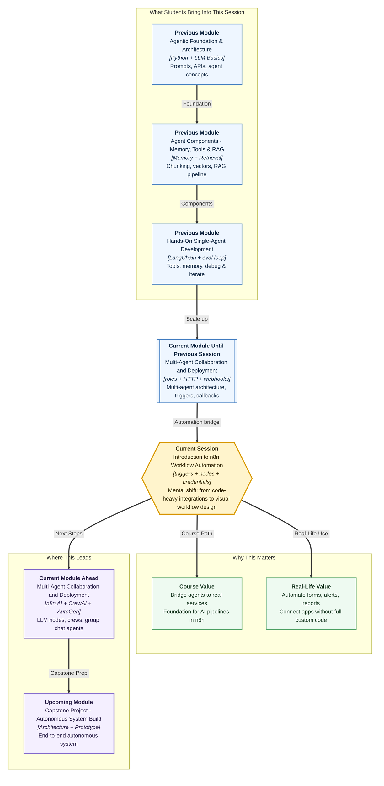

# Pre-read: Introduction to n8n Workflow Automation

## Context of This Session in the Course

---

**Ananya** coordinates student feedback for a training institute in Bengaluru. Every week, hundreds of learners submit responses through an online form — name, email, batch, and a rating out of five. Ananya's job sounds simple: save each response in a spreadsheet, flag high-priority complaints, and notify the trainer when someone rates below three. But in practice, she spends her Monday mornings copying rows by hand, fixing typos in email addresses, and forgetting to alert the trainer until a student follows up angrily on WhatsApp.

Ten submissions? Manageable. Five hundred submissions? The same small process becomes a **daily headache** — slow, error-prone, and impossible to scale without hiring more people for copy-paste work.

What if the form submission itself could **start** a chain of steps — clean the data, decide priority, save the row, and send the right alert — **without Ananya touching every row manually**?

That is the everyday problem **workflow automation** solves. And **n8n** is one of the most practical tools for building those chains visually.

---

## When one business process lives in five different apps

Modern work rarely happens inside a single application. A student fills a form on a website. Payment details sit in Razorpay. Trainers work in Slack. Managers track numbers in Google Sheets. Support tickets live in another tool entirely.

Each app holds useful information. The process breaks down when a human must **move that information by hand** at every step.

Consider a placement cell handling internship applications:

| Step | What happens today (manual) | What goes wrong |
|---|---|---|
| Student submits form | Someone checks email format by eye | Typos slip through |
| Save to spreadsheet | Copy-paste name, batch, rating | Wrong row, duplicate entry |
| High rating alert | Trainer gets a WhatsApp only if someone remembers | Hot leads go cold |
| Low rating escalation | Often missed until too late | Student feels ignored |

Writing custom code for every small process works for engineers — but many teams need a faster way to connect existing tools. They need to **see** the process, **test** each step, and **fix** mistakes without rewriting an entire script.

In the **previous** session, you learned how **multi-agent systems**, **HTTP APIs**, **triggers**, and **webhooks** connect AI pipelines to the outside world. You saw how an external event can **start** work and how a system can **push back** when a job finishes. n8n turns those same ideas into a **visual canvas** — drag blocks, connect them, inspect what happened at each step.

---

## The train route analogy

Imagine a **train route** across India.

The **trigger** is the station where the journey begins. Maybe a student submitted a feedback form. Maybe Razorpay sent a payment-success signal. Maybe the clock hit 9 a.m. and a daily report must run.

The **nodes** are the stations along the route. One station reads the form data. Another decides if the rating is high or low. Another writes to Google Sheets. Another sends a Slack message to the trainer.

The **connections** are the tracks between stations. If the track is wrong, the luggage — the **data** — reaches the wrong destination. If the connection is clear, the whole journey is easy to follow and debug.

The **expressions** are like **Excel formulas** on the route — instead of hard-coding "priority = high" for every student, the workflow calculates priority from the rating automatically. Change the rating, and the result updates without rewriting the whole journey.

This mental model matters because automation should not feel like magic. A good workflow is **visible**, **repeatable**, and **inspectable** — you can open any station and see exactly what arrived and what left.

---

## Why this session matters for agentic systems

An **LLM** alone cannot run a real business process. Agents need **triggers** (when to start), **tools** (where to read and write), **conditions** (which path to take), and **secure access** to third-party services.

n8n sits at that intersection. It is not only for non-technical teams — it is a practical bridge between **agent concepts** and **real integrations**. A finance person can wire Sheets and email on a canvas. An engineer can drop into a code node when custom logic is needed. Either way, the workflow stays observable.

You will also meet ideas that protect real systems:

- **Credentials** — secure keys that let n8n talk to Google, Slack, or OpenAI without pasting secrets on the canvas
- **Environment settings** — sensitive values stored outside the workflow file, the same careful habit you use in Python projects
- **Per-node inspection** — opening Table, JSON, and Schema views to confirm data shape before blaming the next step

---

In this pre-read, you'll discover:

- **Understand** how n8n works as a **visual automation platform** for connecting apps, databases, and AI steps without writing every integration from scratch
- **Discover** how **triggers** start workflows — manually, on a schedule, from a form, from an app event, or from a webhook callback
- **Learn** how **nodes**, **connections**, and **data flow** form a complete multi-step process you can test step by step
- **Understand** why **expressions**, **credentials**, and **output inspection** are essential for secure, reliable automations

---

## Words you will hear — explained right away

- **n8n:** A visual workflow automation platform — you design processes by connecting blocks on a canvas instead of coding every integration by hand.
- **Workflow:** A connected sequence of steps from a starting event to a final outcome.
- **Trigger:** The event that **starts** a workflow — form submit, schedule, webhook, or app change.
- **Node:** One step or action on the canvas — read data, transform it, call an app, or make a decision.
- **Connection:** The link that passes output from one node as input to the next.
- **Expression:** A runtime formula that computes values from incoming data — like an Excel cell that updates when marks change.
- **Credential:** A securely stored access key or token that authorizes n8n to connect to a third-party service.
- **Webhook:** An HTTP callback where an outside system tells your workflow that something happened — payment success, ticket created, form submitted elsewhere.
- **Observability:** The ability to see what went **in** and what came **out** of each node so you can debug failures quickly.

---

## What's next

By the end of the session, you should be able to:

- **Navigate** the n8n workspace and explain what each part of the canvas is for
- **Configure** a **trigger-driven workflow** with at least two connected nodes and visible data flow between them
- **Apply** credentials and environment settings safely when connecting third-party services
- **Validate** a baseline workflow run by inspecting inputs and outputs at each node — not just checking the final result
- **Explain** the difference between n8n (the automation app) and Docker (one way to run it locally for practice)
- **Describe** when to use a **schedule trigger** vs a **webhook trigger** vs a **form trigger** in plain business language

This session is the foundation for **upcoming** work in this module — connecting **LLM nodes** into n8n pipelines, building end-to-end AI automations, and later combining visual workflows with **CrewAI** and **AutoGen** multi-agent patterns.

---

## Questions to think about before class

1. Ananya's feedback form receives **500 submissions after a weekend hackathon**. She must save each row, mark ratings of 4 or 5 as **high priority**, and alert the trainer only for ratings of 1 or 2. Which part of this process is the **trigger**, which steps are **nodes**, and what might an **expression** calculate automatically instead of typing by hand?

2. A payment gateway sends an HTTP callback to your system every time a customer pays successfully — the same pattern you studied as a **webhook** in the **previous** session. In n8n, which trigger type would start the shipping-and-receipt workflow, and why is this better than checking "did payment happen?" every five minutes manually?

3. A workflow runs correctly on your laptop but fails when connecting to Google Sheets. The error says "authentication failed." What is the difference between pasting an API key directly into a node field vs storing it as a **credential** or **environment variable** — and which approach would you trust in a real company?

4. Step 2 of your workflow shows `{ "name": "Priya", "email": "priya@example.com", "rating": 4 }` but Step 3 expects a field called `student_name` and crashes. Without rewriting the entire workflow, what would you inspect first — and what concept (**connection**, **expression**, or **credential**) likely needs fixing?

Bring these questions to class. The session turns HTTP and trigger concepts from the **previous** lesson into a **visual automation language** you can design, test, and trust — one node at a time.
