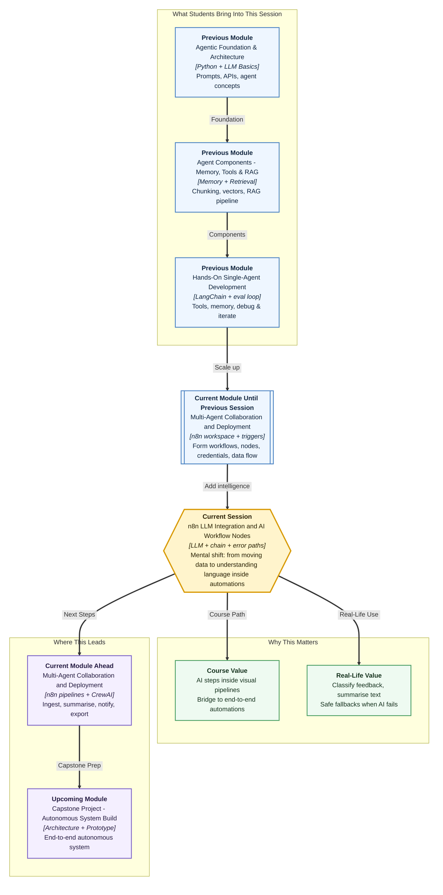

# Pre-read: n8n LLM Integration and AI Workflow Nodes

## Context of This Session in the Course

---

**Ananya** finally automated her student feedback form. When someone submits name, email, batch, and a 1–5 rating, n8n saves the row and sets **high priority** when the rating is four or five. Her Monday mornings improved. Trainers get alerts faster. The spreadsheet fills itself.

Then a new field appeared on the form: **“Tell us what went well or what frustrated you.”** Students started writing real sentences — *“Mentor cancelled twice”*, *“Content was great but assignments were unclear”*, *“Batch timing does not suit working professionals.”*

Ananya’s old rules broke. A rating of **5** with the comment *“Great content but mentor never joined doubt session”* is not truly “high priority happy feedback.” A rating of **3** with *“Life-changing clarity on RAG”* deserves a trainer shout-out, not silence. Copy-paste formulas cannot **read** language. Only a human — or an **AI step inside the workflow** — can summarise the comment and label the mood before the next action runs.

That gap is exactly why **LLM nodes** belong inside n8n.

---

## When moving data is not enough

In the **previous** session you learned the **n8n workspace**: **triggers**, **nodes**, **connections**, **expressions**, and **credentials**. You built a first path where form data flows through a **Set** node and you inspected **inputs and outputs** at each step.

That foundation moves structured fields beautifully. It struggles with **meaning** hidden in free text.

| What expressions handle well | What they struggle with |
|---|---|
| Map `rating = 5` → `priority = high` | Understand *“mentor ghosted us for two weeks”* |
| Copy email into a sheet column | Write a one-line summary for the trainer |
| Branch on exact dropdown values | Decide if tone is angry, confused, or grateful |

Real companies face the same wall. Support teams get long emails. HR gets paragraph-long exit feedback. Sales gets messy review text after a demo. Someone must **read**, **compress**, and **label** before the right person is notified.

**LLM integration in n8n** adds a smart station on the automation route: the workflow still starts on a trigger, still stores results in Sheets or Slack — but an **AI node** turns messy comments into clean fields the next node can trust.

---

## The challenge we will tackle

What if every feedback submission must produce three reliable fields — **sentiment**, **summary**, and **priority** — before anyone updates a spreadsheet?

What if the AI service is **slow**, returns **empty text**, or hits a **rate limit** — and the workflow must **not** silently write garbage rows?

What if the model returns pretty English but **invents** a batch name that was never in the form — and your team acts on false data?

What if you sometimes need to call an AI through n8n’s **LLM node**, and sometimes through a generic **HTTP Request** to your own API — and you must know when each approach fits?

These are not fantasy problems. They appear the moment you chain **language understanding** into **business automation**. The session gives you a practical pattern: connect a provider, write **system and user prompts** that ask for a **predictable shape**, **chain** AI output into downstream actions, add **retry or fallback** paths, and run a simple **quality check** before delivery.

---

## The smart sorting desk analogy

Imagine a **courier hub** after festival season.

Packages arrive (form submissions). Some labels are neat — name, pin code, weight. Others are scribbled paragraphs on the side of the box (“fragile”, “deliver after 6 p.m.”, “wrong address last time”).

A **junior clerk** (expressions) can sort boxes by printed pin code. A **senior sorter** (LLM node) reads the scribbled note, writes a clean sticky label — **urgent / normal**, **one-line reason**, **send to trainer or ops** — and only then the box moves to the right truck (Google Sheets, Slack, email).

If the senior sorter is **on break** (API failure), the hub does not throw packages on the floor. There is a **backup desk** (fallback path) and a **supervisor ping** (alert to a human). Before any truck leaves, a **checker** (quality gate) confirms the sticky label has allowed words and is not blank.

That is the core logic of this session: **automation + language understanding + safe failure handling**.

---

In this pre-read, you'll discover:

- **Understand** how an **LLM provider** connects to n8n and how **prompt configuration** turns form fields into structured AI inputs
- **Learn** to **chain** AI output into later nodes so summaries and labels become spreadsheet columns or team alerts
- **Discover** when to use a dedicated **LLM node** versus a general **HTTP Request** call to an API
- **Understand** **error branches** — limited retry, fallback defaults, and human alerts when AI steps fail
- **Learn** simple **quality criteria** to check AI output before it reaches customers or managers

---

## Words you will hear — explained right away

- **LLM node:** A workflow step that sends text to a large language model and receives generated text back — like asking a knowledgeable intern to read a comment and reply in a fixed format.
- **Prompt configuration:** The written instructions (system + user messages) that tell the model its role, boundaries, and exact output shape for this run.
- **System prompt:** Standing rules — for example, “You only return JSON with sentiment, summary, priority.”
- **User prompt:** The live task plus the actual form data for this submission.
- **Chaining AI steps:** Wiring the model’s answer as input to the next node — Set, Sheets, Slack, or email — without manual copy-paste.
- **HTTP Request node:** A general “call any URL” step in n8n — useful for custom backends or APIs not shown as a ready-made LLM button.
- **Error branch:** An alternate path when a node fails or output fails a check — retry once, then fallback or alert.
- **Fallback:** Safe default values when AI cannot complete — for example, `sentiment = unknown` and “please review manually.”
- **Quality gate:** A simple checklist before delivery — valid labels, non-empty summary, no invented student details.
- **Credential:** The securely stored API key that lets n8n talk to OpenAI or another provider — never pasted on the canvas.

---

## What's next

By the end of the session, you should be able to:

- **Connect** an LLM provider in n8n and configure **system + user prompts** that request structured output for workflow data
- **Chain** an AI step into downstream automation — map sentiment and summary into Set, Sheets, or notify paths
- **Explain** when an **LLM node** is enough versus when an **HTTP Request** node is the better tool
- **Design** a **failure path** with limited retry, fallback values, and optional human alert
- **Apply** a short **quality checklist** before AI-labelled data reaches a spreadsheet or messaging app
- **Inspect** each node’s input and output — the same observability habit from the **previous** n8n build

**Upcoming** work extends this into fuller **end-to-end AI pipelines** — automatic ingestion (for example email), parallel AI tasks, merge steps, and delivery by notification — built on the LLM chaining and safety habits you establish here.

---

## Questions to think about before class

1. A student submits rating **5** but writes *“Content was excellent but mentor missed every doubt session.”* Should `priority` stay **high** because of the number, or change because of the comment? Which part of the workflow should decide — an expression on `rating`, or an **LLM step** — and why?

2. The OpenAI call fails with **rate limit** on a busy hackathon weekend. Should the workflow (a) stop forever, (b) retry endlessly, or (c) retry once then write **fallback** values and alert a human? What harm happens if you choose (a) or (b)?

3. The model returns: `{"sentiment": "super happy", "summary": "", "priority": "low"}`. Which two **quality checks** would fail before this row is allowed into Google Sheets?

4. Your team already runs a FastAPI `/v1/analyse` endpoint that classifies feedback. Would you call it with n8n’s **HTTP Request** node or only use the built-in **LLM chain**? Write one sentence defending your choice for a classroom demo.

Bring these questions to class. You already know how to **move** data through n8n — this session teaches you how to **understand** language inside that flow and how to keep automations trustworthy when AI is in the loop.
