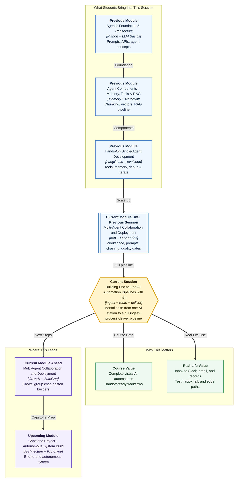

# Pre-read: Building End-to-End AI Automation Pipelines with n8n

## Context of This Session in the Course

---

**Ananya’s** feedback form now has a smart reader. A student types a paragraph. An **AI step** writes a short summary, labels the mood, and the row lands in a sheet.

Then placement week arrives. Internship diaries, chat pings like *“Stipend not credited for June,”* and forwarded emails with three “fw:” stamps all hit the same desk. Someone also submits a **blank** form by accident.

Ananya still has **one clever station**. She does not have a **full journey**: collect what arrives, summarise it, send **urgent** cases to a loud channel, email the **routine** ones, write **every** item in a register, and prove the path still works when the letter is empty or nonsense.

That gap is why this session exists: **end-to-end AI automation pipelines** in n8n — **inbox → understanding → the right desk → a saved record**.

---

## When one smart station is not enough

In the **previous** session you connected an **LLM provider**, wrote **prompts**, **chained** AI output into later steps, and added **error branches** plus a **quality gate**. That teaches the workflow to **understand language**. It is still only **one platform** on the route.

| What you can already do | What operations still need |
|---|---|
| Classify a short form comment | Accept a **document or message** from more than one door |
| Map a summary into a sheet | **Route** high urgency to Slack, medium to email, low to the register only |
| Retry once when the model fails | **Test** a happy letter, a blank letter, and a weird letter |
| Store an API key in credentials | **Export** the workflow so the next intern can run it |

A **placement cell**, a hospital helpdesk, a CA firm’s client inbox — the work is not “run AI once.” It is **take it in, make sense of it, send it to the right person, keep proof**. An **end-to-end pipeline** is that contract: intake, outcome, empty-body behaviour, who gets pinged, where the row is stored, and how you hand the machine to someone else.

---

## The challenge we will tackle

What if a **campus ops inbox** must accept a pasted internship note, a chat complaint, or an email-style message — and never call the model when the body is blank?

What if the model must return a **fixed shape** (summary, category, urgency, action) so a **router** can send **high** to Slack, **medium** to email, and **low** only to Google Sheets — and still write a **sheet row** even when Slack already fired?

What if you only tested the stipend complaint that already worked — and the next real item is *“ok thanks lol”* or a 50-page paste?

What if the canvas lives on **your** laptop, with keys in your head, and a new intern cannot import or operate it?

The session builds one **Campus Ops Inbox** workflow: **ingest → summarise → route → deliver**, then a **test pack** (happy, failure, edge) and a **handoff** note for credentials, dependencies, and assumptions.

---

## The full-train analogy

Until now you practised **stations**. This session runs the **full train** — a festival-weekend express.

- **Ingestion** is the origin. Letters, parcels, and chat notes get a tray label. An empty tray does not board the expensive coach.
- **Summarisation** is the conductor’s slip: what happened, how urgent, what staff should do next.
- **Routing** is the junction. Urgent complaints hit the loud bell (**Slack**). Routine queries go to the clerk (**email**). Quiet praise goes only into the **register** (the sheet).
- **Delivery** notifies someone **and** still writes the row — bells fade, registers remain.
- **Testing** is a trial run: a normal ticket, a blank ticket, a messy “fw: fw:” ticket.
- **Export** is the night-shift intern’s route map: who owns the key cupboard (not keys on a sticky note), India time for clocks, no Slack page on a low-confidence “emergency.”

Core logic: **intake + AI processing + the right desk + proof + a test pack + a runbook**.

---

In this pre-read, you'll discover:

- **Understand** what an **end-to-end AI pipeline** is — ingest, process with AI, route, and deliver a notification or storage update
- **Learn** how **document and message ingestion** turns messy inbox text into fields the next step can trust
- **Discover** how **summarisation** and **routing** send urgent work to Slack, routine work to email, and a **sheet** row to the audit trail
- **Understand** why **testing** needs a happy path, a failure, and an edge case — and why **export** needs credentials, dependencies, and assumptions

---

## Words you will hear — explained right away

- **End-to-end pipeline:** The full journey from intake to outcome — not a single AI click sitting alone on the canvas.
- **Document / message ingestion:** Collecting form paste, chat, or email body into labelled fields before anyone summarises.
- **Summarisation:** An AI step that compresses long content into a short summary plus labels the router can read.
- **Routing:** Choosing the next desk from those labels — high, medium, or low — instead of blasting one group chat.
- **Notification:** A human ping — Slack for “act now,” email for “handle in the inbox.”
- **Database-style update:** For class, a **Google Sheets** append — the register after Slack scrolls away.
- **Pipeline testing:** Planned samples: normal case, failure (empty body), edge case (noisy or oversized text).
- **Workflow export:** Download the n8n JSON plus a **runbook** of who owns which credential and what you assumed.
- **Operational assumption:** A limit you rely on — paste size, timezone, “empty body means review, not a model call.”

---

## What's next

By the end of the session, you should be able to:

- **Design** an ingest → summarise → route → deliver automation on the n8n canvas
- **Integrate** Slack, email, and sheet updates as real outcomes — not only an AI reply on screen
- **Test** a **failure** and an **edge-case** path, not only the sample that already worked
- **Document** credentials, dependencies, and assumptions for handoff — without putting secrets in Git
- **Explain** why a sheet row still matters when Slack already rang

**Upcoming** work in this module moves from visual pipelines into **multi-agent crews**. The same spine still matters: clear intake, a trustworthy middle, a visible outcome.

---

## Questions to think about before class

1. Asha pastes: *“Host company has not paid June stipend.”* Should this ring **Slack**, send **email**, or only write a **sheet** row — and which **label** should the router read, not the original essay?

2. Ravi submits **empty** body text. Should the workflow still call the AI model — and what must remain visible the next morning if it does not?

3. Meera writes *“ok thanks. also Diwali. also maybe internship. lol.”* What goes wrong if this is **high urgency** with **low confidence** and Slack pages the whole placement cell?

4. You mail the exported JSON to a junior intern who has no API key, no Slack, and no sheet. Which three things must the **handoff note** list so they fail **clearly** instead of guessing from a screenshot of your canvas?

Bring these questions to class. You already know how to add **intelligence** inside n8n. This session teaches you how to run the **full train** — prove it, then **hand over the keys**.
