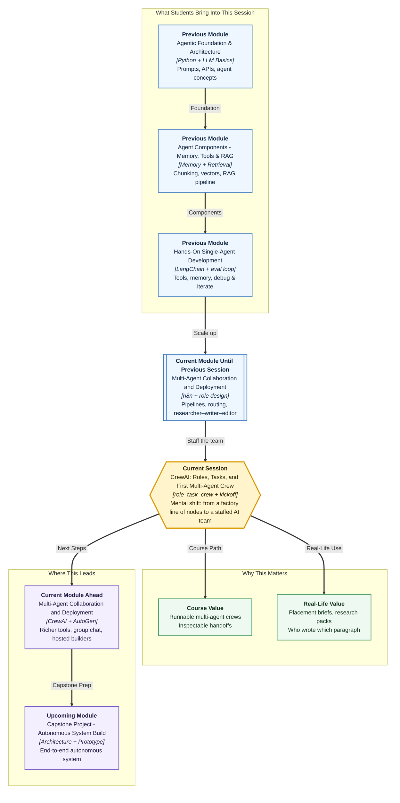

# Pre-read: CrewAI — Roles, Tasks, and First Multi-Agent Crew

## Context of This Session in the Course

---

**Ananya’s** Campus Ops Inbox now runs like a factory line. A stipend complaint arrives. An AI step summarises it. Urgent cases ring Slack. Routine ones go to email. Every item still lands in the register.

Then Prof. Meera Kulkarni walks in with a different request. Fourteen students have not received June internship stipends. The cell already has a short facts file: two company names, one email date, a stipend range. Faculty need a **one-page brief** they can scan in two minutes — not another Slack ping.

Ananya cannot staff this with one clever station. Someone must **gather only file-backed facts**. Someone else must **write the notice**. A third person must **check that no company or amount was invented**. Three job titles. Three work items. One team start.

That is the gap this session fills: **CrewAI** — hire AI teammates, give them roles and tickets, press start, then read who produced which paragraph.

---

## When a factory line is not a team

In the **previous** session you built an **end-to-end n8n pipeline**: ingest, summarise, route, deliver. That is excellent when work looks like **stations** on a belt.

Some work needs **specialists** who think in different ways, then hand a **deliverable** to the next person. A placement brief is not “run AI once.” It is research, then writing, then review.

| What a pipeline of steps does well | What a crew of specialists does well |
|---|---|
| Move a message through apps | Keep a **job title** while doing the work |
| Route high / medium / low | Hand the next person a **usable packet**, not a messy paste |
| Notify Slack and write a sheet row | Let **you** see which role drove each segment of the page |

**CrewAI** is a Python framework for building **multi-agent teams**. In simple words: it is a way to hire AI teammates, give job titles and work items, and press **start** on the whole team.

You already designed a **researcher–writer–editor** pipeline earlier in this module — on paper. Today that design becomes a **runnable crew**.

---

## The challenge we will tackle

What if a **placement cell** must produce a faculty brief on internship stipend delays — and the writer is **forbidden** to invent a third company?

What if the researcher may open a **facts file**, but the writer must work only from **research notes**, and the reviewer must compare draft versus notes — no extra hunting?

What if you only read the pretty final page, and the weak fog lived in **research**, not in the last paragraph?

The session staffs one **Placement Brief Crew** inside a **bounded** campus scenario: three agents, three tasks, one sequential run, three inspectable files.

---

## A film set that hears “Action!”

Think of a college film shoot.

- The **researcher** finds locations and writes what is actually on the ground — not a rumour about a waterfall that is not there.
- The **writer** turns those notes into a script the crew can shoot.
- The **editor** cuts the film and flags shots that were never in the location notes.
- The **crew** is the whole unit that hears **“Action!”** — not three people chatting in three different WhatsApp groups.

That picture is the **role–task–crew** model:

| Building block | Job | Campus mapping |
|---|---|---|
| **Agent** | Teammate with a role, a goal, and a backstory | Placement researcher / brief writer / reviewer |
| **Task** | Work item with an expected output | Research notes → draft → final brief |
| **Crew** | Agents + tasks you run together | “Placement Brief Crew” |
| **Process** | How work moves between agents | Sequential: research, then write, then review |
| **Tool** | Extra ability given to *some* agents | Researcher may read a facts file; writer may not |
| **Kickoff** | Start the crew run | The moment you say “Action!” |
| **Output artifact** | Visible result of a task or of the crew | Saved notes, draft, and final brief |

Vague prompts make three chats that copy each other. Clear roles, strict tasks, and one crew start give the next agent a usable packet.

---

## Job title, target, and workplace story

An **agent** is not “the AI.” It is one teammate whose identity you write in three fields.

- **Role** is the job title — *Campus Placement Researcher*, not “Helper.”
- **Goal** is what success looks like — extract only file-backed facts, not “be useful.”
- **Backstory** is the experience that shapes tone **and** the fence — placement-cell staff; never invent amounts.

The model can still invent. Role, goal, and backstory **steer**. Your **expected output** plus a **reviewer** catch leftovers.

Keep research, writing, and review **narrow**. Overlapping roles are how two people write the same paragraph and then argue. For this first crew, each agent finishes its **own** ticket. Manager-style passing around can wait.

---

## Give the librarian the catalogue — not the novelist

Identity is not enough. Some jobs need a **tool**; others get worse if they have one.

A **tool** is an extra ability — read a file, search, calculate. **Tools per agent** means you attach tools only to the agents that should use them.

Give the librarian the catalogue. Do not give the novelist the same catalogue if you want them to write from notes, not wander. Today only the researcher may open a local facts file. If every agent can “look things up,” the writer may skip the researcher and invent a parallel story.

The scenario stays **bounded** on purpose. A short facts file is the training-wheels version of a knowledge tool. Live web search can wait.

---

## Tickets, not wishes

Agents are people on the org chart. **Tasks** are the tickets they must close.

A task has a **description** (what to do), an **expected output** (the shape of the result), an assigned **agent**, and optional **dependencies** (wait for these earlier tickets). A description without an expected output is a wish. A good expected output names **format**, **length**, and **forbidden extras**.

| Task | Expected output (today) | Why it is strict |
|---|---|---|
| Research | 6–10 bullets plus an `UNCERTAIN` list | Writer must not receive a novel |
| Write | Four sections, no new facts | Reviewer can compare against notes |
| Review | Final brief plus a quality table | **You** can see who drove each segment |

**Dependencies** are the honest rule: do not start writing until research notes exist. The editor of a college magazine does not layout a page before the article file arrives. If the writer task has no dependency wire, the writer may ignore research and produce a generic essay.

---

## Assemble the team, choose the traffic rule, press start

Agents and tasks are ingredients. The **crew** is the dish you actually cook.

A **process** is how work moves. **Sequential** means tasks run in list order — research, then write, then review. That is today’s choice: clear pipeline, easy logs. **Hierarchical** means a manager assigns and checks. That is useful later, not on the first run.

**Kickoff** is “Action!” You pass a topic — like filling a form before an n8n run — and the crew returns a packet of results.

**Output artifacts** are the homework copies: saved files from each task, the final printed result (usually the **last** task), and the per-task text that names which role produced which block. Printing only the last page and declaring success is how a weak research bullet hides inside a pretty brief.

After kickoff you read like a team lead, not like a magic box:

1. Did research stay inside the facts file?
2. Does the draft have the four required sections — and any new number?
3. Did the reviewer **flag** invented claims or quietly keep them?

Style can come from the **writer**. Facts must trace to **research**. Flags must come from the **reviewer**. If you cannot point to a role, the contracts were too loose.

---

In this pre-read, you'll discover:

- **Understand** the **role–task–crew** model — who does the work, what must be delivered, and which team you actually start
- **Learn** how an **agent** is a job title plus a goal plus a backstory, and why **tools** belong only with the teammate who should have them
- **Discover** how a **task** needs an expected output and a dependency, not a vague “write something nice”
- **Understand** how **kickoff** produces **output artifacts** you can map to a role — instead of calling the whole run “the AI was wrong”

---

## Words you will hear — explained right away

- **CrewAI:** Hire AI teammates, assign tickets, start the team as one unit.
- **Agent:** A specialist with a **role** (job title), **goal** (what success looks like), and **backstory** (workplace story and fences).
- **Task / expected output / dependency:** A ticket, the shape it must take, and “do not start until this earlier ticket exists.”
- **Crew / process / kickoff:** The team, the traffic rule (sequential today), and the start button.
- **Tool per agent:** Extra ability attached only where it belongs — librarian gets the catalogue, novelist does not.
- **Output artifact:** Each teammate’s saved copy plus the stapled final version.
- **Bounded scenario:** A fence on knowledge — here, a short campus facts file. Nothing outside the file is “known.”

---

## What's next

By the end of the session, you should be able to:

- **Define** three campus agents with tight roles, goals, and backstories
- **Assign** research, write, and review tasks with expected outputs and dependencies
- **Configure** a sequential crew and run a first **kickoff**
- **Open** three artifacts and name which **role or task** drove each segment
- **Explain** why only the researcher gets the facts-file tool

**Upcoming** work in this module can add richer tools, a manager-style process, and a small evaluation checklist. This session’s job is a **readable first crew**, not a production department.

---

## Questions to think about before class

1. Ananya’s writer produces a polished brief that names **Infosys**. The facts file only lists Nimbus Analytics and Riverbank Retail. Which **role** likely drove that sentence — and which **artifact** would prove it?

2. She gives the facts-file tool to **all three** agents “to be safe.” Why might the writer then skip the researcher and invent a parallel story?

3. The research notes say `UNCERTAIN: per-student unpaid totals`. The draft still prints “each student is owed Rs 12,000.” Which contract was too weak — the writer’s expected output, or the reviewer’s table?

4. After kickoff she reads only the final page and says “the AI was good.” What two earlier files must she open before that sentence is earned?

Bring these questions to class. You already know how to run a **factory line** of automation steps. This session teaches you how to **staff a team**, press **Action!**, and read the homework copies — not only the premiere.
