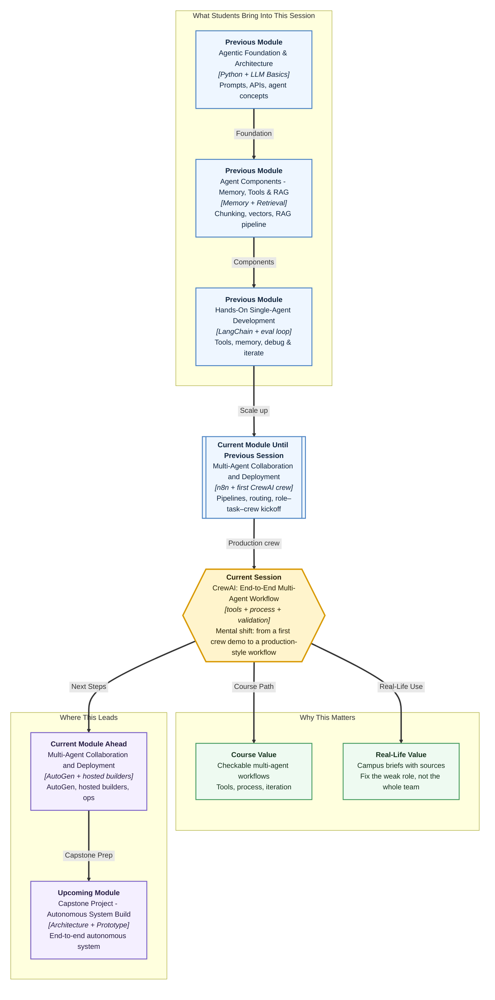

# Pre-read: CrewAI — End-to-End Multi-Agent Workflow

## Context of This Session in the Course

---

**Ananya** still sits between Bengaluru and Pune. The Campus Ops Inbox is no longer a pile of unread forms. n8n summarises a stipend complaint, routes the urgent ones, and writes a row in the register. In the **previous** session she staffed a **Placement Brief Crew**: a researcher, a writer, and a reviewer. One kickoff. Three artifacts. Prof. Meera Kulkarni at Greenfield Institute of Technology, Pune, could finally scan a one-page brief.

Then Monday returned. Fourteen students still waiting on June internships. Nimbus Analytics and Riverbank Retail still on the facts file. Meera did not want a **practice scene**. She wanted a **weekly desk**: the researcher must look up a register, not guess headcounts; the process must match the handoff; and nobody should call the brief “done” until accuracy, completeness, and format have been ticked.

The first crew had **roles**. It did not yet have a **production-style workflow**.

---

## When a first team is not a weekly desk

A demo crew can look impressive once. A production-style workflow must survive repetition.

| What the first crew already gave you | What a weekly brief still needs |
|---|---|
| Job titles, tickets, one kickoff | **Custom tools** on the agents who should look things up |
| A sequential research → write → review line | A **process choice** you can defend, including a manager-led alternative |
| Three markdown files | A **checklist** before faculty see the page |
| A vague “looks fine” | **Iteration** on the weak role or task — not a rewrite of the whole team |

**Production-style**, in simple Indian English, means the workflow is designed to be used seriously. Clearer jobs. Better handoffs. A way to judge success. Optional **memory** if the same crew will run again on a related topic later in the week.

---

## The challenge we will tackle

What if Meera asks Ananya to run the same Placement Brief Crew every Monday — and the writer is still forbidden to invent a third company?

What if the researcher needs **two** lookups: the campus facts file **and** a stipend register with student counts, last HR reminder, and whether trainer Slack has been sent?

What if the final page sounds fluent, misses a required heading, and nobody notices until the faculty meeting?

This session upgrades the crew you already know into an **end-to-end research-and-content workflow**: tool-enabled specialists, a chosen process, a small evaluation checklist, and one targeted refinement when a crew-level failure appears.

---

## A newsroom that goes live

Think of a campus newsroom on deadline day — not a one-hour film shoot.

A practice newsroom can assign a reporter, a desk writer, and an editor, then produce one sample story. A **live** newsroom needs more. The reporter gets verified sources, not rumours. The desk decides whether stories move in a **straight pipeline** or under an **assignment editor**. Before publication, the story passes a checklist: facts correct, all required angles covered, structure in the right format. If the published piece fails, the editor does not shout “the newsroom is broken.” They ask whether the reporter brief was vague, the writer instructions were weak, or the review checklist missed a rule — then they fix **that** failure mode.

| Newsroom practice | CrewAI upgrade |
|---|---|
| Reporter with research access | **Custom tools** on the research agent |
| Straight desk pipeline | **Sequential process** |
| Assignment editor coordination | **Hierarchical process** |
| Pre-publish checklist | **Output validation** (accuracy, completeness, format) |
| Rewrite the weak brief | **Iteration** on one role or task prompt |
| Desk notes kept for the next edition | Optional **memory** |

Once you see the crew this way, “end-to-end” stops meaning “many agents.” It means a complete path from specialist work to a result you can **defend**.

---

## Give the librarian two catalogues — still not the novelist

In the first crew, only the researcher opened a facts file. That habit stays.

This session **extends** tools. A **custom tool** is an extra ability you write — read a file, look up a register row, return `UNKNOWN` when the company is not listed. **Tools per agent** still means you attach tools only where they belong. If the writer also gets the register, they may skip research and invent a parallel story. If every agent can “look things up,” the handoff you designed collapses.

The scenario stays **bounded**. No live web search. Two local files are the training-wheels version of a knowledge tool. Live search can wait for later product work.

---

## Sequential or hierarchical — a design choice, not a fashion

A **process** is how work moves between agents.

**Sequential** means tasks run in list order, like a relay. Research finishes, then writing starts, then review starts. Use it when later stages truly depend on earlier packets. A weekly stipend brief is naturally this shape.

**Hierarchical** means a manager-style lead coordinates specialists: assigns, checks, and may redirect weak research before the writer runs. Use it when the scenario needs oversight, not only a straight line.

If you choose the wrong process, symptoms appear quickly. Sequential may produce clean handoffs but miss a chance to stop bad research early. Hierarchical adds coordination power but creates confusion if the manager role is vague. Match **process semantics** to the scenario. Do not pick hierarchy because it sounds more “enterprise.”

---

## Validation and iteration separate demos from systems

Many beginners stop at “the crew ran.” Professionals ask, “Did the crew meet the success criteria?”

A small checklist is enough:

- **Accuracy** — Are key claims supported by research and tools, or invented by the writer? (Infosys must not appear if only Nimbus and Riverbank are on file.)
- **Completeness** — Did the final brief include every required section?
- **Format** — Is the output in the expected structure — headings, quality table, no mystery extras?

When one check fails, **iteration** begins. Maybe the researcher role never said “include the register counts.” Maybe the writer task never forbade new company names. Maybe the reviewer had no instruction to reject unsupported claims. Fixing **one** identified crew-level failure mode is more powerful than rebuilding everything in panic.

That habit — diagnose, refine, re-run — is the bridge from a first multi-agent demo to a workflow you can improve over time.

---

In this pre-read, you'll discover:

- **Understand** why Ananya’s first Placement Brief Crew must grow into a tool-enabled, checkable workflow for faculty briefs
- **Discover** how **sequential** and **hierarchical** processes change collaboration, and when each fits a campus scenario
- **Learn** how **output validation** uses accuracy, completeness, and format as practical success criteria
- **Understand** how **iteration** on a role description or task prompt corrects one clear crew-level failure mode

---

## What's next

By the end of the session, you should be able to:

- **Extend** the campus crew with **custom tools** on the right agents
- **Choose** sequential or hierarchical process and explain the choice
- **Validate** the final brief against a three-item checklist
- **Refine** one role or task after a failed check, then kick off again
- **Say** when optional memory would help a weekly desk — and when it can wait

**Upcoming** work in this module moves from fixed crew tickets to **dialogue-driven** agent pairs, then hosted builders and ops habits. This session’s job is a **production-style CrewAI workflow**, not a new framework.

---

## Questions to think about before class

1. Ananya gives the stipend-register tool to **all three** agents “to be safe.” Why might the writer then skip the researcher and invent a headcount?

2. For a Monday stipend brief, when is **sequential** safer than **hierarchical** — and when would Prof. Meera actually need a manager lead?

3. The final page is polished but has no “Who is affected” heading, and it names Infosys. Which checklist items fail — accuracy, completeness, format — and which **role or task** would you refine first?

4. After kickoff she says “the AI team failed.” What would a systems thinker say instead?

Bring these questions to class. You already know how to staff a first crew and press start. This session teaches you how to run that crew like a **live newsroom** — tools on the right desks, a process you can defend, a checklist before faculty, and one honest fix when a segment is weak.
