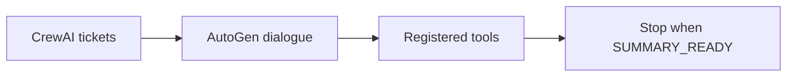
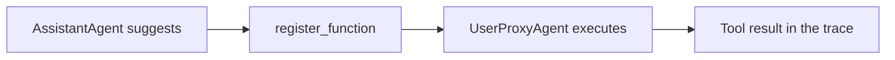
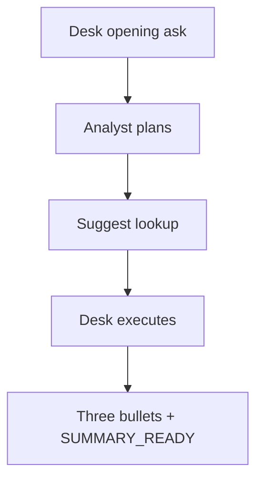

# AutoGen: Conversable Agents and Tool Use

## Context of This Session

In the **previous** session you upgraded a **CrewAI** Placement Brief Crew into a production-style workflow: **custom tools**, **process** choice, optional **memory**, a validation checklist, and **iteration** on one weak prompt.

This session adds a different unit of design. **AutoGen** treats agents as **conversable** partners in a dialogue. You delegate a **daily campus ops summary** to a pair: a desk runner and a stipend analyst, with **registered tools** and a clear **stop rule**.

**In this session, you will:**

- **Configure** an **AssistantAgent** and a **UserProxyAgent** with system messages and boundaries
- **Register** stipend and dispatch lookup functions with safe execution constraints
- **Run** agent-to-agent chat until an explicit **termination** condition is met
- **Read** the **conversation trace** to verify tool use and final-answer quality

---

## From Fixed Crew Tickets to Dialogue-Driven Delegation

Connecting sentence: CrewAI shines when research, write, and review are **tickets**. Morning ops often needs **ask, look up, follow up, stop**.

- **Official Definition:** The **conversable-agent model** is AutoGen’s pattern: agents send and receive messages in a loop until a **termination** condition fires.
- **In Simple Words:** Two colleagues on a work chat, not three folders on a conveyor.
- **Real-Life Example:** **Ananya** needs a **daily** stipend-and-dispatch summary for Prof. Meera Kulkarni at Greenfield Institute of Technology, Pune — not another four-section weekly brief.



**Need:** A weekly crew can feel heavy when Meera only asks, “Riverbank only — has Slack gone?” A pair can follow up without rewriting three tasks.

**Common doubt:** *“Does AutoGen replace CrewAI?”* — No. Crews remain strong for fixed handoffs. Pairs shine for **interactive delegation**.

### Activity — Pick the unit

Write one line: a job that still wants a **crew**, and one line: a job that wants a **conversable pair**.

---

## AssistantAgent and UserProxyAgent

Connecting sentence: A conversation still needs **job titles**. AutoGen names the two seats you will keep repeating.

- **Official Definition:** An **AssistantAgent** is an LLM-backed specialist that plans, replies, and may **suggest** registered tools. A **UserProxyAgent** is the user-side (or desk-side) agent that **starts** the task, may execute tools, and helps enforce stop rules.
- **In Simple Words:** Analyst thinks and asks for lookups. Desk runner starts the thread and presses approved buttons.
- **Real-Life Example:** Ananya (or a script standing in for her) posts the morning ask. The stipend analyst must not invent that Infosys owes eight students.

| Agent | Campus seat | Must do | Must not do |
|---|---|---|---|
| **UserProxyAgent** | Campus desk runner | Start the ask; run registered tools | Invent register rows |
| **AssistantAgent** | Stipend analyst | Plan, call tools, write the summary | Guess headcounts; run unregistered code |

**System messages** are the contracts. Weak: “Be helpful.” Strong: “Use lookup tools for every company status. Never invent a student count.”

**Common error:** Both agents writing the final summary. Roles blur and the trace becomes unreadable.

### Activity — Tighten one system message

Rewrite *“You are a helpful analyst”* in two sentences: campus setting, and one thing the analyst must **not** do.

---

## Register Functions and Optional Code Execution

Connecting sentence: A system message is a promise. **Registration** is the access card that makes the promise checkable.

- **Official Definition:** **`register_function`** connects a Python helper to a **caller** (who may suggest it) and an **executor** (who may run it), with a description the model sees.
- **In Simple Words:** Issue one swipe card. The analyst requests the lookup; the desk runner runs it.
- **Real-Life Example:** `lookup_stipend_status("Nimbus Analytics")` may return eight delayed students. `lookup_stipend_status("Infosys")` must return `UNKNOWN_COMPANY`, not a guessed row.



**This lab’s tools:**

| Function | Returns | Fail honestly |
|---|---|---|
| `lookup_stipend_status(company)` | Delayed count and last HR reminder | `UNKNOWN_COMPANY` |
| `lookup_dispatch_queue()` | Trainer Slack and second-reminder status | Never invent “sent” |

- **Official Definition:** **Code execution** on a UserProxyAgent means that agent may run generated Python (`code_execution_config`).
- **In Simple Words:** Letting the desk runner execute whatever code the analyst writes.
- **Real-Life Example:** Useful later for a chart. Dangerous on a shared campus key. **This lab sets it off.**

**Need:** Unregistered “tools” are just hallucinations. If the trace shows a headcount with **no** tool result, the answer is not grounded.

**Common error:** Registering tools with the same agent as caller and executor while also enabling free-form code. Keep **caller ≠ executor** here, and keep code execution **False**.

### Activity — Who swipes?

If the analyst suggests `lookup_dispatch_queue`, who must speak next in a safe pair — analyst or desk runner?

---

## Termination Conditions

Connecting sentence: Tools answer *how* facts arrive. **Termination** answers *when the chat is allowed to stop*.

- **Official Definition:** A **termination condition** is an explicit rule (`is_termination_msg`, a keyword, a structured phrase, or a turn cap) that ends the agent-to-agent loop.
- **In Simple Words:** The meeting alarm plus a “minutes ready” stamp.
- **Real-Life Example:** The analyst ends with `SUMMARY_READY` after a three-line daily summary. Without that, the pair may keep rephrasing “please review.”

| Stop design | Use when |
|---|---|
| Keyword (`TERMINATE` / `SUMMARY_READY`) | Success is a short, obvious phrase |
| Structured last line | You want a machine-readable close |
| Max turns (pair round limit) | Safety net if the keyword never appears |

**Logic:** CrewAI stopped when the **task list** finished. AutoGen stops when **you** say the job is done. If you never say it, the dialogue can run until money or patience runs out.

**Common error:** Checking only for `TERMINATE` while the analyst writes “done” in plain English. The loop continues. Put the exact phrase in the system message.

### Activity — Write the stamp

Write the last two lines you want in a successful daily summary, including the keyword you will search for.

---

## Lab Setup

Connecting sentence: Same secret habit as CrewAI: the key lives in `.env`, not in the script.

Create folder `campus_ops_pair`. Inside it, `.env` (do **not** commit):

```text
OPENAI_API_KEY=your_openai_key_here
```

Install:

```bash
pip install ag2 python-dotenv
```

`ag2` is the maintained AutoGen package family that still exposes `AssistantAgent`, `UserProxyAgent`, and `register_function`.

If the classroom model name differs, change only the `model` string inside `llm_config`.

---

## Bounded Scenario — Daily Stipend and Dispatch Summary

Connecting sentence: The fence is an in-memory register — the training-wheels version of a campus **REST endpoint** or internal lookup. No live web.

Keep this data **inside** the script as `STIPEND_REGISTER` and `DISPATCH_QUEUE`. Companies on file: **Nimbus Analytics** (8 delayed, HR reminder 4 August) and **Riverbank Retail** (6 delayed, same reminder). Trainer Slack: **not sent**. Second HR reminder: **pending**.

**Goal of the run:** One daily ops summary: who is delayed, what dispatch is pending, one recommended action. Stop with `SUMMARY_READY`.

This continues Campus Ops Inbox: n8n routed complaints; CrewAI wrote the weekly faculty brief; this pair answers Meera’s **morning** question.

---

## Full Pair Script

Connecting sentence: The register is the fence. The script is the pair: analyst, desk runner, two registered tools, one stop rule.

Save as `campus_ops_pair.py` in the same folder as `.env`.

```python
# campus_ops_pair.py — AutoGen conversable pair for a daily campus ops summary
import os  # read OPENAI_API_KEY from the environment
from dotenv import load_dotenv  # load .env into environment variables
from autogen import AssistantAgent, UserProxyAgent, register_function  # AutoGen pair building blocks

load_dotenv()  # read the API key before any model call
API_KEY = os.getenv("OPENAI_API_KEY", "")  # empty string if missing

llm_config = {  # shared LLM settings for the specialist
    "config_list": [  # one endpoint entry
        {"model": "gpt-4o-mini", "api_key": API_KEY},  # classroom OpenAI model
    ],  # end config_list
    "temperature": 0.2,  # steady facts for a daily desk
}  # end llm_config

STIPEND_REGISTER = {  # bounded company rows — not a live HTTP API
    "nimbus analytics": {"students": 8, "status": "delayed", "last_hr": "4 August"},  # file-backed row
    "riverbank retail": {"students": 6, "status": "delayed", "last_hr": "4 August"},  # file-backed row
}  # end register

DISPATCH_QUEUE = {  # bounded dispatch board
    "trainer_slack": "not sent",  # Campus Ops Inbox has not pinged trainers
    "second_hr_reminder": "pending",  # second company HR mail not yet sent
}  # end dispatch queue


def lookup_stipend_status(company: str) -> str:  # tool 1 — company stipend row
    """Return stipend status for one company from the campus register."""  # agent-facing description
    key = company.strip().lower()  # normalise the company name
    row = STIPEND_REGISTER.get(key)  # lookup or None
    if not row:  # unknown company
        return f"UNKNOWN_COMPANY:{company}"  # honest miss
    return (  # human-readable card
        f"company={company}; students={row['students']}; status={row['status']}; last_hr={row['last_hr']}"  # card
    )  # end return


def lookup_dispatch_queue() -> str:  # tool 2 — pending campus dispatch
    """Return the current trainer Slack and HR reminder dispatch flags."""  # agent-facing description
    return (  # no arguments — whole board
        f"trainer_slack={DISPATCH_QUEUE['trainer_slack']}; "  # slack flag
        f"second_hr_reminder={DISPATCH_QUEUE['second_hr_reminder']}"  # hr flag
    )  # end return


def is_done(message) -> bool:  # termination helper
    content = (message.get("content") or "") if isinstance(message, dict) else str(message)  # read text safely
    upper = content.upper()  # case-insensitive
    return ("SUMMARY_READY" in upper) or ("TERMINATE" in upper)  # success stamp or explicit stop


analyst = AssistantAgent(  # specialist who may suggest tools
    name="StipendAnalyst",  # unique name in the trace
    system_message=(  # responsibility boundary
        "You are the GIT Pune stipend analyst for Ananya's Campus Ops Inbox. "  # campus seat
        "For every company status you must call lookup_stipend_status. "  # tool rule
        "For dispatch you must call lookup_dispatch_queue. "  # second tool
        "Never invent student counts or claim Slack was sent. "  # accuracy fence
        "Write a daily summary with three short bullets, then the line SUMMARY_READY. "  # stop stamp
        "Do not run code. Do not mention companies that returned UNKNOWN_COMPANY except as unknown."  # honest miss
    ),  # end system message
    llm_config=llm_config,  # model config
)  # end analyst

desk = UserProxyAgent(  # starter + tool executor
    name="CampusDeskRunner",  # unique name
    human_input_mode="NEVER",  # fully automatic demo
    code_execution_config=False,  # optional code execution stays OFF
    is_termination_msg=is_done,  # stop on SUMMARY_READY or TERMINATE
)  # end desk

register_function(  # wire stipend lookup
    lookup_stipend_status,  # Python function
    caller=analyst,  # who may suggest
    executor=desk,  # who may run
    description="Look up internship stipend status by company name.",  # model-facing help
)  # end register stipend

register_function(  # wire dispatch lookup
    lookup_dispatch_queue,  # Python function
    caller=analyst,  # who may suggest
    executor=desk,  # who may run
    description="Look up trainer Slack and second HR reminder flags.",  # model-facing help
)  # end register dispatch


def print_trace(chat_result):  # quality-review helper
    print("=== CONVERSATION TRACE ===")  # banner
    messages = chat_result.chat_history if hasattr(chat_result, "chat_history") else []  # AutoGen history
    if not messages and hasattr(desk, "chat_messages"):  # fallback to agent store
        stored = desk.chat_messages.get(analyst, [])  # pair transcript
        messages = stored  # use stored list
    for i, msg in enumerate(messages, start=1):  # numbered turns
        name = msg.get("name") or msg.get("role") or "unknown"  # speaker label
        content = str(msg.get("content") or "")[:240]  # short preview
        print(f"{i}. [{name}] {content}")  # one line per turn
    print("=== END TRACE ===")  # footer


if __name__ == "__main__":  # run only when executed directly
    if not API_KEY:  # fail clearly
        raise ValueError("Set OPENAI_API_KEY in .env")  # setup reminder
    opening = (  # delegated morning task
        "Prepare this morning's campus ops summary for Prof. Meera Kulkarni. "  # daily ask
        "Cover Nimbus Analytics and Riverbank Retail stipend delays, "  # two companies
        "then dispatch status, then one recommended next action. "  # dispatch plus action
        "Use tools. Do not guess."  # no hallucination
    )  # end opening
    result = desk.initiate_chat(analyst, message=opening)  # start the pair dialogue
    print_trace(result)  # review tool use and stop reason
```

**How the code works:**

- `AssistantAgent` holds the analyst **system message**. `UserProxyAgent` starts the chat and **executes** tools.
- `register_function` sets **caller=analyst** and **executor=desk**. Suggestions and runs stay on different seats.
- `code_execution_config=False` is the optional-code decision for this campus desk: lookups only, no generated scripts.
- `is_done` looks for `SUMMARY_READY` or `TERMINATE`. That is the **termination condition**.
- `print_trace` is how you verify the analyst did not invent a row. No tool line in the trace means the summary is untrusted.

Run:

```bash
python campus_ops_pair.py
```

| Symptom | Likely cause | Fix |
|---|---|---|
| Auth error | Missing key | `.env` + `load_dotenv()` |
| Endless rephrasing | Keyword never emitted | Repeat `SUMMARY_READY` in the system message |
| Invented Infosys count | Tool not called | Trace: must show `lookup_stipend_status` |
| Code-exec warning | Config left on | Keep `code_execution_config=False` |
| Import error | Wrong package | `pip install ag2 python-dotenv` |

---

## Analyse the Conversation Trace

Connecting sentence: A polished final paragraph is not evidence. The **trace** is.

- **Official Definition:** A **conversation trace** is the ordered record of messages, tool suggestions, tool results, and the close signal.
- **In Simple Words:** CCTV of the work chat.
- **Real-Life Example:** If the summary says “Slack already sent” but `lookup_dispatch_queue` returned `not sent`, the **analyst** ignored the tool — not “AutoGen failed.”

**Read in this order:**

1. Did the analyst **suggest** both tools (or clearly cover both companies plus dispatch)?
2. Did the **desk runner** execute them (tool results visible)?
3. Did the loop **stop** because of `SUMMARY_READY`, not because you hit Ctrl+C?
4. Does the final summary match the tool cards (8 and 6; Slack not sent)?



### Activity — Trace detective

After your run, write one sentence: *Tool use was visible / not visible because…*

### Activity — Follow-up without a new crew

Change the opening message to: *Riverbank Retail only.* Predict: one stipend lookup, still one dispatch lookup, still `SUMMARY_READY`. That is why a **pair** fits daily ops.

---

## A Healthy Trace vs a Guessing Trace

Connecting sentence: After one successful run, lock what “good CCTV” looks like so the next failure is obvious.

| Turn (typical) | Speaker | What good looks like |
|---|---|---|
| 1 | CampusDeskRunner | Morning ask for Meera; names both companies |
| 2 | StipendAnalyst | Plans; suggests `lookup_stipend_status` |
| 3 | CampusDeskRunner | Tool result with students=8 or 6 |
| 4–6 | Pair | Second company + `lookup_dispatch_queue` |
| Last | StipendAnalyst | Three bullets + **SUMMARY_READY** |

| Trace smell | What it usually means | First fix |
|---|---|---|
| Final paragraph, zero tool lines | Analyst guessed | Strengthen “must call lookup” in the system message |
| Tool suggested, never executed | Caller/executor mix-up | `caller=analyst`, `executor=desk` |
| Chat fades without a stamp | Weak termination | Repeat `SUMMARY_READY` in the system message |
| Infosys has a headcount | Hallucinated row | Probe `UNKNOWN_COMPANY`; forbid treating it as delayed |

**Logic:** CrewAI taught you to open **three files**. AutoGen teaches you to open the **trace**. Same professional habit: do not grade only the last paragraph.

### Activity — Score this fake trace

A summary says “Nimbus 8 delayed, Slack sent.” Dispatch tool returned `trainer_slack=not sent`. Which failed — tool registration, or the analyst ignoring the tool result?

---

## Crew Tickets vs a Conversable Pair

Connecting sentence: You now have two design units in this module. Choose on purpose.

| When the job looks like… | Prefer |
|---|---|
| Research notes → draft → review every Monday | **CrewAI** sequential (or hierarchical) crew |
| Meera asks a follow-up before lunch | **AutoGen** pair with registered lookups |
| You need a Driven-by table for faculty | Crew artifacts (`output_file`) |
| You need to see *when* a lookup ran | Pair **conversation trace** |

Ananya’s week can use **both**. Weekly faculty brief stays a crew. Daily “has Slack gone?” is a pair. Do not force every campus question through three tasks.

### Activity — Label Ananya’s requests

For each request, write **crew** or **pair**: (1) four-section weekly brief, (2) “Riverbank only — dispatch status”, (3) re-run after an accuracy FAIL on Infosys.

---

## Safe Execution Constraints — A Desk Policy

Connecting sentence: Registration is not only wiring. It is a **policy** you can say aloud in the placement cell.

Keep this four-line policy next to the script:

1. Only **named** Python functions are tools — stipend lookup and dispatch lookup.
2. The **analyst** may suggest; the **desk** may run. Do not swap those seats without a reason.
3. **Code execution** stays off. A daily summary does not need generated Python.
4. Unknown companies return **UNKNOWN_COMPANY**. The summary may list them as unknown, never as delayed employers.

**When would you turn code execution on?** A later product that must draw a chart from the register. Even then, constrain the working directory and never paste keys into generated code. This lab does not need that power.

**Common doubt:** *“Can I register a live HTTP lookup?”* — Yes, later, as a small Python function that calls a campus **REST endpoint** and returns a **JSON packet**. The AutoGen wiring stays the same: caller suggests, executor runs, trace shows the packet. Do not add a live URL until the local register pair is clean.

### Activity — Policy yes/no

Should the analyst receive `code_execution_config` with a shell? **No.** Should a future `lookup_stipend_status` call an internal register URL and return JSON text? **Yes**, once the pair habit works.

---

## What “Good” Looks Like on This Pair

A successful delegated run has all of the following:

- Trace names **StipendAnalyst** and **CampusDeskRunner**
- At least one stipend lookup and one dispatch lookup appear
- `UNKNOWN_COMPANY` if you probe Infosys — and that name is not treated as a delayed employer
- Final bullets stay inside tool results
- Chat ends with **SUMMARY_READY** (or `TERMINATE`)

**Upcoming** work scales this pair into a **group chat** with research, risk, and messaging specialists. This session’s job is a **controlled two-agent loop**.

### Activity — Reliability checklist

Tick each box after your run:

| # | Check | Done? |
|---|---|---|
| 1 | System messages name campus seats and fences | |
| 2 | Two functions registered with caller ≠ executor | |
| 3 | Code execution is off | |
| 4 | Trace shows stipend and dispatch lookups | |
| 5 | Infosys probe would return UNKNOWN_COMPANY | |
| 6 | Chat ended with SUMMARY_READY | |
| 7 | Final bullets match tool cards (8, 6, Slack not sent) | |

If any box is empty, name **system message**, **registration**, or **termination** — then change only that layer.

Connecting sentence: A pair that looks fluent but fails row 4 is still a guessing chatbot. Row 4 is the professional standard.

### Activity — Probe an unknown company

Add one sentence to the opening message: *Also check Infosys.* Predict the tool return. The daily summary may say Infosys is **unknown**, not “8 students delayed.”

---

## If Kickoff-Style Chat Fails

Connecting sentence: Fix the layer that failed. Do not add a third agent to “help.”

The pair is not a crew. A third novelist will not repair a missing `SUMMARY_READY` or a swapped executor.

Read the terminal from the top: import errors first, then auth, then missing tool lines, then missing stamps. That order saves you from rewriting a system message when the key was empty.

**Common error:** Copying CrewAI `kickoff` vocabulary into AutoGen. Here the start button is **`initiate_chat`**. The stop button is **`is_termination_msg`**. The evidence file is the **trace**, not `output/03_final_brief.md`.

### Activity — Translate the nouns

Write the AutoGen name for each CrewAI habit: (1) kickoff, (2) output artifact, (3) tool on one agent only. Suggested: initiate_chat; conversation trace; register_function with a single caller.

---

## Key Takeaways

- **AutoGen** conversable pairs delegate work through **dialogue**, not only through a fixed CrewAI task list.
- Split seats: **AssistantAgent** reasons and suggests; **UserProxyAgent** starts the job and **executes** registered tools.
- **`register_function`** plus **termination** (`SUMMARY_READY`) and **code execution off** keep the campus desk inspectable and bounded.
- Judge quality from the **conversation trace**: tool calls, honest misses, and the real stop reason.

These habits — clear system messages, registered tools, and a designed stop — are what you will reuse when more than two specialists must share one room in **upcoming** sessions.

---

## Important Commands, Libraries, and Terminologies Used

| Term / Command | Type | Meaning |
|---|---|---|
| **AutoGen / ag2** | Framework | Conversable multi-agent library |
| **Conversable-agent model** | Pattern | Agents chat until a stop rule fires |
| **AssistantAgent** | Class | LLM specialist; may suggest tools |
| **UserProxyAgent** | Class | Starts the task; may execute tools |
| **System message** | Field | Role, limits, and stop phrase |
| **register_function** | Call | Caller suggests; executor runs |
| **Caller / executor** | Roles | Who proposes a tool vs who runs it |
| **Code execution** | Optional | UserProxy running generated Python — **off** here |
| **Termination condition** | Rule | `is_termination_msg` / keyword |
| **SUMMARY_READY** | Keyword | Success stamp for this lab |
| **Conversation trace** | Evidence | Ordered messages and tool results |
| **initiate_chat** | Method | Desk starts dialogue with the analyst |
| **UNKNOWN_COMPANY** | Tool result | Honest miss from the register |
| `pip install ag2 python-dotenv` | Command | Install AutoGen family and `.env` loader |
| `python campus_ops_pair.py` | Command | Run the daily ops pair |
