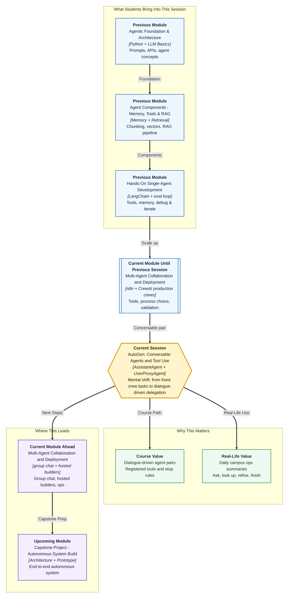

# Pre-read: AutoGen — Conversable Agents and Tool Use

## Context of This Session in the Course

---

**Ananya** opens the Campus Ops Inbox at 8:40 a.m. on the Bengaluru–Pune training campus. Prof. Meera Kulkarni at Greenfield Institute of Technology, Pune, does not want another weekly faculty brief. She wants a **daily ops summary**: which internship stipends are still delayed, what reminder has already gone to company HR, and whether trainer Slack has been dispatched.

The **previous** session gave her a production-style **CrewAI** crew — custom tools, a process she could defend, a checklist, one targeted fix. That model is excellent when the job is a **fixed ticket list**: research, then write, then review.

Daily ops is messier. Some mornings Meera asks a follow-up: “Also check Riverbank only.” Some mornings a lookup returns `UNKNOWN_COMPANY` and the analyst must try the other tool. Some mornings the desk should **stop** the moment a reliable three-line summary appears — not after every pre-written task has fired.

Ananya does not need another rigid pipeline every dawn. She needs a **working conversation** between two focused partners: one who states the campus request, and one who can think, use **approved** lookups, and reply until the job is truly done.

That is where **AutoGen** enters — not as a replacement for every CrewAI habit you have, but as a way to build **conversable agent pairs** that delegate work through dialogue.

---

## When a fixed team brief is not enough

Picture a team lead and an analyst on an internal chat thread. The lead posts: “Give me today’s delayed stipends and one dispatch action.” The analyst plans, calls the register, shares an interim finding, and asks if Pune or Bengaluru dispatch is in scope. The lead says, “Pune placement cell only.” The analyst uses the approved tool again, updates the answer, and sends a final summary. The thread ends when a **completion signal** appears — not because the chat randomly stopped.

A single chatbot can talk fluently and still invent that Infosys owes eight students. A rigid crew can feel heavy for a small delegated job. A dialogue between two agents can become **endless** if nobody defines who does what and **when to stop**.

---

## The challenge we will tackle

What if you had to hand one delegated campus task to a specialist agent, let it use approved stipend and dispatch lookups during a back-and-forth conversation, and stop cleanly only when explicit success rules are met — without the conversation running forever or guessing when to finish?

This session focuses on that design problem using AutoGen’s **conversable-agent model**.

---

## Two agents, one delegated workflow

AutoGen treats agents as **participants in a conversation**, not only as static role cards on a CrewAI task board.

| Agent type | Simple role | What it typically does |
|---|---|---|
| **AssistantAgent** | The specialist | Plans, reasons, replies, and can call **registered** tools when extra ability is needed |
| **UserProxyAgent** | The delegate or human stand-in | Starts the request, can guide the exchange, optionally runs code, and helps control when the run ends |

In simple Indian English, a **conversable agent** is an AI participant that can send messages, receive replies, and continue until a defined stop point. **Conversable** means “able to hold a structured conversation.”

The power comes from pairing them with boundaries:

1. **System messages** — Initial instructions for tone, limits, and responsibility. Example: the analyst must use lookup tools for stipend status, not guess.
2. **Registered tools** — Approved helper functions the assistant may invoke. Safer than open-ended freedom.
3. **Termination conditions** — Explicit rules for when the conversation should end. A final keyword, a success phrase, or a maximum number of turns.
4. **Optional code execution** — In some setups, the user-side agent can run code. Powerful, so this lab keeps it **off** unless a later product truly needs it.

Together, these pieces turn “two agents chatting” into a **delegated task workflow** you can inspect.

---

## A manager and an analyst on work chat

Keep the campus story primary. The **manager–analyst** picture is only the analogy.

| Work-chat behaviour | AutoGen idea | Campus mapping |
|---|---|---|
| Team lead states the job | UserProxyAgent starts the delegated task | Ananya / desk runner posts the morning ask |
| Analyst thinks and fetches data | AssistantAgent reasons and uses registered tools | Stipend analyst looks up Nimbus and Riverbank |
| Approved internal systems only | Safe **register_function** with constraints | Register lookup and dispatch lookup — nothing else |
| “Done — please review” | **Termination condition** | `SUMMARY_READY` or `TERMINATE` |
| Saved chat for audit | **Conversation trace** | Who spoke, which tool ran, what came back |

Once you see it this way, AutoGen is not “more chat for chat’s sake.” It is a **controlled dialogue loop** where responsibility, tool access, and stopping rules are designed on purpose.

---

## Why registration and termination matter

Giving an agent tools is like giving a new employee access cards. If everyone gets every card, confusion and risk increase. If the right person gets the right access, work becomes focused.

**Registering a function** means officially connecting a helper — fetch stipend status, check the dispatch queue — so the assistant can call it during the conversation under defined rules. The agent should not silently invent tool results. The trace should show **when** a tool was called and **what** came back.

**Termination conditions** solve the second common failure: endless loops. Without them, two agents keep agreeing, rephrasing, or chasing minor details. With them, the workflow knows when success has been reached.

Professionals do not only ask, “Did it answer?” They ask, “Did it use the right tools, stop at the right time, and leave a trace I can verify?”

---

## Read the conversation trace like a quality reviewer

After a run finishes, the **conversation trace** is your evidence file: messages, tool calls, intermediate reasoning, and the final response.

A strong trace helps you answer:

- Did the assistant **use a tool** when live register data was needed, or did it guess a headcount?
- Did the user-side agent **stay within its boundary**, or did roles blur?
- Did the exchange **stop for the right reason**, or too early, or too late?
- Is the **final summary** supported by the tool outputs shown in the trace?

This habit connects to the evaluation mindset you built with CrewAI checklists. Multi-agent systems become trustworthy when their behaviour is **observable**.

---

## How this fits with what you already know

You already understand tools, specialist roles, and validation. CrewAI remains strong when **roles, tasks, and process order** are the main design unit. AutoGen conversable pairs shine when the task benefits from **interactive delegation** — ask, tool-use, follow-up, refine, finish.

**Upcoming** work extends this idea from pairs to **group conversations** with multiple specialists. Mastering the pair model first gives you a clean foundation.

---

In this pre-read, you'll discover:

- **Understand** how conversable agent pairs delegate a campus ops task through dialogue instead of only fixed task lists
- **Discover** why **AssistantAgent** and **UserProxyAgent** need clear system messages and responsibility boundaries
- **Learn** how **registered tools** give safe, inspectable abilities during an agent-to-agent run
- **Understand** why **termination** and **conversation traces** separate a useful workflow from an endless or unreliable chat

---

## What's next

After this session, you should be able to explain an AutoGen delegated workflow in everyday language: which agent plans and uses tools, which agent represents the user side, and why both need explicit instructions.

You will also be able to discuss **safe tool access** — which functions are registered, why constraints matter, and when optional code execution is appropriate (and why this lab keeps it off). You will be able to explain **termination design**: what signal tells the system the job is complete, and what happens if that signal never appears.

Most importantly, you will review a **conversation trace** like a professional. Instead of trusting a polished final paragraph, you will check whether tools were used correctly, roles stayed clear, and the workflow stopped for the right reason.

---

## Questions to think about before class

1. For Ananya’s daily stipend-and-dispatch summary, how would you divide responsibility between the **assistant-side** analyst and the **user-side** desk runner so roles do not overlap?

2. Which **tools** should be registered for campus lookup — and what could go wrong if the assistant is allowed to call unregistered or unsafe functions, or to run free-form code?

3. What **termination condition** would you choose — a keyword, a structured final message, a round limit, or a combination — and why?

4. If the final answer looks correct but the **trace** shows no tool calls for live register data, what would you change first: the system message, tool registration, or termination setup?

By the end, AutoGen should feel less like “two chatbots talking” and more like a **designed delegation system** — conversable agents, registered tools, and controlled termination turning dialogue into dependable morning work for the placement cell.
