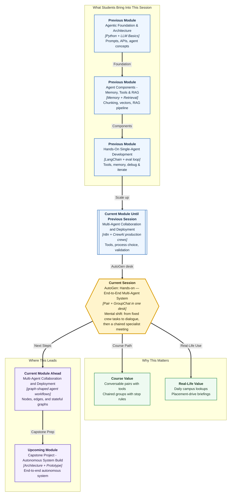

# Pre-read: AutoGen: Hands-on — End-to-End Multi-Agent System

## Context of This Session in the Course

---

**Ananya** opens the Campus Ops Inbox at 8:40 a.m. on the Bengaluru–Pune training campus. Prof. Meera Kulkarni at Greenfield Institute of Technology, Pune, does not want another weekly faculty brief. She wants a **daily ops summary**: which internship stipends are still delayed, what reminder has already gone to company HR, and whether trainer Slack has been dispatched.

Some mornings that is enough. This week it is not. The institute is also launching a **campus stipend-status tracker** during a **placement drive**. The same facts must become one packet: known internship evidence, **policy fences**, and student-facing copy. Three separate documents that nobody reconciled is how Infosys appears in a cheerful notice.

The **previous** session gave Ananya a production-style **CrewAI** crew — custom tools, a process she could defend, a checklist, one targeted fix. That model is excellent when the job is a **fixed ticket list**: research, then write, then review.

Daily ops is messier. Meera may ask, “Also check Riverbank only.” A lookup may return `UNKNOWN_COMPANY`. The desk should **stop** the moment a reliable summary appears. And when the job grows into a drive briefing, three specialists must share **one** thread with a chair — not a WhatsApp group with no admin.

That is where **AutoGen** enters — not as a replacement for every CrewAI habit, and not as two separate products. It is one **dialogue desk**: a **conversable pair** with approved lookups, then a **group chat** when research, risk, and messaging must hand work across.

---

## When a fixed team brief is not enough

Picture a team lead and an analyst on an internal chat. The lead posts: “Give me today’s delayed stipends and one dispatch action.” The analyst plans, calls the register, and sends a final summary when a **completion signal** appears.

Now picture the same morning an hour later. Meera wants a page faculty can read before the drive, with risk fences visible. The researcher must not write the poster. The messenger must not answer a legal question. Someone must **call the next speaker** and ring a **bell** so the meeting cannot run forever.

A single chatbot can talk fluently and still invent that Infosys owes eight students. A rigid crew can feel heavy for a small delegated job. A pair with no chair is noisy when three experts must contribute **distinct** slices. A group with no stop rule is an endless meeting.

---

## The challenge we will tackle

What if you had to hand one delegated campus task to a specialist pair, let it use approved stipend and dispatch lookups, stop cleanly on an explicit stamp — and then, the same morning, bring three specialists into a shared conversation with speaker rules and a round cap so the campus ships **one** trustworthy briefing?

This session focuses on that **end-to-end** design problem using AutoGen’s conversable-agent model **and** group orchestration.

---

## Two agents, then a chaired room

AutoGen treats agents as **participants in a conversation**, not only as static role cards on a CrewAI task board.

| Piece | Simple role | What it typically does |
|---|---|---|
| **AssistantAgent** | The specialist | Plans, reasons, replies, and can suggest **registered** tools |
| **UserProxyAgent** | The delegate or desk runner | Starts the request, can run tools, and helps control when the run ends |
| **GroupChat** | The shared room | Keeps every specialist contribution in one traceable thread |
| **GroupChatManager** | The chair | Applies flow and stop rules so the meeting stays structured |

In simple Indian English, a **conversable agent** is an AI participant that can send messages, receive replies, and continue until a defined stop point. **Orchestration** means managing turn-taking so a group stays purposeful instead of chaotic.

The power comes from pairing those pieces with boundaries:

1. **System messages** — Seat, limits, and stop phrase. Example: the analyst must use lookup tools; messaging must not invent companies.
2. **Registered tools** — Approved helpers (`register_function`) with a **caller** who may suggest and an **executor** who may run. Safer than open-ended code.
3. **Termination conditions** — A keyword (`SUMMARY_READY` / `BRIEF_READY`), a success phrase, or a maximum number of turns.
4. **Speaker selection and max rounds** — Who speaks next, and the bell that stops runaway dialogue.

Optional **code execution** and always-on **human input** exist in AutoGen. This lab keeps code execution **off** and the demo automatic, so you can see tools and handoffs clearly.

Together, these pieces turn “agents chatting” into a **delegated workflow** you can inspect.

---

## A work chat that can grow into a round-table

Keep the campus story primary. The **manager–analyst** picture and the **chairperson** picture are only analogies.

| Behaviour | AutoGen idea | Campus mapping |
|---|---|---|
| Desk states the morning job | UserProxyAgent starts the task | Ananya posts the ask |
| Analyst fetches data | AssistantAgent + registered tools | Stipend lookup; dispatch lookup |
| “Done — please review” | Termination condition | `SUMMARY_READY` on the pair |
| Shared discussion room | GroupChat | One briefing thread |
| Chair calling the right expert | Speaker selection | Research → risk → messaging |
| Meeting cannot continue forever | Max rounds | `max_round` plus `BRIEF_READY` |
| Saved chat for audit | Conversation trace | Who spoke, which tool ran, what came back |

Once you see it this way, AutoGen is not “more chat for chat’s sake.” It is a **controlled dialogue loop** that can stay a pair or become a chaired specialist meeting — by design.

---

## Why registration, termination, and a chair matter

Giving an agent tools is like giving a new employee access cards. If everyone gets every card, confusion and risk increase.

**Registering a function** means officially connecting a helper so the assistant can call it under defined rules. The agent should not silently invent tool results. The trace should show **when** a tool was called and **what** came back.

**Termination conditions** solve endless loops. Without them, two agents keep agreeing or chasing minor details.

**Speaker selection** and **max rounds** solve the two most common group failures: **wrong speaker** (the messenger answers a policy question) and **runaway dialogue** / **repetition deadlock** (the same Nimbus paragraph four times). The fix usually lives in **configuration** — the ladder, the role text, or the round cap — not in a new framework.

Professionals do not only ask, “Did it answer?” They ask, “Did it use the right tools, did the right specialist speak, did it stop at the right time, and is there a trace I can verify?”

---

## How this fits with what you already know

You already understand tools, specialist roles, and validation. CrewAI remains strong when **roles, tasks, and process order** are the main design unit. AutoGen conversable pairs shine when the task benefits from **interactive delegation**. AutoGen groups shine when **different experts must contribute in sequence** under a chair.

Do not force every campus question through three CrewAI tasks. Do not put three novelists in a GroupChat for a yes/no dispatch question.

**Upcoming** work draws the same kind of workflow as a **graph**: nodes and edges instead of a chat chair. Mastering seats, tools, stop rules, and traces here gives you a clean foundation.

---

In this pre-read, you'll discover:

- **Understand** how conversable AutoGen agents — with clear system messages — form both a two-seat pair and specialist group members
- **Discover** why **registered tools**, a **caller/executor** split, and an explicit **termination** stamp turn a pair into a delegated lookup you can inspect
- **Learn** how **GroupChat**, **speaker selection**, and **max rounds** let three specialists finish one briefing with distinct sub-results
- **Understand** how to read a **conversation trace** and apply one configuration fix for missing tools, wrong speaker, deadlock, or a missing stop stamp

---

## What's next

After this session, you should be able to explain an AutoGen campus desk in everyday language: which agent plans and uses tools, which agent represents the user side, when two seats are enough, and when you need a chair.

You will also be able to discuss **safe tool access**, **termination design**, and **orchestration choices**: which speaker ladder fits a briefing, why a round limit is necessary, and what the trace must show before you trust the last paragraph.

Most importantly, you will review a run like a professional. Instead of saying “the chat failed,” you will name the layer — system message, registration, stop rule, or speaker / round cap — and change only that.

---

## Questions to think about before class

1. For Ananya’s daily stipend-and-dispatch summary, how would you divide responsibility between the **assistant-side** analyst and the **user-side** desk runner so roles do not overlap — and what extra seats would you add for a drive briefing?

2. Which **tools** should be registered for campus lookup, who should **execute** them, and what **termination** stamp would you choose so the pair cannot talk forever?

3. For a placement-drive group with research, risk, and messaging, how would you define **speaker selection** and **max rounds** so messaging still gets a turn?

4. If the final answer looks correct but the **trace** shows no tool calls — or messaging spoke first — what would you change first, and why is that a configuration issue rather than “AutoGen is broken”?

By the end, AutoGen should feel less like “chatbots talking” and more like a **designed campus desk** — conversable agents, registered tools, a chair when you need one, and traces that make the morning work inspectable.
