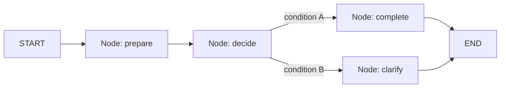

# Getting Started with LangGraph: Fundamentals & Setup

## Introduction

This session introduces **LangGraph**, the library used to run agent workflows as **graphs**.

**LangChain** is already in the stack. It wires **models**, **prompts**, **tools**, **memory**, and **RAG**. **LCEL** runs those pieces as a **chain** (prompt → model → parser). **AgentExecutor** can run a tool loop, but that loop is mostly hidden.

LangGraph does **not** replace LangChain. It sits **on top of** the same models and tools when the job is **control flow**: named steps, branches, loops you can inspect, and a shared **state** object.

### Why LangGraph when LangChain is already there

LangChain answers: *how do I call a model, a tool, or a retriever?*

LangGraph answers: *which step runs next, what is kept between steps, and how do I prove it?*

A chain is the right tool for a straight transform. It is the wrong tool when you must **branch**, **loop**, **audit**, or later **pause** a run.

**Common doubt:** *“Should every LCEL chain become a graph?”* — No. Keep LCEL for a pipeline with no fork. Add LangGraph when routing, shared state, or a visible tool cycle matter.

| Layer | What it gives you | What it does not give you |
|---|---|---|
| LangChain LCEL | Prompt → model → parser as a pipe | Named stations, Python gates, a shared notebook |
| LangChain AgentExecutor | A managed tool-calling loop | A map you can draw, branch, and trace by node |
| **LangGraph** | State, nodes, edges, cycles, traces | A new model vendor (it still uses ChatGroq and the same tools) |


### Problem LangGraph solves

- **Official Definition:** **Orchestration** is coordinated control of multi-step work so the correct step runs with the correct shared context.
- **In Simple Words:** A stage manager. The model is an actor, not the director.
- **Real-Life Example:** A clerk can fill a form. A supervisor still decides which counter is next. LangGraph is that supervisor in code.

Without a graph, typical failures look like this:

- You cannot say **which function** ran, only that “the agent answered”
- A **tool result** is swallowed and the model invents the missing fact
- A **policy rule** (missing id, money limit) lives only in a prompt and the model ignores it
- A **branch** (complete vs clarify) is buried inside one mega-function

LangGraph makes those facts **visible**: nodes write fields; **edges** choose the next node; a `trace` lists the hop order.

### Merits

- **Explicit map** — nodes and edges *are* the workflow, not a comment above a chain
- **Shared state** — several steps read and update one typed notebook
- **Python routing** — a gate the model cannot override by talking more
- **Visible cycles** — `assistant → tools → assistant` is on the graph, not inside AgentExecutor
- **Same LangChain pieces** — `ChatGroq`, `@tool`, messages; only the control plane changes
- **Room to harden** — checkpoints, human pause, retries attach to the same `StateGraph` later

### Demerits

- **More boilerplate** than one LCEL pipe (`StateGraph`, `add_node`, `compile`)
- **Easy mistakes** — forgetting a **reducer** overwrites lists; a cycle with no stop can spin
- **Over-splitting** — a node per line of code makes the map unreadable
- **Heavier debugging** than a chain’s single output; you must read `trace` / `stream`
- **Not the fastest path** for “one prompt in, one string out” with no branch

**Logic:** Pay the graph cost when control and audit matter. Do not pay it for a hello-chain.

### Real-life applications

These products need a graph, not a single chain:

- **Support and ticket desks** — extract fields → look up a record → Python policy → ticket or clarify
- **Approvals** — a high-value refund or payout pauses until a human stamps it
- **Document pipelines** — classify → retrieve policy → draft → quality gate → send or hold
- **Ops runbooks** — check a system, retry a flaky API, page a human if it still fails
- **Intake workflows** — missing identifiers take the clarify path; complete packs take the complete path

The same pattern appears in banking KYC, campus administration, and IT service desks. The lab in this session uses a **records lookup** so the graph objects stay easy to see.

**In this session, you will:**

- Justify LangGraph on top of LangChain (problem, merits, demerits, fit)
- Define **shared state** with **reducers** so lists accumulate instead of being overwritten
- Build a graph with **nodes**, **unconditional edges**, and one **conditional** branch
- Add an **LLM node** and a **tool node** in a **cycle**, then **trace** what ran

---

## What is LangGraph

LangGraph is not a new model provider. It is an **orchestration** library. The model still generates text or tool calls. LangGraph decides **which function runs**, **in what order**, and **what data is kept**.

- **Official Definition:** **LangGraph** is a framework for building stateful, multi-step agent workflows as graphs of nodes, edges, and shared state.
- **In Simple Words:** You draw a runnable map. Each box is a function. A notebook travels with the run.
- **Real-Life Example:** A printed office flowchart that the software actually follows, not a slide that nobody executes.

**Need:** One long prompt hides *which* step ran and *why* control moved. A graph makes those facts visible in code.



---

## Building Blocks

Four objects make every LangGraph program. Learn the names before the first `pip` command.


### State

- **Official Definition:** **State** is the typed shared data that every node can read and that nodes update by returning a dictionary of changes.
- **In Simple Words:** The notebook for one run.
- **Real-Life Example:** A case file that moves from desk to desk. Each desk writes only its fields.

Keep state **small**. Each field should have one job (`request`, `result`, `trace`). Do not dump the whole universe into one string.

### Node

- **Official Definition:** A **node** is a function that receives the current state and returns a **partial update** (a dict of fields to change).
- **In Simple Words:** One station. One bounded job.
- **Real-Life Example:** “Verify ID” is a station. “Verify ID, print letter, and email accounts” is three jobs stuffed into one desk.

Name nodes as **verb + object**: `clean_request`, `route_request`, `write_result`.

**Common error:** A node that both calls an API *and* decides three different next stations. Split: one node writes a flag; an **edge** chooses the next node.

### Edge

- **Official Definition:** An **edge** (transition) moves execution from one node to another. It is **unconditional** (always) or **conditional** (a router function chooses the next node name).
- **In Simple Words:** The track between stations.
- **Real-Life Example:** After document check, complete papers go to the next counter; incomplete papers go back to the help desk.

### Graph

- **Official Definition:** A **`StateGraph`** is the builder that registers state, nodes, and edges. **`compile()`** produces a runnable app. **`invoke`** runs it once. **`stream`** yields updates as nodes finish.
- **In Simple Words:** You assemble the map, compile it, then run it.
- **Real-Life Example:** Publishing a metro map, then running a single journey.

`START` and `END` are built-in terminals. You always enter from `START`. You finish at `END`.

---

## Setup

Install LangGraph next to the LangChain packages already used for models and tools.

```bash
pip install langgraph langchain-groq langchain-core python-dotenv
```

| Package | Role |
|---|---|
| `langgraph` | `StateGraph`, edges, compile, invoke |
| `langchain-core` | Messages, `@tool` |
| `langchain-groq` | `ChatGroq` — Groq chat model with tool calling |
| `python-dotenv` | Load `GROQ_API_KEY` from `.env` |

Create a `.env` file in the project folder (never commit the key):

```bash
GROQ_API_KEY=your_key_here
```

This session uses **`ChatGroq`** with `llama-3.3-70b-versatile`. Get a key from the Groq console. The graph code stays the same if a later lab swaps the chat class; only the model line changes.

---

## Shared State and Reducers

Nodes return **updates**, not a full copy of state. LangGraph **merges** those updates into the notebook.

For ordinary fields (`request`, `result`), the merge is **replace**: the new value overwrites the old one.

For lists such as `messages` or `trace`, replace is dangerous. The second node would wipe the first node’s list. You attach a **reducer**.

- **Official Definition:** A **reducer** is a merge function on a state field. LangGraph uses it to combine the old value with the node’s update.
- **In Simple Words:** “Append this item” instead of “throw away the old list.”
- **Real-Life Example:** A visitor log. Each desk adds a line. Nobody replaces the whole register with a single name.

LangGraph ships `add_messages` for chat histories. Python’s `operator.add` concatenates lists.


**Common error:** Using a reducer **and** returning `state["trace"] + ["this_node"]`. That appends twice. With `add`, return only the **new** items: `{"trace": ["this_node"]}`.

### Activity — Predict the merge

Field `trace` uses `operator.add`. Node A returns `{"trace": ["clean"]}`. Node B returns `{"trace": ["check"]}`.

What is `trace` after both nodes?

**Suggested answer:** `["clean", "check"]` — concatenated, not replaced.

If `trace` had **no** reducer and Node B returned `{"trace": ["check"]}`, the final value would be `["check"]` only.

---

## A First Graph: Nodes, Edges, and a Branch

The framework is now defined. The program below is a **minimal runnable graph**: clean text, apply a completeness rule, then branch to `complete` or `clarify`.

There is no LLM in this program. That is deliberate. First prove that **you** control routing in Python.

```python
from typing import Annotated, TypedDict  # typed state and reducer annotation
from operator import add  # list-concat reducer for the trace field
from langgraph.graph import StateGraph, START, END  # graph builder and terminals


class RequestState(TypedDict):  # shared notebook for one run
    request: str  # raw user text
    cleaned: str  # normalised text
    is_complete: bool  # Python rule: does the text include an id token
    result: str  # final user-facing message
    trace: Annotated[list[str], add]  # append-only list of node names


def clean_request(state: RequestState) -> dict:  # station 1: normalise input
    text = state["request"].strip()  # remove surrounding whitespace
    return {  # partial update only
        "cleaned": text.lower(),  # store a stable form for the rule
        "trace": ["clean_request"],  # reducer will append this name
    }


def check_complete(state: RequestState) -> dict:  # station 2: Python gate
    has_id = "id-" in state["cleaned"]  # demo rule: an id token must appear
    return {  # write the flag; do not choose the next node here
        "is_complete": has_id,  # True → complete path; False → clarify path
        "trace": ["check_complete"],  # append this station to the trace
    }


def write_complete(state: RequestState) -> dict:  # success station
    return {  # final message for a complete request
        "result": "Request accepted: " + state["cleaned"],  # echo cleaned text
        "trace": ["write_complete"],  # record this station
    }


def write_clarify(state: RequestState) -> dict:  # blocked station
    return {  # guidance when the id token is missing
        "result": "Please resend with an id token such as id-104.",  # clear ask
        "trace": ["write_clarify"],  # record this station
    }


def route_after_check(state: RequestState) -> str:  # edge router, not a node
    if state["is_complete"]:  # read the flag written by check_complete
        return "write_complete"  # next node name on the success branch
    return "write_clarify"  # next node name on the blocked branch


builder = StateGraph(RequestState)  # graph shell with this state schema
builder.add_node("clean_request", clean_request)  # register station 1
builder.add_node("check_complete", check_complete)  # register station 2
builder.add_node("write_complete", write_complete)  # register success station
builder.add_node("write_clarify", write_clarify)  # register blocked station
builder.add_edge(START, "clean_request")  # always begin at clean
builder.add_edge("clean_request", "check_complete")  # always move to the gate
builder.add_conditional_edges(  # branch using the router function
    "check_complete",  # from this node
    route_after_check,  # function that returns a node name
    {  # map router labels to actual node names
        "write_complete": "write_complete",  # success label
        "write_clarify": "write_clarify",  # blocked label
    },
)
builder.add_edge("write_complete", END)  # success path finishes
builder.add_edge("write_clarify", END)  # blocked path finishes
graph = builder.compile()  # freeze the map into a runnable app

blocked = graph.invoke(  # run the missing-id path
    {  # initial state
        "request": "Please close my ticket.",  # no id token
        "cleaned": "",  # empty before clean
        "is_complete": False,  # default before the gate
        "result": "",  # empty before a write node
        "trace": [],  # reducer starts from this list
    }
)
print("BLOCKED TRACE:", blocked["trace"])  # expect clean → check → clarify
print("BLOCKED RESULT:", blocked["result"])  # expect the resend message

ok = graph.invoke(  # run the complete path
    {  # initial state
        "request": "Please close ticket id-104.",  # contains id-104
        "cleaned": "",  # empty before clean
        "is_complete": False,  # default before the gate
        "result": "",  # empty before a write node
        "trace": [],  # fresh trace
    }
)
print("OK TRACE:", ok["trace"])  # expect clean → check → complete
print("OK RESULT:", ok["result"])  # expect the accepted message
```

### How the code works

- `RequestState` is the contract. Every node sees the same field names.
- `trace: Annotated[list[str], add]` concatenates. Nodes return **only new** names.
- `check_complete` writes `is_complete`. It does **not** call the next function itself.
- `route_after_check` is an **edge**. It returns a **string node name**.
- `add_conditional_edges` wires that router. The blocked run never visits `write_complete`.

### Activity — Predict before you run

For `"reset password for id-77"`, write the expected `trace` and whether `result` starts with `Request accepted`.

**Suggested answer:** `["clean_request", "check_complete", "write_complete"]` and yes — `id-` is present.

---

## Cycles: LLM Nodes and Tools

A **directed acyclic graph** (DAG) never returns to a node. Many agents must **loop**: the model may call a tool, read the tool result, then call another tool or finish.

- **Official Definition:** A **cycle** is an edge that can send control back to a node already visited in the same run (within a hop limit).
- **In Simple Words:** The model may visit the tool station more than once.
- **Real-Life Example:** A clerk checks the register, comes back to the counter, then checks a second register.

LangGraph’s prebuilt helpers for this loop:

| Helper | Role |
|---|---|
| `bind_tools` | Model may emit structured tool calls |
| `ToolNode` | Executes those calls and writes `ToolMessage`s |
| `tools_condition` | If the last AI message has tool calls → `tools`; else → `END` |

**Need:** `AgentExecutor` hides the loop. On a graph you *see* `assistant → tools → assistant`.


**Common doubt:** *“Should the tool node also decide the next station?”* — No. `ToolNode` runs functions. `tools_condition` routes. Policy flags still belong in Python nodes when the rule must not be left to the model.

```python
from typing import Annotated, TypedDict  # state typing
from dotenv import load_dotenv  # load GROQ_API_KEY
from langchain_core.messages import AnyMessage, HumanMessage, SystemMessage  # chat types
from langchain_core.tools import tool  # decorator for a typed tool
from langchain_groq import ChatGroq  # Groq chat model with tool calling
from langgraph.graph import StateGraph, START, END  # graph builder
from langgraph.graph.message import add_messages  # reducer for message lists
from langgraph.prebuilt import ToolNode, tools_condition  # tool station and router


load_dotenv()  # read .env from the working directory


@tool  # register a typed tool the model can call
def lookup_record(record_id: str) -> str:  # fake register lookup
    """Return the status for a record id such as id-104."""  # shown to the model
    directory = {  # in-memory register for the demo
        "id-104": "OPEN: assigned to Desk A",  # known record
        "id-200": "CLOSED: completed last week",  # known record
    }
    return directory.get(record_id, "NOT_FOUND")  # never invent a missing row


tools = [lookup_record]  # list ToolNode will execute
llm = ChatGroq(model="llama-3.3-70b-versatile", temperature=0)  # Groq tool-calling model
llm_with_tools = llm.bind_tools(tools)  # model may request lookup_record


class AgentState(TypedDict):  # notebook for the cyclic graph
    messages: Annotated[list[AnyMessage], add_messages]  # append-only chat log


def assistant(state: AgentState) -> dict:  # LLM station
    system = SystemMessage(  # fixed instructions for this node
        content=(  # tell the model when to use the tool
            "You are a records assistant. "  # role
            "If the user names a record id, call lookup_record. "  # tool policy
            "If no id is present, ask for an id such as id-104. "  # clarify path
            "Do not invent statuses."  # hard rule in language; tool is source of truth
        )
    )
    reply = llm_with_tools.invoke([system] + list(state["messages"]))  # one model step
    return {"messages": [reply]}  # reducer appends this AIMessage


builder = StateGraph(AgentState)  # graph shell
builder.add_node("assistant", assistant)  # LLM station
builder.add_node("tools", ToolNode(tools))  # execution station
builder.add_edge(START, "assistant")  # first hop is always the model
builder.add_conditional_edges(  # cycle vs finish
    "assistant",  # after the model
    tools_condition,  # built-in: tool calls → tools, else END
)
builder.add_edge("tools", "assistant")  # tool results go back to the model
app = builder.compile()  # runnable cyclic graph

missing = app.invoke(  # path with no id — model should ask, not call the tool
    {"messages": [HumanMessage(content="What is the status of my request?")]}  # no id
)
print("MISSING LAST:", missing["messages"][-1].content)  # expect a request for an id

found = app.invoke(  # path with a known id — expect a tool call then an answer
    {"messages": [HumanMessage(content="Status of id-104 please.")]}  # known id
)
print("FOUND LAST:", found["messages"][-1].content)  # expect OPEN / Desk A from the tool
```

### How the code works

- `add_messages` appends. Return only **new** messages from the node.
- `assistant` may return an `AIMessage` with `tool_calls`. `tools_condition` then sends control to `tools`.
- `ToolNode` runs `lookup_record` and appends a `ToolMessage`. The edge `tools → assistant` creates the **cycle**.
- When the model answers in plain text (no tool calls), `tools_condition` routes to `END`.
- Unknown ids return `NOT_FOUND` from the tool. The model must not invent a status.

**Common error:** Forgetting `tools → assistant`. The tool runs once and the graph dies before the model can speak the result.

### Activity — Label the hop

A user sends `"Status of id-999"`. `id-999` is not in the directory. List the node order you expect, and the tool return value.

**Suggested answer:** `assistant` → `tools` → `assistant` → `END`. Tool return: `NOT_FOUND`. Final text should report not found, not a fake status.

---

## Tracing Execution

Building the graph is half the skill. The other half is **reading** a run.

- **Official Definition:** An **execution trace** is the ordered record of nodes visited and the state fields each node changed.
- **In Simple Words:** Replay the journey from the notebook.
- **Real-Life Example:** A parcel scan log: hub, warehouse, out for delivery — not only “failed.”

Use `stream` to watch updates live:

```python
for event in graph.stream(  # yield after each node
    {  # same initial state as a blocked invoke
        "request": "Please close my ticket.",  # no id
        "cleaned": "",  # empty
        "is_complete": False,  # default
        "result": "",  # empty
        "trace": [],  # empty
    }
):
    print(event)  # dict keyed by node name, value is that node's update
```

Walkthrough template (use after every run):

| Step | Node | Fields changed | Next edge |
|---|---|---|---|
| 1 | | | |
| 2 | | | |
| 3 | | | |

If the blocked request visited `write_complete`, the **router** or the **flag** is wrong. Fix the Python gate. Do not add another prompt.

---

## Key Takeaways

- **LangGraph** runs agent work as **state + nodes + edges**, not as one hidden loop.
- **Reducers** (`add_messages`, `operator.add`) append list fields; nodes return **new** items only.
- **Conditional edges** keep routing in Python. Nodes write flags; routers return node names.
- **Cycles** (`assistant` ⇄ `tools`) are how tool-calling agents run on a graph you can audit.
- **`invoke`** and **`stream`** plus a `trace` field are the proof of what ran.

Checkpoints, human approval pauses, timeouts, and retries belong with a full workflow, not with first compile. Those controls attach to the same `StateGraph` once the map is correct.

---

## Important Commands, Libraries, Terminologies Used

| Name | Meaning |
|---|---|
| **LangGraph** | Library for stateful graph workflows |
| **StateGraph** | Builder for state, nodes, and edges |
| **State** | Shared typed notebook for one run |
| **Node** | Function that returns a partial state update |
| **Edge** | Unconditional or conditional transition |
| **START / END** | Built-in entry and exit terminals |
| **Reducer** | Merge function for a state field |
| **`add_messages`** | Reducer that appends chat messages |
| **`operator.add`** | Reducer that concatenates lists |
| **`add_conditional_edges`** | Branch using a router function |
| **Cycle** | Path that can revisit a node |
| **`bind_tools`** | Attach tools to a chat model |
| **`ToolNode`** | Executes model-requested tool calls |
| **`tools_condition`** | Route to tools or END from the last AI message |
| **`compile`** | Freeze the builder into a runnable app |
| **`invoke`** | Run the graph once to a final state |
| **`stream`** | Yield state updates after each node |
| **`ChatGroq`** | LangChain chat wrapper for Groq models |
| **`GROQ_API_KEY`** | Environment key loaded from `.env` |
| **`load_dotenv`** | Load API keys from `.env` |
