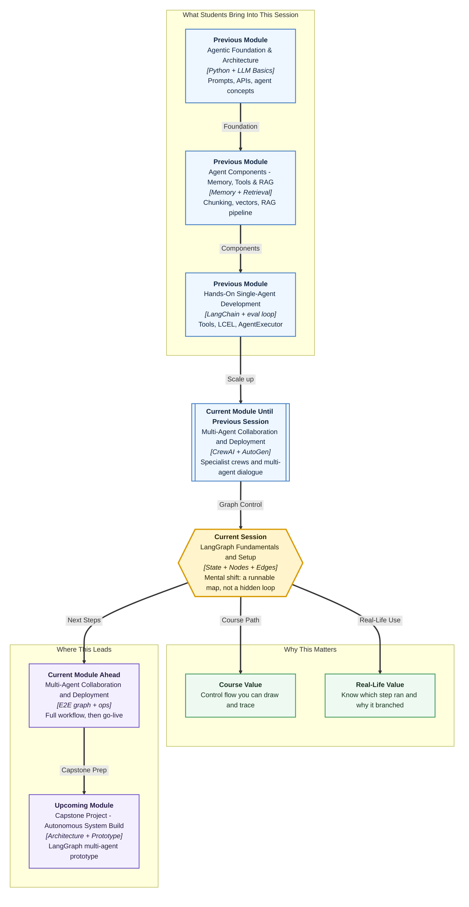

# Pre-read: Getting Started with LangGraph: Fundamentals & Setup

## Context of This Session in the Course

---

Walk into a busy **taluk office**. A file for a certificate moves from one counter to the next. If something goes wrong, a good clerk does not say “the office answered.” They say: *this counter checked the id, that counter refused, this is the note on the file.*

You already know how to call a model, write a prompt, and attach a tool. **LangChain** is that skilled clerk. What you often still cannot answer after a run is simpler and harder: **which step ran, why control moved, and what was written on the shared file.**

That gap is why this session exists.

## The problem a chain does not solve

Imagine you must accept a request only when an id is present, otherwise ask the user to resend. A **chain** (prompt → model → parser) is a straight pipe. It is excellent when every item takes the same path.

Now add a fork. Complete requests go to “accepted.” Incomplete ones go to “please resend.” Hide that fork inside one long prompt and you will get fluent answers that you cannot **audit**. The model may skip the id check. A tool result may disappear. You will only see the last sentence.

**What if** a reviewer asks, three days later: *did lookup run, or did the model invent the status?* If your runtime is a hidden loop, you shrug. If your runtime is a **map**, you point at a station.

## The map that the software actually follows

**LangGraph** is not a new model company. **Groq** still generates text and tool calls. LangGraph is the **stage manager**. It decides which function runs, in what order, and what is kept in a shared notebook called **state**.

Think of a printed office flowchart that the program **runs**, not a slide that nobody executes.

Four names will carry the whole session:

- **State** — the notebook for one run (`request`, `result`, `trace`)
- **Node** — one station; one bounded job; a function that returns a small update
- **Edge** — the track to the next station; always, or only when a rule says so
- **Graph** — you assemble the map, **compile** it, then **invoke** (or **stream**) a journey

**LangChain** stays. Tools, messages, and `ChatGroq` stay. LangGraph sits **on top** when you need **control flow**: branches, loops you can see, and a notebook several steps share.

In this pre-read, you'll discover:

- **Why** a graph is added when chains and agent loops already exist
- **What** problem the graph solves (visible steps, Python gates, a shared file)
- **How** a notebook must **append** a log instead of wiping it
- **Where** a model-plus-tool loop sits on that map

## Merits, costs, and where this shows up in real work

A graph earns its keep when you must **name** the stations. Routing can live in **Python**, so a money or id rule is not left to extra wording in a prompt. A **trace** lists hops. The same map can later pause for a person or save progress. Those are the merits.

There is a cost. You write more structure than one pipe. If you forget how lists **merge**, the second station overwrites the first. If you split every line of code into its own station, the map becomes unreadable. A hello-chain with no fork should stay a chain.

Where do people actually use this shape?

- A **support desk** that extracts fields, looks up a record, then tickets or asks for an id
- An **approval** path where a large refund cannot print until a supervisor stamps it
- A **document** walk: classify, retrieve policy, draft, quality gate, send or hold
- An **ops** runbook: check a system, try a shaky API again, then stop honestly

The live lab uses a small **records lookup** so the objects stay easy to see. The product in the **next** session grows into a full desk. This session is the grammar.

## The two ideas that surprise first-time builders

**Reducers.** When two stations both write a list called `trace`, the default merge is **replace**. Station B would erase station A. A **reducer** says “append this item.” You return only the **new** name, not the whole old list plus the new name.

**Cycles.** A straight map never returns to a station. A tool-calling assistant often must: the model may request a lookup, read the tool result, then speak — or call a tool again. On a graph that loop is visible: **assistant → tools → assistant**, until there are no tool calls and the run ends.

If those two ideas are clear before you sit in class, the code will feel like labelling a map, not memorising spells.

## Questions the live session will settle

Bring a short written guess. You do not need a laptop for these.

1. A field `trace` **appends**. Station A writes `["clean"]`. Station B writes `["check"]`. What is `trace` at the end? What if there was **no** append rule?
2. A user says `"Please close my ticket"` with **no** id token. Should the run visit the “accepted” station? Why or why not?
3. After the model asks for `lookup_record`, who should **execute** the function — the model node, or a separate tool station? What happens if the tool result never returns to the model?

If you can argue those three in plain language, you are ready. The lecture will attach names: `StateGraph`, `add_conditional_edges`, `ToolNode`, `tools_condition`, `GROQ_API_KEY`.

## After this session you will be able to

- Explain, to a non-engineer, why LangGraph is used **with** LangChain, not instead of it
- Point at **state, node, edge, graph** on a diagram and say what each is for
- Predict whether a list field was **replaced** or **appended**
- Read a short **trace** and say which branch ran
- Sketch an assistant-and-tool **cycle** before a longer product is assembled

The map comes first. Saving the file mid-way, pausing for a human stamp, and surviving a slow register belong to the **next** session — on the same kind of graph, once this grammar is in your hands.
