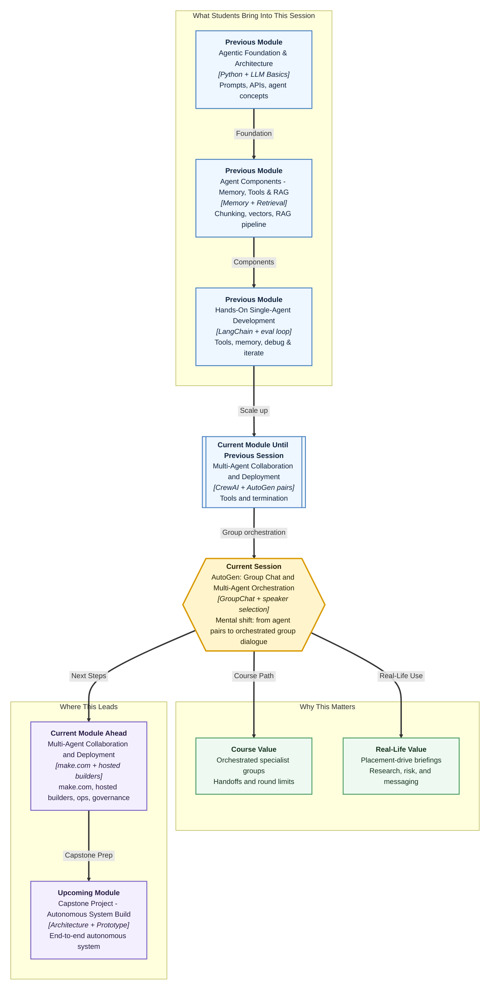

# Pre-read: AutoGen — Group Chat and Multi-Agent Orchestration

## Context of This Session in the Course

---

**Prof. Meera Kulkarni** walks into the placement cell at Greenfield Institute of Technology, Pune, with a request that no longer fits a two-person morning chat. The institute is launching a **campus stipend-status tracker** for students — a feature on top of Ananya’s Campus Ops Inbox — and the same week hosts a **placement drive** briefing for faculty. Someone must gather what is actually known about Nimbus Analytics, Riverbank Retail, and the delayed June internships. Someone else must flag **risk**: no invented legal threats, no per-student unpaid totals, no company names that are not on file. A third person must turn approved findings into **messaging** faculty and students can scan in two minutes.

A two-agent AutoGen pair — the model you practised in the **previous** session — works well when one specialist and one desk runner can finish a delegated lookup through back-and-forth dialogue. Launch planning and a drive briefing need **three specialists in the same working conversation**. Each agent should contribute a distinct piece. The group should hand work to the right specialist at the right moment. The whole exchange must finish without turning into an endless meeting where everyone talks and nothing gets stapled.

That is the natural next step: from **two agents finishing one delegated task** to **a coordinated group completing a complex campus task together**.

---

## When one specialist is not enough

Ananya has seen the failure mode on WhatsApp already. The researcher pastes competitor-style fluff. The risk person never speaks. The writer publishes a cheerful notice that names Infosys. Three separate documents. Nobody reconciled them.

A group that looks intelligent on paper can behave like a noisy meeting with **no chairperson**.

---

## The challenge we will tackle

What if you had to bring three or more specialized AutoGen agents into one shared conversation, let each contribute a different sub-result, control **who speaks next**, prevent the dialogue from looping forever, and still finish with one trustworthy combined briefing?

This session focuses on **group chat orchestration** — the design layer that turns many conversable agents into a working team.

---

## From pairs to a managed group conversation

AutoGen extends the conversable-agent idea into a **group chat**: a shared message space where multiple agents participate in the same task thread.

| Concept | Simple meaning | Why it matters |
|---|---|---|
| **GroupChat** | The shared room where agents exchange messages | Keeps all specialist contributions in one traceable conversation |
| **GroupChatManager** | The coordinator that runs the group exchange | Decides flow, applies rules, keeps the dialogue structured |
| **Speaker selection** | Rules for who should speak next | Prevents random or wrong agents from taking over the thread |

In simple Indian English, **orchestration** means managing the order and control of a multi-participant workflow so the group stays purposeful instead of chaotic.

A well-designed group chat also includes:

1. **Max rounds** — A limit on speaking turns, so the conversation cannot run without end.
2. **Multi-agent handoffs** — Clear movement of work from one specialist to another when their part is needed.
3. **Optional human input** — A path for Ananya or Meera to guide or approve at key points when the scenario requires oversight. This lab can run fully automatic, then you discuss when a human should step in.

Together, these controls turn “many agents in one chat” into **collaborative task completion** with observable structure.

---

## A chaired round-table in the placement cell

A strong analogy is a cross-functional review with a **chairperson**.

Meera opens: “Prepare a placement-drive briefing covering known internship facts, policy risks, and student-facing messaging for the stipend tracker launch.” The **research specialist** speaks first with file-backed signals. The chair then invites the **risk specialist** to flag claims that would invent numbers or legal language. Next, the **messaging specialist** converts approved findings into the notice. If the group repeats the same debate, the chair redirects. If the messenger answers a policy question, the chair passes the floor to risk. When the brief is complete — or the meeting hits its time limit — the chair closes.

| Meeting behaviour | AutoGen idea |
|---|---|
| Shared discussion room | **GroupChat** |
| Chairperson managing flow | **GroupChatManager** |
| Calling the right expert next | **Speaker selection** |
| Meeting cannot continue forever | **Max rounds** |
| Work moves between specialists | **Multi-agent handoffs** |
| Meera can intervene when needed | **Optional human input** |

Once you see the group this way, orchestration is not an extra feature. It is what makes multi-agent collaboration **usable**.

---

## Three specialists, one complex task

A group chat works best when each agent has a **clear specialty** and a **bounded contribution**.

| Specialist | Owns | Must not do |
|---|---|---|
| **Research** | Known campus facts, companies on file, what the tracker will show | Write final marketing copy; invent companies |
| **Risk** | Policy fences: no legal threats, no unpaid totals not on file, high-urgency rule is a policy not a lawsuit | Rewrite the whole brief without cause |
| **Messaging** | Faculty/student notice from **approved** inputs | Invent market facts or stipend figures |

Each agent should produce a **distinct sub-result** the group can build on. Good group design answers practical questions **before** the run starts: who owns which slice; when work moves from research to risk to messaging; what signal shows the combined task is complete; what happens if one output is weak.

---

## Why speaker selection and round limits prevent failure

The two most common group-chat failures are **wrong speaker** and **runaway dialogue**.

**Wrong speaker** happens when the coordinator picks an agent not suited to the current need. Example: the messaging agent starts answering a compliance question because it spoke last and the selection policy is too loose. The fix usually lives in **speaker selection rules** — favour the agent whose role matches the current stage.

**Runaway dialogue** happens when agents keep responding without closure. Sometimes they repeat similar points in a **repetition deadlock**. Sometimes they politely agree in circles. **Max rounds** gives a hard stop, forcing you to think about completion signals and efficient handoffs.

A group chat without orchestration rules is like a placement-cell meeting with ten experts and no agenda.

---

## Diagnose failure, then change one configuration

Strong builders inspect messy runs and ask what **configuration** caused the behaviour.

| Failure mode | What it looks like | Likely configuration angle |
|---|---|---|
| **Repetition deadlock** | Agents restate the same internship paragraph | Tighter speaker selection, clearer roles, or a firmer completion signal |
| **Wrong speaker** | Messaging answers a risk question | Speaker policy tied to task stage |
| **Incomplete handoff** | Risk never sees research | Clearer instructions on when to pass work forward |
| **Endless loop** | No final briefing | Max rounds plus explicit termination |

Treat the **conversation trace** as a debugging document — the same professional habit you built with CrewAI checklists and pair-based delegation.

---

## How this builds on what you already know

From **CrewAI**, you learned role-based teams with tasks, process choice, and validation. From the **previous** AutoGen session, you learned conversable pairs with tools, termination, and trace review. This session combines those instincts at **group scale**: multiple specialists, one shared conversation, explicit orchestration.

A pair solves delegated work through direct dialogue. A group solves **complex collaborative work** where different experts must contribute in sequence or in response to each other — under management.

**Upcoming** work in this module moves toward no-code scenarios, hosted builders, ops, and governance. Learning group orchestration now prepares you for richer system design later and for the capstone.

---

In this pre-read, you'll discover:

- **Understand** why a placement-drive plus feature-launch brief needs three or more specialized AutoGen agents in one shared group conversation
- **Discover** how **GroupChat** and **GroupChatManager** create a structured space with a coordinator instead of a free-for-all chat
- **Learn** why **speaker selection** and **max rounds** prevent wrong-speaker mistakes and runaway dialogue
- **Understand** how to diagnose **repetition deadlock** or **wrong speaker** and apply a targeted configuration fix

---

## What's next

After this session, you should be able to explain a multi-agent group design in plain language: which specialists belong in the group, what distinct sub-result each should contribute, and how work moves through **handoffs**.

You will also discuss **orchestration choices** with confidence. Which speaker selection approach fits the campus briefing? Why is a round limit necessary? When might optional human input be appropriate?

Most importantly, you will review a group conversation like a systems thinker. Instead of saying “the group failed,” you will identify a likely failure mode and suggest one focused configuration improvement.

---

## Questions to think about before class

1. For a placement-drive group with research, risk, and messaging specialists, how would you define **speaker selection** so the right agent responds at each stage?

2. What **max rounds** would you set, and what completion signal would tell the group it is safe to stop before hitting that limit?

3. If the trace shows the same Nimbus paragraph repeated four times with no progress, which failure mode is likely — and what configuration change would you try first?

4. When should **optional human input** include Ananya or Prof. Meera, and how can it improve trust without slowing every turn?

By the end, AutoGen group chat should feel less like “many chatbots in one room” and more like a **chaired specialist meeting** in the Pune placement cell — orchestration, handoffs, and round control turning multi-agent dialogue into one briefing the campus can actually use.
