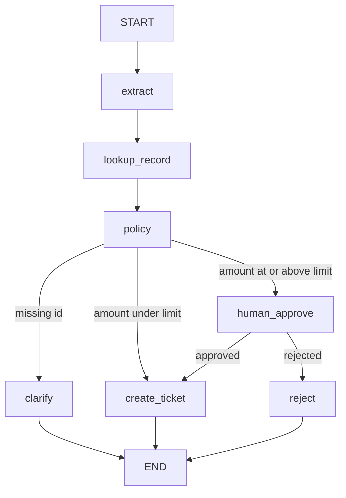

# LangGraph: Building an End-to-End AI Agentic Workflow

## Introduction

The end-to-end example for this session is a **Service Request Desk**.

A user sends **one message**. The desk must read it, look up the record, follow office rules, and finish with a clear outcome: **open a ticket**, **ask for a missing id**, or **wait for a supervisor**.

That full path — message in, honest outcome out, with a saved case file — is the application you will build. LangGraph is the engine. The desk is the product.

By the end you will have **one runnable desk**, not four disconnected demos.

### What “end to end” means here

| User message | What the desk should do |
|---|---|
| `"Close ticket id-104, amount 800"` | Look up the record and **stamp a ticket** (`TKT-104`) |
| `"Please help, nothing works"` | **Ask again** — there is no record id, so no ticket |
| `"Refund id-200, amount 7500"` | **Pause** — Rs 5000 or more needs a supervisor’s yes or no |

You will wire every station of that walk: read the message → look up the register → apply the money rule → ticket **or** wait for a person → send a reply.

### How the aims of the session fit the desk

The list below is what the desk **needs in real use**. Each need is one skill you will code. The technical names are in brackets so they stay attached to the job, not floating as jargon.

1. **Walk the whole job, not one mega-prompt.** A model may read the text. **Python** decides the path. High-value money cannot be “approved” by extra wording in a prompt.
2. **Do not lose the case if the program stops.** Each request gets a **file number**. Progress is saved after each station so you can open the **same** case later. *(checkpointer + thread id)*
3. **Do not let the computer stamp a big refund alone.** The graph **pauses**. A person says yes or no. Then the **same** case continues. The router cannot stamp `approved` by itself. *(human approval)*
4. **Survive a slow or shaky register.** If lookup hangs, stop waiting. If it fails once with a temporary error, try a few times. If it still fails, tell the user honestly — **never invent** a ticket id. *(timeout, bounded retries, fail closed)*
5. **Prove the desk with those three messages.** Clean close, missing id, high-amount refund. That small exam is the **golden pack**.

**What you will walk out with:**

- One Service Request Desk graph you can run
- Three live outcomes: auto-ticket, clarify, pause-and-resume
- A saved case you can inspect mid-way
- A clear user message when the register is slow or down

---

## Application: Service Request Desk

The same desk, specified as stations. This is the worked example for the session, not a new framework.

**Job:** One request string in. Extract fields, look up a record, apply policy in **Python**, then open a ticket or wait for a human. The three messages named in the introduction are the three cases you will run.

**Need:** The model may extract text. It must not be the last word on money. Policy lives in Python.




| Node | Kind | Must do | Must not do |
|---|---|---|---|
| `extract` | LLM | Fill `record_id`, `amount`, `summary` | Invent a missing id |
| `lookup_record` | Tool | Return register row or `NOT_FOUND` | Create tickets |
| `policy` | Python | Set `route`: `clarify` / `ticket` / `human` | Call the LLM to “decide money” |
| `human_approve` | Interrupt | Pause; apply resume payload | Auto-approve |
| `create_ticket` | Python | Stamp `TKT-` + id | Run when route is `clarify` |

---

## Checkpoints and Thread IDs

An in-memory `invoke` dies when the process dies. Production graphs **save** after nodes.

- **Official Definition:** A **checkpoint** is a snapshot of graph state and position. A **checkpointer** is the store. A **thread id** is the key for one job.
- **In Simple Words:** Save-game + filing cabinet + file number.
- **Real-Life Example:** A draft form you reopen tomorrow. Two customers must not share one draft id.


| Checkpointer | Where it lives | Use |
|---|---|---|
| `MemorySaver` | Current process | Lab, HITL in one Python run |
| `SqliteSaver` | SQLite file | Survive restart |

```bash
pip install langgraph langgraph-checkpoint-sqlite langchain-groq langchain-core python-dotenv
```

**Common error:** Resuming with a **new** thread id. That starts a new case. Resume uses the **same** `configurable.thread_id`.

```python
from langgraph.checkpoint.memory import MemorySaver  # in-process checkpointer
from langgraph.checkpoint.sqlite import SqliteSaver  # disk checkpointer
import sqlite3  # connection for SQLite

memory = MemorySaver()  # lab checkpointer
graph_mem = builder.compile(checkpointer=memory)  # attach before invoke

conn = sqlite3.connect("desk.db", check_same_thread=False)  # file-backed store
sqlite = SqliteSaver(conn)  # disk checkpointer
graph_disk = builder.compile(checkpointer=sqlite)  # survives process exit

config = {"configurable": {"thread_id": "case-104"}}  # file number for one job
```

List checkpoints for a thread when a run looks stuck:

```python
for cp in graph_mem.get_state_history(config):  # walk saved snapshots
    print(cp.next, cp.values.get("route"), cp.values.get("trace"))  # position and flags
```

---

## Human-in-the-Loop

High-risk actions need a **person**, not a longer prompt.

- **Official Definition:** **Human-in-the-loop** pauses the graph until a resume payload arrives. **`interrupt`** stops inside a node. **`Command(resume=...)`** continues that thread.
- **In Simple Words:** The graph waits at the stamp desk.
- **Real-Life Example:** A refund voucher that cannot print until a supervisor signs.


**Logic:** `policy` may set `route = "human"`. Only `human_approve` may turn that into a ticket, and only after resume. The model never writes `approved=True` on its own.

**Common error:** Putting the money limit only in the system prompt. The model can ignore it. The limit belongs in the **policy** node.

---

## Timeouts and Retries

Lookup calls fail in two messy ways: they **hang**, or they **blip**.

- **Official Definition:** A **timeout** cancels a slow call. A **retry** repeats a **transient** failure with a **bounded** attempt count. **Backoff** waits longer between attempts.
- **In Simple Words:** Kitchen timer. Knock again, not a hundred times.
- **Real-Life Example:** UPI stops waiting. A 503 is worth one or two retries. A missing id is not.


| Failure | Retry? | What the user should see |
|---|---|---|
| Timeout / 503 / brief network blip | Yes, within limits | Success after retry, or a clear error |
| `NOT_FOUND`, bad input, forbidden | No | Honest message, no silent loop |
| Retries exhausted | Stop | User-facing error; fail **closed** |

- **Official Definition:** **Fail closed** means stop with a named error rather than guessing a ticket id.
- **In Simple Words:** No fake `TKT-` when the register did not answer.

LangGraph **`RetryPolicy`** wraps a node. A small **timeout wrapper** still belongs around the I/O itself.

### Activity — Classify the failure

| Situation | Transient or permanent? | Timeout, retry, or clear error? |
|---|---|---|
| Lookup returns “service busy” | | |
| User omitted a record id | | |
| Lookup hangs for 60 seconds | | |

**Suggested answers:** transient → retry; permanent → clear error; hang → timeout (then retry only if policy allows).

---

## Full Workflow Code

One program. Extract uses the model. Lookup is a tool with a simulated blip. Policy is Python. Human pause uses `interrupt`. Tickets are stamped only on the allowed routes.

```python
from typing import Annotated, Literal, TypedDict  # state and route literals
from operator import add  # trace reducer
from concurrent.futures import ThreadPoolExecutor, TimeoutError as FuturesTimeout  # per-call timeout
from dotenv import load_dotenv  # API key
from langchain_core.messages import HumanMessage, SystemMessage  # extract prompt
from langchain_groq import ChatGroq  # Groq extractor model
from langgraph.graph import StateGraph, START, END  # builder
from langgraph.checkpoint.memory import MemorySaver  # lab persistence
from langgraph.types import RetryPolicy, interrupt, Command  # retry + HITL


load_dotenv()  # read GROQ_API_KEY
llm = ChatGroq(model="llama-3.3-70b-versatile", temperature=0)  # Groq extract


class DeskState(TypedDict):  # shared notebook
    request: str  # raw user text
    record_id: str  # extracted id or empty
    amount: int  # extracted amount or 0
    summary: str  # short extract
    lookup: str  # register payload or error
    route: Literal["", "clarify", "ticket", "human"]  # policy decision
    approved: bool  # set only after human resume
    ticket_id: str  # TKT- stamp or empty
    result: str  # user-facing message
    error: str  # fail-closed text
    trace: Annotated[list[str], add]  # append-only node log


DIRECTORY = {"id-104": "OPEN", "id-200": "OPEN"}  # in-memory register
ATTEMPTS = {"n": 0}  # demo counter so lookup fails once then works


def run_with_timeout(fn, seconds: float, *args):  # kitchen timer around I/O
    with ThreadPoolExecutor(max_workers=1) as pool:  # one worker
        future = pool.submit(fn, *args)  # start the call
        return future.result(timeout=seconds)  # raise if too slow


def fake_lookup(record_id: str) -> str:  # register call with one blip
    ATTEMPTS["n"] += 1  # count calls
    if ATTEMPTS["n"] == 1:  # first call in the process
        raise ConnectionError("service busy")  # transient failure for RetryPolicy
    return DIRECTORY.get(record_id, "NOT_FOUND")  # real register result


def extract(state: DeskState) -> dict:  # LLM station: structured fields only
    sys = SystemMessage(  # extract contract
        content=(  # tell the model the output shape
            "Extract record_id (id-NNN or empty), amount (integer, else 0), "  # fields
            "and a five-word summary. Reply as: ID=<id>;AMT=<n>;SUM=<text>"  # parseable line
        )
    )
    raw = llm.invoke([sys, HumanMessage(content=state["request"])]).content  # one call
    record_id, amount, summary = "", 0, raw  # defaults if parse fails
    try:  # best-effort parse of the contract line
        parts = dict(p.split("=", 1) for p in raw.strip().split(";"))  # ID/AMT/SUM
        record_id = parts.get("ID", "").strip()  # may be empty
        amount = int(parts.get("AMT", "0"))  # integer amount
        summary = parts.get("SUM", raw).strip()  # short text
    except (ValueError, KeyError):  # malformed model line
        summary = raw  # keep raw text; policy will clarify if id missing
    if record_id in ("", "empty", "none"):  # normalise empty ids
        record_id = ""  # policy treats empty as clarify
    return {  # partial update
        "record_id": record_id,  # extracted or empty
        "amount": amount,  # extracted or 0
        "summary": summary,  # extract text
        "trace": ["extract"],  # reducer append
    }


def lookup_record(state: DeskState) -> dict:  # tool station with timeout
    if not state["record_id"]:  # nothing to look up
        return {"lookup": "", "trace": ["lookup_record"]}  # skip I/O
    try:  # bounded wait
        payload = run_with_timeout(fake_lookup, 4.0, state["record_id"])  # 4s timer
        return {"lookup": payload, "error": "", "trace": ["lookup_record"]}  # store row
    except FuturesTimeout:  # too slow
        return {  # fail closed
            "lookup": "",  # no guessed row
            "error": "Lookup timed out. Please retry.",  # user-facing
            "trace": ["lookup_record"],  # still record the hop
        }


def policy(state: DeskState) -> dict:  # Python gates — not the model
    if state.get("error"):  # timeout already set a message
        return {"route": "clarify", "result": state["error"], "trace": ["policy"]}
    if not state["record_id"] or state["lookup"] in ("", "NOT_FOUND"):  # missing / unknown
        return {  # cannot ticket
            "route": "clarify",  # blocked path
            "result": "Please resend with a valid record id such as id-104.",  # ask
            "trace": ["policy"],  # hop
        }
    if state["amount"] >= 5000:  # high-risk money
        return {"route": "human", "trace": ["policy"]}  # must pause
    return {"route": "ticket", "trace": ["policy"]}  # auto path


def route_after_policy(state: DeskState) -> str:  # edge router
    return {"clarify": "clarify", "human": "human_approve", "ticket": "create_ticket"}[
        state["route"]
    ]  # map flag to node name


def human_approve(state: DeskState) -> dict:  # planned pause
    decision = interrupt(  # stop; payload is shown to the operator
        {  # inspectable payload
            "record_id": state["record_id"],  # what they are signing
            "amount": state["amount"],  # money at risk
            "summary": state["summary"],  # short extract
            "ask": "Approve ticket? Resume with true or false.",  # operator prompt
        }
    )
    approved = bool(decision)  # resume payload
    if not approved:  # supervisor said no
        return {  # reject path
            "approved": False,  # stamp
            "result": "Request rejected by reviewer.",  # user message
            "trace": ["human_approve"],  # hop
        }
    return {"approved": True, "trace": ["human_approve"]}  # continue to ticket


def after_human(state: DeskState) -> str:  # edge after the stamp
    if state.get("approved"):  # only a true stamp
        return "create_ticket"  # allowed to stamp a ticket
    return "clarify"  # reuse clarify/END path via result already set


def create_ticket(state: DeskState) -> dict:  # stamp — never invent without a route
    tid = "TKT-" + state["record_id"].replace("id-", "")  # deterministic id
    return {  # success payload
        "ticket_id": tid,  # visible stamp
        "result": "Ticket " + tid + " created.",  # user message
        "trace": ["create_ticket"],  # hop
    }


def clarify(state: DeskState) -> dict:  # terminal helper if result already set
    msg = state["result"] or "Please resend with a valid record id."  # fallback
    return {"result": msg, "trace": ["clarify"]}  # ensure result exists


builder = StateGraph(DeskState)  # shell
builder.add_node("extract", extract)  # LLM
builder.add_node(  # lookup with bounded retries
    "lookup_record",  # name
    lookup_record,  # function
    retry_policy=RetryPolicy(max_attempts=3, initial_interval=0.5, backoff_factor=2.0),  # blip
)
builder.add_node("policy", policy)  # Python gates
builder.add_node("human_approve", human_approve)  # interrupt
builder.add_node("create_ticket", create_ticket)  # stamp
builder.add_node("clarify", clarify)  # blocked terminal
builder.add_edge(START, "extract")  # always extract first
builder.add_edge("extract", "lookup_record")  # then register
builder.add_edge("lookup_record", "policy")  # then gates
builder.add_conditional_edges("policy", route_after_policy)  # three-way
builder.add_conditional_edges(  # after human
    "human_approve",  # from interrupt node
    after_human,  # approved → ticket else clarify
)
builder.add_edge("create_ticket", END)  # success ends
builder.add_edge("clarify", END)  # blocked ends
desk = builder.compile(checkpointer=MemorySaver())  # persist + HITL
```

### How the code works

- `extract` may parse poorly. Empty `record_id` still hits **policy**, not a guessed ticket.
- `RetryPolicy` retries `ConnectionError` on lookup. `NOT_FOUND` is data, not a retry reason.
- `run_with_timeout` fails closed into `error`. Policy turns that into `clarify`.
- `interrupt` runs only on the human route. Resume with `Command(resume=True)` or `False`.
- `create_ticket` is unreachable from `clarify`. The router cannot self-approve `amount >= 5000`.

---

## Golden Pack: Three Cases

Reset `ATTEMPTS["n"] = 0` before a batch if you need the first-call blip again. Use a **new thread id** per case.

```python
def blank(request: str) -> dict:  # initial notebook
    return {  # every field named
        "request": request,  # user text
        "record_id": "",  # empty
        "amount": 0,  # empty
        "summary": "",  # empty
        "lookup": "",  # empty
        "route": "",  # empty
        "approved": False,  # default
        "ticket_id": "",  # empty
        "result": "",  # empty
        "error": "",  # empty
        "trace": [],  # reducer start
    }


# Case A — clean auto-ticket
cfg_a = {"configurable": {"thread_id": "gold-a"}}  # unique thread
out_a = desk.invoke(blank("Close ticket id-104, amount 800"), cfg_a)  # under limit
print("A", out_a["ticket_id"], out_a["trace"])  # expect TKT-104 and create_ticket


# Case B — blocked, no id
cfg_b = {"configurable": {"thread_id": "gold-b"}}  # unique thread
out_b = desk.invoke(blank("Please help, nothing works"), cfg_b)  # no id
print("B", out_b["route"], out_b["result"])  # expect clarify; no ticket_id


# Case C — human gate, then approve
cfg_c = {"configurable": {"thread_id": "gold-c"}}  # unique thread
paused = desk.invoke(blank("Refund id-200, amount 7500"), cfg_c)  # >= 5000
print("C paused next:", desk.get_state(cfg_c).next)  # expect ('human_approve',) or after interrupt
resumed = desk.invoke(Command(resume=True), cfg_c)  # supervisor stamp
print("C", resumed["ticket_id"], resumed["approved"])  # expect TKT-200 and True
```

| Case | Prove |
|---|---|
| A | `ticket_id` is `TKT-104`; trace includes `create_ticket`; no interrupt |
| B | `ticket_id` is empty; `result` asks for an id |
| C | First invoke does not stamp a ticket; after `Command(resume=True)`, `TKT-200` |

Reject path: `Command(resume=False)` on thread `gold-c` (use a fresh thread). `ticket_id` must stay empty.

Inspect a paused thread:

```python
snap = desk.get_state(cfg_c)  # latest checkpoint
print(snap.values["amount"], snap.values["route"], snap.next)  # 7500, human, waiting node
```

### Activity — Predict Case C if resume is False

What is `ticket_id`, and which terminal node should appear in `trace`?

**Suggested answer:** empty `ticket_id`; `human_approve` then `clarify`; result explains rejection.

---

## Code-First Graphs and Other Surfaces

A LangGraph desk owns **routing, logs, and pause points** in your runtime. A **no-code** scenario builder owns a visual canvas and app connectors. A **hosted agent** builder owns the model runtime and configuration panes.

| Lens | LangGraph (this desk) | No-code scenario | Hosted agent builder |
|---|---|---|---|
| Routing | Python policy + edges | Visual routers | Instructions + platform defaults |
| Pause | `interrupt` + thread | Manual module or approval app | Vendor HITL if offered |
| Proof | `trace` + checkpoints | Run bundle | Chat / audit UI |
| Maintainer | Engineering review | Ops on the canvas | Ops + platform admin |

Use the graph when a money gate must be **unenforceable by the model**. Use a canvas when the job is event → app update. Use a hosted agent when the product is a bounded FAQ with files.

---

## Key Takeaways

- An end-to-end LangGraph workflow is **specialist nodes + Python policy + tools**, not one mega-prompt.
- **Checkpointers** and **thread ids** persist and resume a case, including a planned human pause.
- **`interrupt` / `Command`** implement human-in-the-loop. High-risk routes cannot self-approve.
- **Timeouts**, **RetryPolicy**, and **fail closed** keep flaky I/O from inventing tickets.
- A **three-case golden pack** (clean / blocked / human-gate) is the exam for the desk.

The same graph is what you later version, evaluate, and observe in operations work: traces and checkpoints are already the audit trail.

---

## Important Commands, Libraries, Terminologies Used

| Name | Meaning |
|---|---|
| **Policy node** | Python gates that choose `clarify` / `ticket` / `human` |
| **Checkpointer** | Store for graph snapshots |
| **`MemorySaver`** | In-process checkpointer |
| **`SqliteSaver`** | SQLite file checkpointer |
| **Thread id** | Key for one job’s checkpoints |
| **`get_state` / `get_state_history`** | Inspect the latest or all snapshots |
| **`interrupt`** | Pause inside a node for a human payload |
| **`Command(resume=...)`** | Continue a paused thread |
| **Human-in-the-loop** | Planned pause before a high-risk action |
| **`RetryPolicy`** | Bounded retries with backoff on a node |
| **Timeout** | Maximum wait for one I/O call |
| **Fail closed** | Stop with a named error; do not guess |
| **Golden pack** | Fixed cases that must keep passing |
| **`compile(checkpointer=...)`** | Attach persistence (required for interrupt) |
| **`ChatGroq`** | LangChain chat wrapper for Groq (`llama-3.3-70b-versatile`) |
| **`GROQ_API_KEY`** | Key loaded from `.env` |
