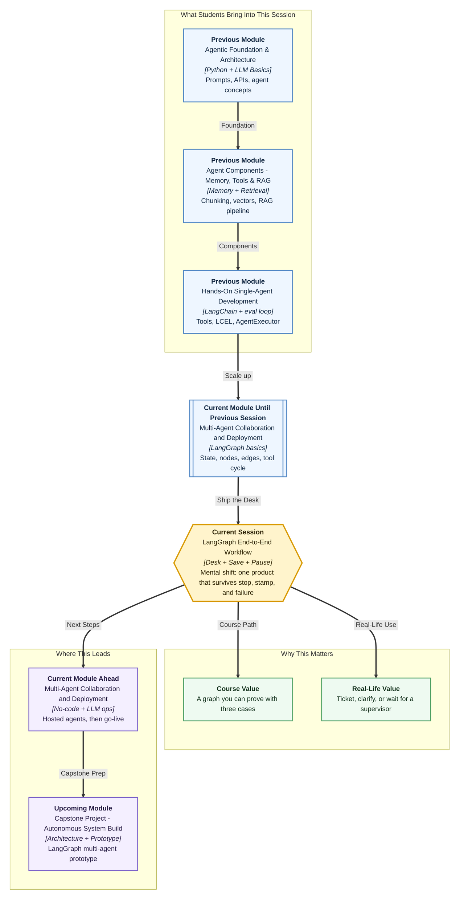

# Pre-read: LangGraph: Building an End-to-End AI Agentic Workflow

## Context of This Session in the Course

---

A **service counter** that only works while one volunteer is staring at the laptop is not a desk. If the volunteer closes the lid, the case vanishes. If a large refund prints without a supervisor’s signature, accounts will not accept the story that “the model sounded confident.” If the register hangs, the citizen should not wait forever, and nobody should invent a ticket number to look busy.

You already know how to draw a **graph**: stations, a shared notebook, a fork, a model-and-tool loop. This session uses that grammar to ship **one product**.

The end-to-end example is a **Service Request Desk**.

## What if the desk has to be honest?

A user sends **one message**. The desk must finish with a clear outcome:

| Message | Honest outcome |
|---|---|
| Close ticket **id-104**, amount **800** | Stamp a ticket (`TKT-104`) |
| “Please help, nothing works” | **Ask again** — no record id, so no ticket |
| Refund **id-200**, amount **7500** | **Pause** — Rs 5000 or more needs a supervisor |

**What if** the program dies after lookup? A real office keeps a **file number**. You reopen the **same** file. You do not start a new case and hope the details match.

**What if** the amount is high? A clerk must not stamp “approved” because the prompt was polite. The graph **waits**. A person says yes or no. Then the **same** file continues.

**What if** the register is slow or blips once? You stop waiting after a limit. You try a few times. If it still fails, you tell the user the truth. You **never invent** `TKT-`.

Those three “what ifs” are not extra topics glued on. They are what makes the walk **end to end**.

## One desk, not four demos

Think of a **case file** in a campus admin office or a bank desk.

- The **file number** is how you find the same case tomorrow. In the graph this is a **thread id**. The cupboard that stores snapshots is a **checkpointer**.
- The **supervisor stamp** is a planned pause. The computer cannot sign for the supervisor.
- The **kitchen timer** on the register call is a **timeout**. Knocking again a few times, not a hundred, is a **retry**. Stopping without a fake stamp is **fail closed**.

LangGraph is still the engine. The desk is the product. **Groq** may read the message and fill fields. **Python** still decides the path. High-value money cannot be approved by extra wording in a prompt.

In this pre-read, you'll discover:

- **What** the Service Request Desk must do for three different messages
- **Why** a case needs a file number if the program can stop
- **Why** a large refund pauses for a person
- **Why** a hanging register must time out, retry a blip, then speak honestly

## How the stations fit together

The walk is the same story you will code:

**Read the message → look up the register → apply the money rule → ticket or wait for a person → send a reply.**

- **Extract** may use the model. It must not invent a missing id.
- **Lookup** talks to a register (in the lab, a small in-memory directory with one simulated blip).
- **Policy** is Python. Missing id or unknown record → ask again. Amount under the limit → ticket. Amount at or above the limit → human pause.
- **Human approve** waits. Resume with yes or no on the **same** file number.
- **Create ticket** stamps `TKT-` only on the allowed path. The clarify path cannot reach it.

You will prove the desk with those **three messages**. That small exam is the **golden pack**: clean close, missing id, high-amount refund.

## What you should arrive knowing

You do not need to memorise library names tonight. You should be able to tell a friend, in ordinary language:

- The product is **one desk**, not a pile of snippets.
- A **file number** means “continue this case,” not “start another.”
- A **pause** is a feature when money is large, not a crash.
- A **timeout** is a kitchen timer. A **retry** is a second knock after a temporary fail. A missing id is **not** a reason to knock again.
- If lookup never answered, the user sees an error. The desk does not mint a fake ticket to look complete.

The lecture will attach the names: `MemorySaver`, `SqliteSaver`, `interrupt`, `Command`, `RetryPolicy`, and a Groq extract node. The desk comes first; the names sit on the furniture.

## Questions the live session will settle

Write a short guess before class.

1. Two users send refunds. Must they share one file number, or must each case have its own? What goes wrong if they share?
2. Amount is **7500**. The model’s last sentence is “looks fine, create the ticket.” Should `create_ticket` run **before** a human says yes? Why?
3. Lookup hangs for a minute. Should the user wait until the laptop is hot, or should the desk stop and explain? If lookup returns “not found,” should the desk retry?

If you can argue those without code, the lab will feel like filling in a map you already understand.

## After this session you will be able to

- Run **one** Service Request Desk graph for three named messages
- Show a **saved** case and continue it, including a supervisor yes or no
- Explain **timeout**, **retry**, and **fail closed** as desk behaviour, not as slogans
- Point at a **trace** and say whether the run ticketed, asked for an id, or waited for a human

A canvas of app connectors and a hosted chat agent are different surfaces. They come later in this module. This session is the code-first desk you can prove: message in, honest outcome out, file still there if you closed the lid.
