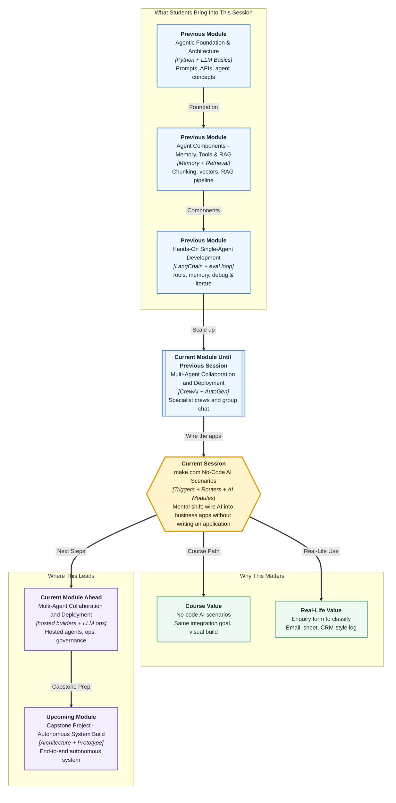

# Pre-read: make.com — No-Code AI Automation Scenarios

## Context of This Session in the Course

---

**Ananya** opens the Campus Ops Inbox at Greenfield Institute of Technology, Pune. Overnight, the student enquiry form has filled again: a placement FAQ, a hostel-leave question, a half-empty spam row, and one angry stipend complaint.

Someone still copy-pastes names into a spreadsheet. Someone else drafts a polite email. A third person updates a CRM-style sheet so Prof. Meera Kulkarni can see the queue. Hot leads wait while average ones get lucky replies first.

Nothing here is “AI magic.” It is **repetitive handwork** — the kind that burns hours, creates typos, and makes good enquiries wait.

Now ask a sharper question:

**What if every new enquiry could be classified by AI, emailed to the right desk, and logged into a sheet — without anyone writing an application?**

That is the career-relevant skill this session unlocks. Campuses and companies do not only hire people who *build* agents in code. They also hire people who can **wire AI into the apps the team already uses** — forms, email, sheets — quickly and safely.

---

## The challenge: one enquiry, many paths, zero patience

What if Greenfield receives 200 enquiries in a week, and each type needs different treatment?

| Enquiry type | What should happen |
|---|---|
| Placement FAQ | AI drafts a short answer → email goes out → sheet row updates |
| Hostel / leave question | AI extracts the student name → routes to Student Affairs → sheet logs the ticket |
| Incomplete / spam | Holding list → no faculty ping → optional polite auto-reply |
| Angry stipend complaint | Escalate to a human → skip auto-email → log severity |

Doing this by hand is exhausting. Doing this with a custom Python HTTP API is powerful — but slow when the only goal is “connect Form → AI → Gmail → Sheet.”

In the **previous** session you practised **group chat** with specialist AutoGen agents: who speaks, how rounds stop, how distinct sub-results combine. Earlier in this module you also staffed **CrewAI** crews. Those skills teach orchestration thinking: *who does what, in what order, with what handoff*.

This session asks a different practical question:

> How do you design the same integration goal — trigger → decide → transform with AI → act on business tools — using **make.com**, a popular no-code scenario builder used widely in ops and growth teams?

---

## Enter make.com: a visual business assembly line

**make.com** (earlier known as Integromat) lets you build **scenarios** — visual workflows where apps talk to each other.

A **scenario** is like a factory floor plan for work: something starts the line, stations do small jobs, and finished goods leave through different exits.

Key building blocks you will meet:

- **Modules** — each app step on the canvas (watch a form, call AI, send email, update a sheet). Think of them as workers at stations.
- **Triggers** — the starting gun. “When a new form row appears…” or “When a webhook fires…” or “Every weekday at 9 AM…”
- **Routers** — the decision junction. “If placement FAQ, go left; if complaint, go right.”
- **AI / HTTP modules** — the smart station. An **OpenAI** (or similar) module classifies or drafts; an **HTTP** module talks to any REST endpoint when a ready-made connector is missing.
- **Data stores** — a small memory cupboard inside make.com for lookup values, counters, or temporary records.
- **Scheduling** — run on a clock, not only on an event.
- **Error handling** — what happens when Gmail fails, AI times out, or a required field is empty.

Code-first automation and make.com scenarios chase the **same goal**: reliable integration. The difference is *how* you build and who can maintain it. In make.com, you assemble the flow visually and test paths without compiling an app. In code-first stacks, you own deeper control, custom logic, and engineering process. Good practitioners know **when each style fits**.

---

## A railway station junction

Picture a busy railway junction in India.

1. A train **arrives** (trigger).
2. The station master checks the **route board** (router): Express? Passenger? Goods?
3. A clerk **writes a clean summary** of the cargo or passenger list (AI transformation).
4. Then the system **updates** platforms, announcements, and logs (email / CRM-style sheet).
5. If a track is blocked, the station does not freeze forever — it follows a **recovery plan** (error handling).

make.com works the same way. Your scenario is the junction. Modules are stations. The router is the route board. AI is the clerk who turns messy student language into structured next steps. Business apps are the platforms where work actually lands.

Once you see automation as a **junction with clear routes**, the canvas stops feeling mysterious.

---

## What a practical scenario looks like

Here is a mental sketch of the kind of flow you will assemble in the live session — described in plain language, not as an export file:

1. **Start** — A new student enquiry arrives (form submission, sheet row, or scheduled pull).
2. **Decide** — A router checks AI labels: *placement / leave / incomplete / complaint*.
3. **Transform** — An AI module cleans the message, extracts name and intent, and drafts a short reply or CRM note.
4. **Act** — Success path updates a spreadsheet (the campus CRM-style register), and sends an email to the right desk.
5. **Recover** — If the email module fails, the scenario logs the failure, retries where safe, or routes to a “needs human” list instead of silently dying.

That last step is career gold. Anyone can demo a happy path. Professionals also document a **recoverable error path** — what breaks, how you notice, and how the system continues safely.

You will also discuss **testing**: run one clean placement enquiry and one broken case (missing email, API timeout, bad AI output format). Then write short notes so a teammate can hand off the scenario tomorrow without guessing.

---

In this pre-read, you'll discover:

- **Discover** why no-code scenarios matter for real campus and business operations — not only for developers
- **Understand** how a **trigger**, **router**, and **AI module** work together like a station junction
- **Learn** what **data stores**, **scheduling**, and **error handling** contribute to a trustworthy automation
- **See** how make.com compares with code-first automation while serving similar integration goals

---

## Why this sits in your journey

So far in this module you have:

- Connected services visually with **n8n**
- Coordinated specialised agents with **CrewAI**
- Orchestrated group collaboration with **AutoGen**

make.com extends the same *systems thinking* into another widely used no-code platform. After this, you will be ready to evaluate **hosted agent builders** in the **upcoming** session — products where AI agents live inside vendor platforms with knowledge, actions, and guardrails.

The bigger course story is simple: **agents are not only chat windows**. They are pipelines that sense events, decide routes, transform information, and act on business tools — with reliability built in.

---

## Questions to think about before class

1. **The hot-lead junction** — Greenfield’s form receives both “When is the TCS drive?” and “My stipend is two weeks late and I am furious.” How do you design one scenario with a router so each path gets a different AI prompt and a different business action?

2. **The silent failure** — Email sending fails at 11 PM. What should the scenario do so Ananya does not lose the enquiry, and how do you document that recoverable error path for Campus Ops?

3. **No native app button** — The tool you need is not listed as a ready module. When do you reach for an **HTTP** module, and what must you verify before trusting that connection?

Bring these questions to class — and one messy process from your own life that currently depends on copy-paste. **Upcoming** work in this module moves from wiring apps to standing up a hosted helper, then to operations and governance. This session’s job is a **testable scenario**, not a full product.

---

## Words you will hear — explained right away

- **Scenario:** The visual workflow you run — the whole junction, not one station.
- **Module:** One app step on the canvas — watch a form, call AI, send mail, write a sheet.
- **Trigger:** The starting gun — a new enquiry, a webhook, or a clock.
- **Router:** The route board — different labels take different exits.
- **Data store:** A small cupboard of lookup values inside make.com.
- **Error handling:** The recovery plan when Gmail, AI, or a field fails.

---

## What's next

By the end of the session, you should be able to:

- **Explain** how make.com scenarios relate to code-first automation without confusing the two
- **Assemble** a scenario with a **trigger**, **router**, and at least one **AI-powered** transformation
- **Connect** outputs to everyday business tools such as **email** and a **CRM-style spreadsheet**
- **Test** and document **one success path** and **one recoverable error path**
- **Talk** confidently about **modules**, **data stores**, **scheduling**, and **error handling**

You already know how to staff an AI **team** in code. This session teaches you how to **wire AI into the apps Campus Ops already opens every morning**.
