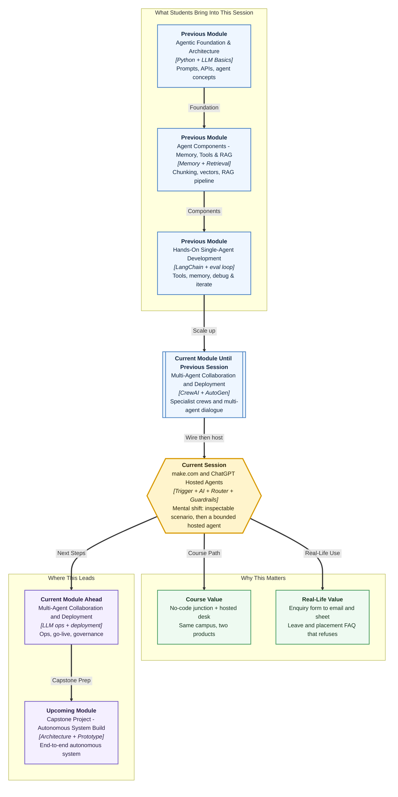

# Pre-read: make.com and ChatGPT Hosted Agents

## Context of This Session in the Course

---

This pre-read introduces **make.com** and **ChatGPT Agent** (hosted agent builders).

**make.com** is a no-code integration platform. Its distinctive behaviour is that an **AI module** sits on the same canvas as app **triggers** and **actions**.

A **scenario** starts on an event, the model returns structured fields, a **router** branches, and Gmail or Sheets update. After **Run once**, you inspect the **bundle** at each station. You do not compile or host that pipeline.

A **ChatGPT Agent** is configured in a vendor UI with **knowledge sources**, **actions**, **instructions**, and **guardrails**. The vendor runs the model runtime.

---

## What make.com is (technical)

**make.com** (formerly Integromat) is a no-code integration platform. A **scenario** is one runnable workflow made of modules, connections, and mapping.

- **Module** — one step on the canvas (app or flow-control)
- **Trigger** — first module; starts a run on an event or a schedule
- **AI module** — calls an LLM; output is mapped into later modules
- **Router** — copies the bundle onto routes; **filters** decide which route continues
- **Action** — writes to an external app (email, sheet, CRM connector)

A **hosted agent builder** is a vendor UI plus a vendor runtime. **Code-first** means you own the application, logs, and APIs.

Connectors are not the unique point. The distinctive behaviour is **AI + router + inspectable bundle** on one canvas.

---

## Let us take an example of a student enquiry form

**Greenfield Institute of Technology, Pune** collects student enquiries on a Google Form. Staff currently copy each row into Gmail and a register by hand.

**Implementation you will assemble:** Watch the form (or a sheet twin). Classify into `placement` / `leave` / `incomplete` / `complaint`. Route on parsed `intent`. Send Gmail. Append `Enquiry_CRM`. Incomplete rows get `holding` and no faculty mail. Complaints escalate; they do not get an auto-soothing student email.

That is event in, apps out. It is not a chat.

---

## Let us take an example of a policy Q&A agent

The same campus still needs answers from official files: casual leave days, a placement-talk date. Uploading a PDF into an unconstrained chat is fast and unsafe. A curious prompt can ask for a mobile number or “ignore the policy.”

**Implementation you will configure:** Attach only leave-policy and placement-FAQ extracts. Write instructions with an unsure rule and an anti-override line. Enable at most one ticket-log action. Run **in-domain** queries (casual leave = 8; Nimbus date) and **refusal** queries (personal mobile; extra leave). Name the **lever** that answered or refused.

Do not give the hosted agent “send Gmail to anyone.” Mail after a router belongs on the **scenario**.

| Job | Better fit |
|---|---|
| Form row → classify → email + sheet | make.com scenario |
| Conversation from official files | Hosted agent |
| Custom graphs and owned logs | Code-first |

---

In this pre-read, you'll discover:

- **Discover** what is unique about a make.com **scenario**: trigger, AI fields, router, actions, inspectable bundle
- **Understand** how **hosted agent** configuration uses knowledge, actions, instructions, and guardrails
- **Learn** how to keep mail on the scenario and chat on the agent
- **See** how one enquiry form and one policy FAQ become two separate implementations

---

## Questions to think about before class

1. **The router** — One form receives both “When is the TCS drive?” and “My stipend is two weeks late.” How do filters on parsed `intent` send each path to a different action?

2. **The stack choice** — When do you recommend **make.com**, when a **hosted agent**, and when **code-first**?

3. **The over-helpful agent** — Casual-leave is correct, but the agent invents a festival exception. Which lever do you tighten first — **knowledge**, **instructions**, or **guardrails** — and which refusal query proves the fix?

Bring one copy-paste process from your own life. This session’s job is a **testable scenario** plus a **bounded hosted agent**.

---

## Words you will hear

- **Scenario:** One visual workflow you turn On.
- **Trigger / router:** Event that starts a run; branches on fields.
- **Bundle:** One data item moving through modules.
- **Hosted agent builder:** You configure knowledge, actions, and rules; the vendor hosts the runtime.
- **Knowledge boundary:** Only attached files count as truth.
- **Guardrails:** Rules that block harm, leaks, and out-of-scope help.
- **In-domain vs refusal:** Questions files should answer vs questions the agent must decline.

---

## What's next

By the end of the session, you should be able to:

- **Assemble** a make.com scenario with a trigger, an AI-powered step, a router, and an email or spreadsheet action
- **Compare** no-code scenarios and hosted builders with code-first frameworks on control, cost, and who maintains them
- **Configure** a ChatGPT-style hosted agent with knowledge boundaries, action permissions, instructions, and guardrails
- **Test** one make.com success path and demonstrate the agent on in-domain and refusal queries with explainable behaviour

This session teaches **trigger → AI JSON → router → action** on make.com, then a **hosted agent** with a knowledge boundary you can explain.
