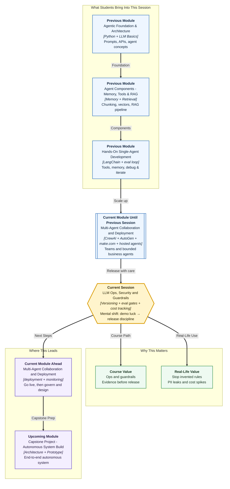

# Pre-read: LLM Operations, Security and Guardrails for Agent Systems

## Context of This Session in the Course

---

**Ananya** published the Greenfield Leave & Placement Desk on Monday after a clean demo. Over the weekend someone tweaked the instructions — “make it more helpful.” They also pasted the OpenAI key into a shared note “for convenience.” They skipped the refusal pack because Friday had looked fine.

By Tuesday:

- A student asks about **casual leave** and gets a confident answer that **invents a festival extra day** not present in any official document.
- A curious user asks for **a classmate’s phone number** and the agent echoes **personal data** it should never reveal.
- Finance notices the **API bill tripled** overnight because a loop kept calling the model on every minor follow-up.
- Security finds the **API key** sitting in plain text inside a log export shared on Slack.

Nothing here is science fiction. These are ordinary **operations failures** — the gap between “it worked in the demo” and “it is safe to run for five hundred students every day.”

In the **previous** session you configured **hosted agents** with knowledge boundaries, action permissions, and guardrails — the first layer of control. This session goes deeper: how teams **run**, **secure**, **measure**, and **release** agent changes without gambling on luck.

---

## The challenge: ship fast without breaking trust

**What if Campus Ops improves the desk every week — new prompts, new tools, new retrieval settings — but each change could silently make answers worse, leak secrets, or burn budget?**

Building an agent is only half the job. **LLM Ops** — in simple words, the operational habits around large language model systems — is how responsible teams treat agents like **production software**, not one-off experiments.

That means:

- **Versioning** prompts, tool configs, and retrieval settings so you always know what changed and can roll back
- **Evaluation gates** that run a fixed set of test questions before any release — a **regression set** that catches “we fixed leave policy but broke refusal behaviour”
- **Cost and quality signals** — token usage, latency, and answer quality — tied to release decisions
- **Security controls** for secrets, access boundaries, and sensitive data
- **Guardrails** on both **input** and **output** so unsafe or out-of-scope requests never reach users unchecked

The hard question is not “Can we publish?” It is:

> How do we know this agent change is **safe enough**, **accurate enough**, and **affordable enough** to release — with evidence, not gut feeling?

---

## A simple analogy: the airport security lane

Think of a well-run **airport**.

1. **Check-in desk (input guardrails)** — Certain items never enter: weapons, oversized liquids, invalid tickets. The system rejects bad input **before** it reaches the plane.
2. **Boarding pass scan (policy layer)** — Even valid passengers must match the flight, seat, and time. Rules apply in layers — not one giant rule, but checkpoints.
3. **Baggage screening (output guardrails)** — What leaves the secure zone is also checked. Harmful or prohibited content does not pass through to the public area.
4. **Flight log (observability)** — Every gate scan, delay, and incident is recorded. If something goes wrong, investigators can trace **what happened and when**.
5. **Manual review (human-in-the-loop)** — High-risk cases go to a human officer instead of an automated “yes/no.”

An agent pipeline works the same way:

| Airport idea | Agent equivalent |
|---|---|
| Reject invalid items at entry | **Input guardrails** — block jailbreaks, off-topic abuse, or requests for forbidden data |
| Layered policy checks | **Policy layers** — scope rules, role rules, campus compliance applied step by step |
| Screen what goes out | **Output guardrails** — filter unsafe, non-compliant, or hallucinated responses before users see them |
| Flight logs | **Token tracking, cost logs, quality metrics** — observe behaviour in production |
| Officer review | **Human-in-the-loop** — escalate high-stakes decisions to a person |

A demo that only tests polite leave questions is like an airport that only screens empty bags. Real students bring messy, sneaky, and urgent requests.

---

## Versioning and the pre-release gate

Imagine a **restaurant chain** updating its biryani recipe. They do not change the spice mix in all two hundred outlets on Friday night because one chef had a good idea. They **version** the recipe, run a **taste test** on a fixed panel, compare scores to the old version, and only then roll out nationally.

Agent teams need the same discipline:

- **Prompt versioning** — Store prompts like code: labelled versions, change notes, and the ability to revert
- **Tool and retrieval config versioning** — When you change which documents the agent searches or which API it may call, that change must be tracked too
- **Regression evaluation** — A saved set of test cases: normal questions, edge cases, and **refusal** questions. Every candidate release must pass this gate before going live

**LLM Ops workflow**, in plain words, is: change → test against regression set → compare quality and cost → approve or reject release. Skipping the gate is how “make it more helpful” becomes “institute-wide wrong advice.”

---

## Security: secrets, access, and sensitive data

Agents touch powerful systems — sheets, email, ticketing, REST endpoints. Security here is not optional decoration.

**Secrets management** means API keys, passwords, and tokens live in secure stores — **environment variables**, secret managers — never in chat logs, shared documents, or version control. In simple words: treat keys like house keys, not sticky notes on the Campus Ops door.

**Access boundaries** mean each agent (or tool) gets only the permissions its job requires. A leave-policy desk does not need payroll records. A support bot does not need admin delete rights. **Least privilege** — give the minimum access needed, nothing extra.

**PII handling** — **Personally Identifiable Information**, in simple words, data that identifies a real person: phone numbers, Aadhaar-linked details, salary, health records. Agents must **detect**, **mask**, or **refuse** to expose PII unless policy explicitly allows it. Logging must not copy sensitive fields into plain-text files shared on Slack.

These controls protect students, protect the institute, and protect you from career-defining incidents.

---

## Guardrails: filter before and after the model

**Guardrails** are automated checks that enforce behaviour rules the model alone cannot guarantee.

**Input guardrails** catch problems **before** the LLM runs: prompt injection, requests clearly outside scope, requests for data the agent must not touch.

**Output guardrails** catch problems **after** the LLM responds but **before** the user sees the answer: harmful content, PII leaks, invented policy details, claims that an action was taken when no tool actually ran.

**Policy layers** stack these rules — institute policy, product policy, role policy — so one weak layer does not collapse the whole system. When automation is unsure, **human-in-the-loop** sends the case to a reviewer instead of guessing.

---

## Cost, quality, and the release decision

Every agent call consumes **tokens** — pieces of text sent to and received from the model. Tokens translate directly into **money**. A helpful agent that loops unnecessarily, retrieves huge documents every time, or calls the most expensive model for trivial questions can drain budget fast.

Strong teams track token usage per request, cost signals (daily spend, spikes), and quality metrics (accuracy on regression tests, refusal correctness, escalation rate).

These numbers feed **release decisions**. A new prompt version that answers 5% more questions but costs 40% more and fails two refusal tests should not auto-deploy. Ops is where engineering meets business judgment.

---

In this pre-read, you'll discover:

- **Discover** why **LLM Ops** treats agent changes like controlled software releases — not informal chat tweaks
- **Understand** how **versioning**, **regression evaluation**, and **release gates** prevent silent quality breakdowns
- **Learn** security essentials: **secrets management**, **access boundaries**, and **PII handling** in agent pipelines
- **See** how **input and output guardrails**, **policy layers**, and **human-in-the-loop** work together like airport checkpoints
- **Connect** **token usage**, **cost signals**, and **quality metrics** to decisions about whether an agent change is ready for real users

---

## What's next

After the live lecture, you will be able to:

- **Describe** an LLM Ops workflow for versioning prompts, tools, and retrieval configs with pre-release evaluation against a regression set
- **Design** security controls for secrets, access boundaries, and sensitive data handling in agent pipelines
- **Implement** or configure guardrails that filter unsafe, out-of-scope, or non-compliant inputs and outputs
- **Relate** token usage, cost signals, and quality metrics to release decisions for a representative agent change
- **Explain** why human-in-the-loop and policy layers matter when stakes are high — HR, finance, or student data

**Upcoming** lessons extend this into **deployment, monitoring, and governance** — how agents stay visible and accountable after launch. Ops and guardrails are the foundation; observability and governance are how trust scales.

---

## Questions to think about before class

1. **The Friday-night prompt edit** — Ananya’s leave-policy accuracy improves on ten happy-path questions, but the desk now answers salary questions it used to refuse. Which **LLM Ops habit** should have caught this — versioning alone, regression eval alone, or both — and what belongs in your regression set?

2. **The leaky log file** — A debugging export shared in a team channel contains student phone numbers and a live API key. Walk through the **security controls** that should exist at three points: before the request, during logging, and in access permissions.

3. **The budget spike** — Token spend jumps 300% after a retrieval config change. How do you use **cost signals** and **quality metrics** together to decide: roll back, tune the config, or accept the cost — and who should approve that release?

Think of one question the Greenfield desk must **never** answer, one piece of data it must **never** leak, and one metric you would check before trusting a new version. We will turn those instincts into an ops and guardrails plan you can defend in a room full of faculty and managers.
