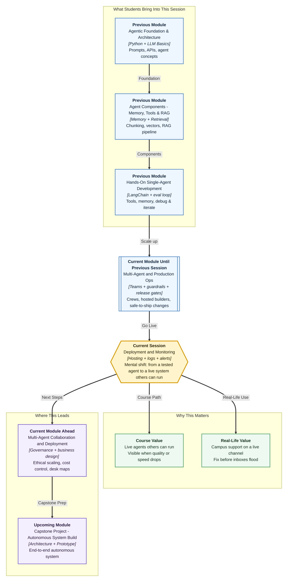

# Pre-read: Deployment and Monitoring for Agent Systems

## Context of This Session in the Course

---

**Ananya’s** Campus Ops support agent finally leaves the lab. Friday evening, it goes live on a WhatsApp-like student channel. It reads hostel and stipend policy, calls a ticketing tool, and replies in the same thread. The demo was perfect. Prof. Meera Kulkarni sends a thumbs-up.

By Monday morning:

- Students report **wrong mess-rebate amounts** — confident answers, but not matching the official circular.
- Average reply time jumps from **4 seconds to 45 seconds** during the 9 a.m. rush.
- One warden asks: *“Did the agent even search the right circular, or did it guess?”*
- Ananya is in a placement meeting. The intern on duty has a vague error line and a screenshot.

Everyone is guessing. Was it the model? The retrieval step? A tool that timed out? A Sunday-night config change? Without a clear picture of **where the agent runs**, **what it logged**, and **what to watch**, every incident becomes a panic call — not a fix.

The same story plays outside campus. A growing Indian fintech launches a **customer support agent** on WhatsApp. Leadership celebrates. By Monday, refund amounts are wrong, replies crawl, and the engineer who built it is on leave. Campus or company, the failure is identical: a tested agent with no operational eyes.

In the **previous** session you learned how to **version** agent changes, run **release gates**, protect **secrets**, and apply **guardrails** so unsafe inputs and outputs do not reach users. That discipline answers: *“Is this change safe enough to release?”*

This session answers the next question:

> **After release, how do we keep the agent visible, measurable, and fixable when real students — or real customers — depend on it every day?**

That is **deployment and monitoring** — not glamorous demo work, but the difference between a science project and a system a warden, a manager, or an auditor will trust.

---

## The challenge: a live agent with no operational eyes

**What if your agent is already serving hundreds of users — but when quality drops or responses slow down, your team cannot tell whether the problem is deployment, retrieval, a tool, or the model itself?**

An agent is not one button that returns one answer. A single student question may trigger:

1. **Input checks** — guardrails and policy filters
2. **Retrieval** — fetching chunks from a knowledge base
3. **Reasoning** — the model deciding what to do next
4. **Tool calls** — hitting a ticketing API, a sheet, or a hostel register
5. **Final output** — the answer the student actually sees

If step 3 succeeds but step 4 fails silently, the student still gets a broken experience. If step 2 pulls last semester’s circular because production points to the wrong **environment**, every answer looks polished — and wrong.

Manual debugging by re-running random test questions does not scale. You need:

- A deliberate **deployment strategy** — where the agent runs, in which **environment**, on what **hosting and runtime**
- An **observability plan** — what to **measure**, **trace**, and **alert** on across agent, tool, and retrieval steps
- A **logging strategy** — records that capture inputs, decisions, tool traffic, retrieval context, errors, and outcomes for **audit** and debugging
- **Monitoring workflows** — how the team responds when **latency** rises or **answer quality** falls in production

Without these, you are flying a plane at night with the cockpit lights off.

---

## Where agents live: deployment choices that shape everything

**Deployment**, in simple words, means deciding how and where your agent system runs so real users can reach it reliably.

Teams typically choose among several paths — each with trade-offs:

| Approach | What it means | When it fits |
|---|---|---|
| **Self-hosted on a server or VM** | You manage the machine, updates, and scaling | Full control, custom tools, campus data that must stay on-prem |
| **Container-based hosting** | Agent packaged in a container and run on a platform | Repeatable environments, easier handoffs between intern batches |
| **Serverless / managed functions** | Code runs on demand without you managing servers | Spiky traffic (result day, fee deadline), but cold starts matter |
| **Platform-hosted agents** | Vendor runs much of the stack (hosted builders you already compared) | Fast launch, less infra work, less low-level control |
| **Hybrid** | Some parts self-hosted, some on vendor platforms | Common when mess policy stays internal but chat sits on a vendor |

**Runtime choices** — the software layer that actually executes your agent — matter too. A LangChain Python service behind an **HTTP API**, an **n8n** workflow with LLM nodes, and a **CrewAI** script on a scheduled job are all “deployments,” but they need different monitoring hooks.

**Environments** separate risk. At minimum, teams use:

- **Development** — where Ananya experiments freely
- **Staging** — where a release candidate runs with production-like settings
- **Production** — where real students interact

A classic failure: retrieval in staging uses this month’s circular, but production still points to last semester’s index. The agent “works” in testing and fails in the hostel group. Good deployment strategy includes **where** each environment lives and **how** configs stay aligned.

Choosing deployment is not about picking the fanciest cloud name. It is about matching **control, cost, compliance, and team skill** to the scenario — and knowing what you will need to observe once users arrive.

---

## Think of it like an airport control tower

A useful daily-life picture is a busy **airport**.

- **Runways and terminals (deployment)** — Planes do not park randomly on public roads. Each flight has an assigned gate, route, and ground crew. Your agent needs a defined place to run, with clear entry and exit paths for student requests.
- **Radar and flight boards (observability)** — Controllers do not guess where planes are. They watch position, altitude, and scheduled vs actual times. For agents, observability means seeing each step — retrieve, reason, act — not only the final reply.
- **Black box and voice logs (logging and audit)** — After an incident, investigators replay recordings: who said what, when, and which checklist was skipped. Agent logs must capture **decisions**, **tool traffic**, **retrieval context**, **errors**, and **outcomes** so you can reconstruct a bad run without blaming everyone in the room.
- **Weather alerts (monitoring and alerts)** — When wind speed crosses a limit, alarms sound before a crash. Production monitoring watches **latency**, **error rates**, **token spend**, and **quality signals** — then alerts the on-call intern before the warden’s inbox floods.
- **Emergency playbook (incident response)** — Towers do not improvise during fog. They follow steps: divert, hold, inspect, resume. When agent quality degrades, teams need a workflow — who checks logs first, when to roll back a release, when to disable a tool, when to escalate to a human.

The mental shift: **treat a live agent like managed air traffic**, not a magic chat box that only shows the last sentence.

---

## Observability, logging, and the fields an auditor will ask for

**Observability** means you can understand what happened inside the system from the signals it leaves behind — logs, traces, and metrics — without guessing from the final answer alone.

A practical plan answers three questions:

1. **What should we measure?** End-to-end **latency**, success vs failure at each step, **token usage**, retrieval hit rate, tool-call success.
2. **What should we trace?** A **trace** is the full journey of one agent run, linked by a shared id — like a courier tracking number on every scan. Fields include run id, timestamp, step name, model/prompt version, retrieval query and top chunks, tool name and arguments, decision summary, error flag, and final outcome.
3. **What should trigger alerts?** Not every log line should wake someone at 2 a.m. Alerts fire on patterns that hurt users or budget: error spikes, latency above a threshold, sudden cost jumps, or quality scores dropping on a sampled eval set.

**Logging**, in this context, is the habit of writing structured records at each important moment — not scattered print statements. Capture **inputs** (sanitized, no secrets), **decisions**, **tool traffic**, **retrieval context**, **errors**, and **outcomes**. Structured records let you filter: *show all failed tool calls in the last hour*, or *show every run where retrieval returned empty*.

That trail serves two audiences: the intern debugging tonight, and the registrar asking *“Can you prove what the agent did on 3 August?”* tomorrow.

---

## Monitoring workflows and incident response

**Monitoring** is the ongoing practice of watching production signals and acting when they cross safe limits.

| Signal | Possible meaning | First response |
|---|---|---|
| Latency up 3× | Model overload, slow tool, or bad retrieval index | Check traces for slowest step; scale or rollback |
| Error rate spike | Bad deployment, expired credential, tool outage | Compare timing with last release; inspect error logs |
| Cost surge | Runaway loop, larger model, or huge retrieval payloads | Identify high-token runs; tune limits or caching |
| Quality drop on eval sample | Prompt drift, stale knowledge, wrong environment | Run regression set; compare staging vs production configs |
| Guardrail blocks rising | Attack attempts or misconfigured policy | Review blocked inputs; adjust rules if false positives |

**Incident response planning** means deciding in advance: who is **on call**, when to **roll back** vs patch forward, when to **disable a tool**, when to switch to **human fallback**, and how incidents are **documented** so the same failure does not repeat blindly.

You are not monitoring for pretty dashboards alone. You are monitoring so the right person takes the right action before a small glitch becomes a reputational crisis — on campus or in a company WhatsApp queue.

---

## In this pre-read, you'll discover:

- **Understand** why choosing **hosting, runtime, and environments** affects every production incident — not only launch day
- **Learn** how an **observability plan** defines what to measure, trace, and alert on across retrieval, reasoning, and tool steps
- **Discover** what a production-grade **logging strategy** must capture for audit, debugging, and compliance
- **Understand** how **monitoring workflows** and **incident response** connect latency and quality signals to concrete operational actions

---

## What's next

By the end of the session, you should be able to:

- **Compare** deployment options for agent-backed services and justify a hosting and runtime strategy for a campus or business scenario
- **Design** an observability plan that specifies metrics, traces, alerts, and audit fields across agent, tool, and retrieval steps
- **Specify** a logging strategy that records inputs, decisions, tool traffic, retrieval context, errors, and outcomes — without drowning in noise
- **Relate** monitoring signals to operational response when agent quality or latency degrades in production
- **Outline** an incident response workflow a team could follow during a real degradation — roll back, isolate, fix, verify

**Upcoming** work in this module extends this into **governance, ethical scaling, and cost control** — the policies and oversight that keep agent fleets accountable at organisation level. Deployment and monitoring give you the operational eyes; governance gives you the rules those eyes must serve. After that comes **business design** ready for capstone.

---

## Questions to think about before class

1. **The Sunday Night Switch** — Ananya’s support agent worked fine in staging. Production was updated Sunday night with a new retrieval index path, but the environment variable still points to the old circulars. Students get fluent wrong answers about mess rebate. Which **deployment and environment** checks should have caught this — and what **log field** would prove retrieval pulled stale chunks?

2. **The 45-Second Reply** — Latency alerts fire at 9 a.m. Traces show retrieval completes in 200 ms, but one ticketing-tool step averages 40 seconds. Should the team scale servers, fix the tool, add a timeout, or all three? Walk through the **monitoring workflow** step by step.

3. **The Audit Request** — The registrar asks: *“Show exactly what the agent did for ticket #8842 — including which policy section it retrieved and which tool it called.”* Which **trace and audit fields** must exist in your logging design to answer that without hand-waving?

Think of one agent your campus or organisation might deploy — who uses it, what could go wrong at 2 a.m., and what three signals you would watch on day one. We will turn those instincts into a deployment and monitoring plan you can defend in front of engineers, wardens, managers, and auditors alike.
