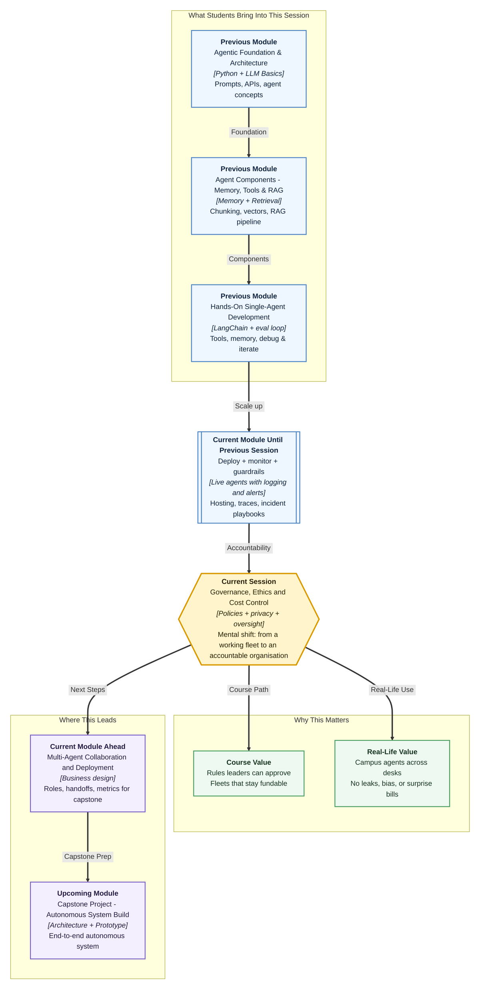

# Pre-read: Governance, Ethical Scaling and Cost Control for Agent Systems

## Context of This Session in the Course

---

**Ananya’s** campus agents did not stay as one support bot. Over one term, different desks quietly launch their own helpers:

- **Student support** answers hostel and stipend queries on the WhatsApp-like channel.
- **HR / placement screening** ranks internship applications and flags incomplete files.
- **Campus finance** summarises vendor bills for the fest committee and flags odd GST lines.
- **Marketing / admissions** drafts personalised campaign messages from enquiry history.

Each desk celebrates faster work. The director sees productivity rising. Then, in one week, three crises hit at once:

- The support agent **quotes a student’s hostel room number and fee balance** in a group thread visible to other students — a **privacy** breach that triggers a parent complaint.
- Placement leadership discovers the screening agent **consistently ranks applicants from certain colleges lower**, even when qualifications match — a **bias** problem no one tested for before go-live.
- Accounts receives a cloud bill **three times the forecast** because five desks each deployed agents on the most expensive model, with no **budget limits** or shared **usage monitoring**.

The technical teams did nothing “wrong” in isolation. Each agent worked in a demo. But nobody asked: *Who approved these workflows? Who audits what data they touch? Who watches total spend across the fleet?*

The same pattern shows up outside campus. A large Indian retail company launches support, HR, finance, and marketing agents in six months. One week: a customer address leaks in a group chat, hiring ranks some colleges down, and the bill triples. Campus or company, the failure is identical: a **working fleet** with no **rules of the road**.

In the **previous** session you learned how to **deploy** agents, design **observability**, build **logging** for audit, and respond when **quality or latency** drops in production. That discipline answers: *“Can we see what the agent did after it went live?”*

This session answers the organisation-level question:

> **When a fleet of agents runs across support, HR, finance, and marketing — how do we keep them private, fair, safe, and financially sustainable — not just individually working, but collectively trustworthy?**

That is **governance, ethical scaling, and cost control** — the layer that separates a clever pilot from a system a director, a legal team, and a finance head will actually fund at scale.

---

## The challenge: a fleet of agents with no rules of the road

**What if your campus or company already has fifteen agents touching student data, employee records, and payment systems — but there is no shared policy on who can launch one, what data they may read, or how much they are allowed to spend per month?**

A single agent is like one driver on an empty road. An **agent fleet** is like a city full of vehicles — support vans, delivery trucks, school buses — all sharing the same streets, fuel budget, and traffic laws. Without rules, even skilled drivers cause collisions.

Each autonomous agent workflow may:

1. **Read sensitive data** — phone numbers, hostel allotments, salary notes in internal documents
2. **Make consequential decisions** — approve a rebate, rank a candidate, escalate a fraud-like invoice
3. **Call expensive models repeatedly** — looping through retrieval, reasoning, and tool steps on every message
4. **Act without a human in the loop** — sending emails, updating records, or posting replies before anyone reviews

Manual trust — *“Ananya built it, so it must be fine”* — does not scale when Ananya is one of twenty builders and the agents run 24/7.

You need:

- **Governance principles** — clear steps for **approving**, **monitoring**, and **auditing** agent workflows before and after launch
- **Privacy controls** — rules for what internal and student or customer data agents may access, store, and expose in logs
- **Bias and safety guardrails** — checks so high-impact decisions do not silently harm certain groups or violate policy
- **Human oversight** — defined moments when a person must review, override, or take over
- **Cost-control strategies** — **model selection**, **caching**, **limits**, **budgets**, and **usage monitoring** across the entire fleet

Without these, scaling agents does not multiply productivity — it multiplies risk.

---

## Governance: who approves, who watches, who audits

**Governance**, in simple words, means the set of rules and processes that decide *who is allowed to do what*, *how decisions are recorded*, and *how mistakes are caught* before they become headlines.

In mature organisations, autonomous agent workflows pass through a lifecycle:

| Stage | What governance asks |
|---|---|
| **Proposal** | What problem does this agent solve? What data and tools does it need? |
| **Approval** | Has legal, security, and the business (or campus) owner signed off? |
| **Launch** | Are guardrails, logging, and monitoring in place? |
| **Operation** | Is behaviour still within policy? Are costs within budget? |
| **Audit** | Can we prove what the agent did six months ago for a specific student or customer? |

**Audit trails** — structured records of inputs, decisions, tool actions, and outcomes — are not optional paperwork. They are how teams answer regulators, angry parents, and internal investigations without guessing.

Governance also defines **policies**: written standards such as *“Agents must not store raw Aadhaar numbers in logs”*, *“Rebate agents above ₹10,000 require human approval”*, or *“No new production agent without a regression test on the eval set.”*

The mental shift: **treat every agent workflow like a regulated business process**, not a side project that happens to use AI.

---

## Privacy, bias, safety, and a named human stamp

**Data privacy** means protecting personal and sensitive information so it is collected, used, and stored only in ways people expect and the law allows.

Agents create privacy risks that traditional software often avoids, because they **read natural language** — emails, tickets, HR forms, chat transcripts — and may **repeat fragments** in replies or logs.

Common risk patterns:

- An agent retrieves a chunk containing a **phone number** and includes it in a reply meant for a different student
- **Internal stipend data** sits in a knowledge base the marketing agent can search because folders were not separated
- Debug logs store **full queries** with names and roll numbers, visible to every intern with log access
- A vendor-hosted model processes **confidential contracts** without a data-processing agreement

Strong privacy controls include **data classification**, **access boundaries**, **minimisation**, **log redaction**, and **retention rules**. Privacy is how students, parents, and employees keep trusting you after agents become the front door.

**Bias**, in this context, means systematic unfairness — when an agent treats similar people differently based on patterns that should not matter, such as region, gender, college name, or language style. **Safety** means preventing harm: wrong medical-style advice, incorrect legal guidance, fraudulent approvals, or outputs that violate values.

If past hiring favoured one profile, an HR screening agent may **repeat that bias** at scale — faster and with more confidence than any human recruiter.

| Control | Purpose |
|---|---|
| **Pre-deployment testing** | Run the agent on diverse scenarios before real users depend on it |
| **Bias checks** | Compare outcomes across groups; flag skewed ranking or refusal rates |
| **Safety filters** | Block harmful, illegal, or out-of-scope requests and responses |
| **Human-in-the-loop** | Require a person to approve, edit, or reject before action is taken |
| **Escalation paths** | Route uncertain or sensitive cases to a human expert |
| **Kill switch** | Ability to disable an agent quickly when policy is violated |

**Human oversight** does not mean humans review every message. It means humans are in the loop **where the stakes justify it**, with clear accountability for who owns the final decision.

---

## Think of it like a hospital with many specialists

A useful daily-life picture is a busy **hospital**.

- **Admission desk (governance approval)** — Not every visitor walks straight into the operating theatre. Each case is registered, triaged, and assigned with documented consent.
- **Patient records room (privacy)** — Doctors see only the files their speciality requires. Copies are controlled; names are protected.
- **Medical ethics board (bias and safety)** — New procedures are reviewed for harm before wide rollout. Outcomes are monitored across patient groups.
- **Senior consultant sign-off (human oversight)** — A junior doctor may draft a plan, but certain surgeries need the consultant’s approval before the knife moves.
- **Pharmacy budget and inventory (cost control)** — The hospital tracks medicine usage department by department. Expensive drugs require justification.

The mental shift: **scaling agents is like scaling a hospital network** — expertise matters, but without shared standards on records, ethics, approval, and budget, every new ward adds chaos instead of care.

---

## Cost control: keeping agent fleets financially sustainable

**Cost control** means designing agent systems so they deliver value without surprise bills — especially when usage grows from hundreds to millions of requests.

Agent costs come from many directions: **model choice**, **token usage**, **tool calls**, **runaway loops**, and **fleet duplication** (ten desks each running similar agents on premium models).

| Strategy | What it does |
|---|---|
| **Model selection** | Match model size to task difficulty — simple routing on a cheap model, complex reasoning only when needed |
| **Caching** | Reuse answers or embeddings for repeated questions instead of recomputing every time |
| **Rate and token limits** | Cap requests per user, per team, or per workflow |
| **Budgets and alerts** | Set monthly spend thresholds; notify owners before limits are breached |
| **Usage monitoring** | Dashboards showing cost by agent, team, model, and tool — so finance sees trends, not shocks |
| **Shared platforms** | Centralise common agents instead of every desk rebuilding the same pipeline |

Cost control is not penny-pinching. It is how leadership keeps funding agents long after the first demo excitement fades.

---

## In this pre-read, you'll discover:

- **Understand** why **governance** — approval, monitoring, and audit — is the backbone of trustworthy agent fleets
- **Learn** how **privacy and data-handling** risks appear when agents read internal and student or customer information — and what controls reduce them
- **Discover** what **bias**, **safety**, and **human oversight** mean for high-impact decisions that affect people’s lives and livelihoods
- **Understand** how **cost-control strategies** — model choice, caching, limits, budgets, and fleet-wide monitoring — keep scaling agents financially sustainable

---

## What's next

By the end of the session, you should be able to:

- **Explain** governance principles for approving, monitoring, and auditing autonomous agent workflows
- **Identify** privacy and data-handling risks when agents access internal documents or personal information
- **Propose** bias, safety, and human-oversight controls for agent decisions where mistakes carry serious consequences
- **Design** a cost-control plan covering model selection, caching, usage limits, budgets, and monitoring for an agent fleet
- **Connect** policies and audit trails to the logging and monitoring practices you built in **previous** production-focused work

**Upcoming** work in this module extends this into **designing a complete multi-agent business workflow** — roles, handoffs, tools, and success metrics you can take into the capstone build. Governance gives you the rules; business design gives you the blueprint those rules protect.

---

## Questions to think about before class

1. **The HR Screening Shock** — An agent ranks five hundred internship applicants overnight. Placement notices graduates from certain states consistently score lower despite similar qualifications. Which **bias checks** should have run before launch, and what **human oversight** gate should exist before any rejection email is sent?

2. **The Log That Leaked Too Much** — Compliance asks whether student Aadhaar or PAN numbers ever appeared in agent logs. Support swears the agent “only answers policy questions.” Which **privacy controls**, **data boundaries**, and **audit trail** fields would let you answer that question with evidence — not assumptions?

3. **The Million-Rupee Month** — Finance discovers agent spend jumped 400% after three new desks launched workflows on the largest model with no caching. How would you design **budgets**, **usage monitoring**, and **model selection rules** so teams innovate without bankrupting the AI line item?

Think of one agent your campus or organisation might deploy at scale — who it affects, what sensitive data it touches, and what could go wrong if nobody governs it. We will turn those instincts into a governance and cost-control framework you can present to engineers, managers, legal teams, and finance with confidence.
