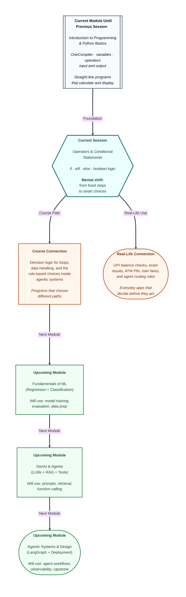

```mermaid
%%{init: {"diagramPadding": 24, "flowchart": {"htmlLabels": true, "nodeSpacing": 90, "rankSpacing": 110, "curve": "basis", "padding": 20}, "theme": "base", "themeVariables": {"fontFamily": "Arial", "fontSize": "15px", "lineColor": "#334155"}}}%%
flowchart TB
    subgraph FOUNDATION[" "]
        direction LR
        PREV[["&nbsp;&nbsp;<b>Current Module Until Previous Session</b>&nbsp;&nbsp;<br/><br/>Introduction to Programming<br/>&amp; Python Basics<br/><br/><i>OneCompiler · variables · operators<br/>input and output</i><br/><br/><i>Straight-line programs<br/>that calculate and display</i>"]]
    end

    CURRENT{{"&nbsp;&nbsp;<b>Current Session</b>&nbsp;&nbsp;<br/><br/>Operators &amp; Conditional<br/>Statements<br/><br/><i>if · elif · else · boolean logic</i><br/><br/><b>Mental shift:</b><br/>from fixed steps<br/>to smart choices"}}

    subgraph VALUE[" "]
        direction LR
        COURSE["&nbsp;&nbsp;<b>Course Connection</b>&nbsp;&nbsp;<br/><br/>Decision logic for loops,<br/>data handling, and the<br/>rule-based choices inside<br/>agentic systems<br/><br/><i>Programs that choose<br/>different paths</i>"]
        REAL(["&nbsp;&nbsp;<b>Real-Life Connection</b>&nbsp;&nbsp;<br/><br/>UPI balance checks, exam<br/>results, ATM PIN, train fares,<br/>and agent routing rules<br/><br/><i>Everyday apps that<br/>decide before they act</i>"])
    end

    subgraph FUTURE[" "]
        direction LR
        M2["&nbsp;&nbsp;<b>Upcoming Module</b>&nbsp;&nbsp;<br/><br/>Fundamentals of ML<br/>(Regression + Classification)<br/><br/><i>Will use: model training,<br/>evaluation, data prep</i>"]
        M3["&nbsp;&nbsp;<b>Upcoming Module</b>&nbsp;&nbsp;<br/><br/>GenAI &amp; Agents<br/>(LLMs + RAG + Tools)<br/><br/><i>Will use: prompts, retrieval,<br/>function calling</i>"]
        M4(["&nbsp;&nbsp;<b>Upcoming Module</b>&nbsp;&nbsp;<br/><br/>Agentic Systems &amp; Design<br/>(LangGraph + Deployment)<br/><br/><i>Will use: agent workflows,<br/>observability, capstone</i>"])
    end

    PREV ==>|&nbsp;Foundation&nbsp;| CURRENT
    CURRENT ==>|&nbsp;Course Path&nbsp;| COURSE
    CURRENT ==>|&nbsp;Real-Life Use&nbsp;| REAL
    COURSE ==>|&nbsp;Next Module&nbsp;| M2
    M2 ==>|&nbsp;Next Module&nbsp;| M3
    M3 ==>|&nbsp;Next Module&nbsp;| M4

    classDef previous fill:#f8fafc,stroke:#475569,stroke-width:2px,color:#0f172a
    classDef current fill:#ecfeff,stroke:#0f766e,stroke-width:3px,color:#134e4a
    classDef value fill:#fff7ed,stroke:#c2410c,stroke-width:2px,color:#7c2d12
    classDef future fill:#f0fdf4,stroke:#15803d,stroke-width:2px,color:#14532d

    class PREV previous
    class CURRENT current
    class COURSE,REAL value
    class M2,M3,M4 future

    style FOUNDATION fill:transparent,stroke:transparent
    style VALUE fill:transparent,stroke:transparent
    style FUTURE fill:transparent,stroke:transparent
    linkStyle default stroke:#334155,stroke-width:3px
```
