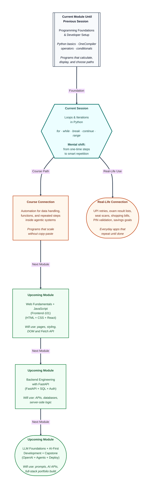

```mermaid
%%{init: {"diagramPadding": 24, "flowchart": {"htmlLabels": true, "nodeSpacing": 90, "rankSpacing": 110, "curve": "basis", "padding": 20}, "theme": "base", "themeVariables": {"fontFamily": "Arial", "fontSize": "15px", "lineColor": "#334155"}}}%%
flowchart TB
    subgraph FOUNDATION[" "]
        direction LR
        PREV[["&nbsp;&nbsp;<b>Current Module Until Previous Session</b>&nbsp;&nbsp;<br/><br/>Programming Foundations<br/>&amp; Developer Setup<br/><br/><i>Python basics · OneCompiler<br/>operators · conditionals</i><br/><br/><i>Programs that calculate,<br/>display, and choose paths</i>"]]
    end

    CURRENT{{"&nbsp;&nbsp;<b>Current Session</b>&nbsp;&nbsp;<br/><br/>Loops &amp; Iterations<br/>in Python<br/><br/><i>for · while · break · continue · range</i><br/><br/><b>Mental shift:</b><br/>from one-time steps<br/>to smart repetition"}}

    subgraph VALUE[" "]
        direction LR
        COURSE["&nbsp;&nbsp;<b>Course Connection</b>&nbsp;&nbsp;<br/><br/>Automation for data handling,<br/>functions, and repeated steps<br/>inside agentic systems<br/><br/><i>Programs that scale<br/>without copy-paste</i>"]
        REAL(["&nbsp;&nbsp;<b>Real-Life Connection</b>&nbsp;&nbsp;<br/><br/>UPI retries, exam result lists,<br/>seat scans, shopping bills,<br/>PIN validation, savings goals<br/><br/><i>Everyday apps that<br/>repeat until done</i>"])
    end

    subgraph FUTURE[" "]
        direction LR
        M2["&nbsp;&nbsp;<b>Upcoming Module</b>&nbsp;&nbsp;<br/><br/>Web Fundamentals + JavaScript<br/>(Frontend-101)<br/>(HTML + CSS + React)<br/><br/><i>Will use: pages, styling,<br/>DOM and Fetch API</i>"]
        M3["&nbsp;&nbsp;<b>Upcoming Module</b>&nbsp;&nbsp;<br/><br/>Backend Engineering<br/>with FastAPI<br/>(FastAPI + SQL + Auth)<br/><br/><i>Will use: APIs, databases,<br/>server-side logic</i>"]
        M4(["&nbsp;&nbsp;<b>Upcoming Module</b>&nbsp;&nbsp;<br/><br/>LLM Foundations + AI-First<br/>Development + Capstone<br/>(OpenAI + Agents + Deploy)<br/><br/><i>Will use: prompts, AI APIs,<br/>full-stack portfolio build</i>"])
    end

    PREV ==>|&nbsp;Foundation&nbsp;| CURRENT
    CURRENT ==>|&nbsp;Course Path&nbsp;| COURSE
    CURRENT ==>|&nbsp;Real-Life Use&nbsp;| REAL
    COURSE ==>|&nbsp;Next Module&nbsp;| M2
    M2 ==>|&nbsp;Next Module&nbsp;| M3
    M3 ==>|&nbsp;Next Module&nbsp;| M4

    classDef previous fill:#f8fafc,stroke:#475569,stroke-width:2px,color:#0f172a
    classDef current fill:#ecfeff,stroke:#0f766e,stroke-width:3px,color:#134e4a
    classDef value fill:#fff7ed,stroke:#c2410c,stroke-width:2px,color:#7c2d12
    classDef future fill:#f0fdf4,stroke:#15803d,stroke-width:2px,color:#14532d

    class PREV previous
    class CURRENT current
    class COURSE,REAL value
    class M2,M3,M4 future

    style FOUNDATION fill:transparent,stroke:transparent
    style VALUE fill:transparent,stroke:transparent
    style FUTURE fill:transparent,stroke:transparent
    linkStyle default stroke:#334155,stroke-width:3px
```
