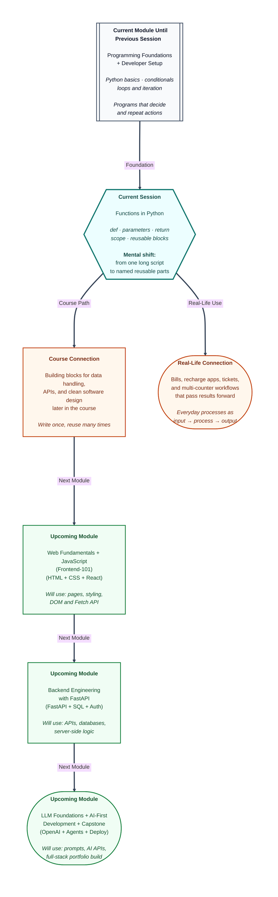

# Pre-read: Functions in Python

Imagine a busy **tea stall** near your college. Orders keep coming — less sugar, more milk, cutting, strong. The worker does not invent a new process every time. The steps are already known. Someone simply says **"make tea"**, and the familiar flow begins.

That is how skilled work scales. You name a useful task once, then reuse it with small changes. The same idea powers bills, recharge, tickets, and results — without rewriting the same logic for every customer.

In the previous session, your programs learned to **decide** with conditions and **repeat** with loops. Now they are ready for the next upgrade: packaging repeated work into **named, reusable blocks**.

---

## Context of This Session in the Course

---

## When the same work repeats at every counter

Picture a **college fest**. Food coupons, event registration, merchandise, and certificates — four counters, same kind of work: take details, calculate an amount, apply a small rule, show a final message.

You *could* write the full calculation again for every counter. Then the organisers change the discount from ₹50 to ₹75. Suddenly you hunt through every copy. Miss one place, and one counter shows a different total from the others.

**What if** you could save the calculation **once**, give it a clear name, and reuse it wherever a bill is needed — with different prices, quantities, or discounts?

That is the problem **functions** solve. A **function** is a reusable block of logic — in simple words, a small machine with a name. You define the steps once. Later you **call** it as many times as you need, with different inputs.

Think of an **ATM**: you give PIN and amount (**input**), it checks your account (**process**), and it gives cash or a message (**output**). Functions follow the same pattern: **input → process → output**.

---

## Recipes, empty boxes, and answers that come back

Defining a function is like writing a **recipe title** at the top of a notebook — *"Make Lemon Rice"* — and listing the steps under it. The recipe sits quietly until someone places an order. In Python, the keyword **`def`** is how you write that recipe name and its steps. A **function call** is the order: "do this now."

To make the same recipe work for different people, you need **empty boxes** that fill at order time. A **parameter** is that empty box in the definition — for example, a space for "name" or "distance". An **argument** is the actual value you put in when you call the function — `"Anita"`, or `5` kilometres. Same process; different fillings. That is why one tea recipe can handle less sugar, more milk, or no sugar at all.

Sometimes the function should not only **show** something on screen. It should **give an answer back** so the rest of the program can use it. **`return`** does that. Printing is like announcing the bill loudly at the counter. Returning is like handing the written total to the next counter so they can add delivery or apply a coupon. Without a return, the calculation stays trapped inside — the outside world gets nothing useful to pass forward.

Many real tools also have a **backup choice**. A delivery app may use standard delivery unless you pick express. A **default parameter value** is that backup: if the caller does not provide a value, Python uses the one already written in the recipe.

---

## Private notes, notice boards, and clean teams of functions

Not every number in a program should be visible everywhere. A **local variable** is like a shopkeeper’s rough calculation on a small paper — useful only inside that billing step. A **global variable** is like a notice on the wall that the whole shop can read. **Scope** simply means *where a name is allowed to be used*. Mixing these carelessly causes confusing bugs. The cleaner habit is: pass what a function needs as **parameters**, and send results out with **return**.

When you split a big job into small named jobs — calculate subtotal, add delivery, apply coupon — you are doing **modular programming**. In simple words: build with Lego bricks, not one giant clay lump. You can **chain** functions so the output of one becomes the input of the next, like a bill moving from counter to counter. Combine that with the **loops** you already know, and the same pass/fail check can run for many students without copying the decision logic again and again.

---

**In this pre-read, you'll discover:**

- Why **functions** let you write a useful task once and reuse it many times with different inputs.
- How **parameters**, **arguments**, and **default values** make one recipe flexible for many situations.
- Why **return** is different from only printing — and how answers can flow from one function to another.
- How **local vs global scope** and **modular programming** keep programs readable, testable, and easier to fix.

A function with a clear purpose — names like *calculate total* or *check pass fail* — is easier to trust than a vague *do stuff*. Readable code is how you understand what the program should do when something breaks.

---

## After this session, you'll be able to

- Define and **call** functions with a clear purpose using **`def`**.
- Pass data with **parameters** and **arguments**, including **default** backups when a value is optional.
- Use **`return`** so results can be stored, reused, or passed into another function.
- Explain **local vs global scope** and avoid common scope-related mistakes.
- **Refactor** repeated logic into small, readable functions — and connect them into a simple pipeline.

These reusable blocks prepare you for larger programs in upcoming lessons, where clean structure matters as much as getting the answer right.

---

## Questions we will solve together in the live class

1. **A mobile recharge needs plan price × months, then a platform fee, then cashback.** If each step is a separate function, how does the **output of one become the input of the next** — and what goes wrong if a step calculates a value but forgets to **return** it?

2. **Delivery fee uses ₹10 per km by default, but some customers get a special rate.** How do **default parameters** keep the common case simple while still allowing a custom rate — and what happens if you put the default box *before* a required one?

3. **A shop has a shared shop name on the wall, but each bill’s discount is calculated on a private paper.** How do you explain **local vs global scope** with that story — and why is “pass inputs in, return the answer out” safer than editing shared values from inside every function?

Bring your curiosity. The live session turns tea stalls, fest counters, and recharge pipelines into Python functions you can define, call, connect, and trust.
