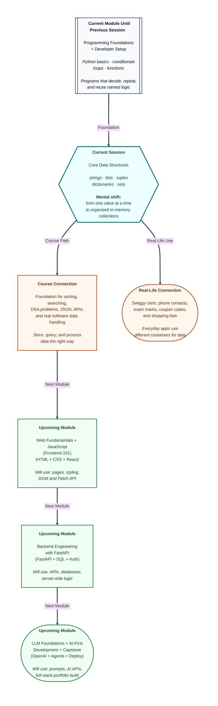

# Pre-read: Core Data Structures — Strings, Lists, Tuples, Dictionaries & Sets

Imagine you are helping run a **college fest**. One counter collects student names for a dance competition. Another tracks food orders. A third stores roll numbers and marks for a quiz. A fourth keeps a list of coupon codes so nobody uses the same discount twice.

Every counter is holding **many pieces of information at once**. Names, prices, marks, codes — all mixed together, all needed quickly. You cannot write each item on a separate sticky note with its own label like `name1`, `name2`, `name3` up to `name200`. That works for three items. It collapses the moment real data arrives.

In the previous session, your programs learned to package logic into **reusable functions** — named blocks that take input, do work, and send results back. That was a big upgrade. But functions still need something to work **with**. A billing function needs a list of items. A result checker needs marks. A contacts lookup needs names linked to phone numbers.

This session answers a question every real program eventually faces: **how do you store and organise many values inside the computer's memory?**

---

## Context of This Session in the Course

---

## When one variable is not enough

Picture a **Swiggy order** with rice, dal, curd, and a cold drink. You need all four items together, in order, with the option to add one more item at the last second. You also need to remove the drink if the restaurant runs out. That is not a single number or a single word — it is a **collection** that grows and shrinks.

Now picture your **phone contacts**. You do not search by position number three or position number forty-seven. You search by **name** — tap **"Maa"** and her number appears. The label matters more than the position.

Now picture an **exam hall seating plan** printed and locked before the test starts. Roll number, seat, and room should not change halfway through. You can read the plan, but you should not scribble over it.

And picture a **fest coupon desk** that must reject duplicate codes — if `SAVE50` was already used, the system should know instantly without scanning every entry from the top.

**What if** your program had to handle all four situations — flexible lists, fixed records, name-based lookup, and duplicate-free collections — using only separate variables? You would drown in names like `item1`, `item2`, `price_a`, `price_b`. Worse, you would pick the wrong kind of container and create bugs that are hard to spot.

That is the challenge **data structures** solve. A **data structure** — in simple words — is a **container** for storing many values in an organised way so your program can access, update, and process them efficiently. Python gives you five core containers, each designed for a different kind of everyday data problem.

---

## Five containers for five everyday jobs

Think of Python's core data structures like items you already use at home and on your phone:

| Container | Everyday picture | Best when you need… |
|-----------|------------------|---------------------|
| **List** | A **tiffin box** with compartments you can rearrange | An ordered collection you can add to, remove from, or change |
| **String** | Your **name on an Aadhaar card** — fixed text, character by character | Text — names, messages, labels — that stays as written |
| **Tuple** | A **sealed parcel** packed once and not opened again | A fixed record — like a GPS coordinate or RGB colour — that should not accidentally change |
| **Dictionary** | Your **phone contacts** — search by name, get the number | Data linked by a **label** (called a **key**) to a **value**, like a menu price or roll number to marks |
| **Set** | A **unique coupon code list** where duplicates are thrown away automatically | Only **distinct** items — no repeats — with fast "is this already here?" checks |

Each container has rules. Some keep **order** (lists, strings, tuples). Some allow **changes** after creation; others do not. Some let you reach an item by **position** — the first item is at index **0**, the last at **-1**. Some let you reach data only by **key**, like looking up `"Dosa"` to find its price.

Choosing the wrong container is like using a sealed parcel when you needed a shopping bag — technically you have a box, but the job becomes painful. Choosing the right one makes your programs shorter, clearer, and safer.

---

## Reading slices, building reports, and picking the right box

Once data lives inside a container, you need ways to **reach** it and **summarise** it without doing everything by hand.

**Indexing and slicing** are how you pick one item or a portion from an ordered collection — like taking songs 3 to 5 from a playlist, or reading the first letter of a word on a board. **Indexing** means "give me the item at this seat number." **Slicing** means "give me this range" — and the end seat is **not** included, which surprises many beginners the first time.

For labelled data, **key–value** access works differently. You ask for `"Maa"` in contacts, not "the third contact." Python's **dictionary** behaves like a fast locker system — each **key** opens one **value** directly. Methods like safe lookup (so a missing name does not crash your program), listing all keys, and looping over pairs turn a contacts book into a small reporting engine.

For collections of numbers — marks, prices, quantities — Python offers ready-made tools: counting how many items exist, sorting a copy without destroying the original, finding the smallest and largest, and totalling everything up. These built-in helpers work across lists, strings, and other collections, so you do not rebuild the same maths every time.

The skill that ties everything together is **choosing the right structure for the problem**. Need a growing shopping cart? **List.** Need a fixed `(latitude, longitude)` pair? **Tuple.** Need roll number → marks? **Dictionary.** Need to remove duplicate registrations from two batches and find who attended both? **Set.**

---

**In this pre-read, you'll discover:**

- Why programs need **data structures** instead of dozens of separate variables when handling real-world amounts of data.
- How **lists**, **strings**, and **tuples** store ordered items — and why some can change while others are locked after creation.
- How **dictionaries** and **sets** solve labelled lookup and duplicate-free collection problems you see in contacts apps and coupon systems.
- How **indexing**, **slicing**, and built-in helpers like counting, sorting, and totalling let you query and summarise collections with confidence.

Understanding these containers is not just syntax — it is how every app you use organises information before showing it on screen.

---

## After this session, you'll be able to

- Create and update **lists** and work with **strings** using indexing, slicing, and essential methods.
- Use **tuples** for fixed records and explain when immutability — data that cannot change — protects your program from accidental edits.
- Build and query **dictionaries** with key–value pairs, including safe lookup when a key might be missing.
- Use **sets** to remove duplicates and check membership quickly.
- Apply built-in helpers to measure, sort, and summarise collections — and **choose the right structure** for a given problem instead of guessing.

These skills become the backbone of sorting, searching, and problem-solving work in upcoming lessons — and of every real program that handles more than one piece of data at a time.

---

## Questions we will solve together in the live class

1. **A fest food counter tracks orders in a list, prices in a dictionary, and seat coordinates as fixed tuples.** A volunteer tries to change a seat coordinate after printing and gets an error — while adding a new food item to the list works fine. Why does Python treat these containers differently, and how do you decide **list vs tuple** before you start coding?

2. **Two batches of workshop registrations have overlapping names, and the organiser wants only unique attendees plus a list of people who registered for both batches.** Which two data structures combine naturally for "remove duplicates" and "find common members" — and why is a list the wrong tool for the duplicate-check part?

3. **A class teacher stores marks in a dictionary and wants the highest score, the average, and names sorted alphabetically — without manually looping through every entry three separate times.** How do built-in helpers on collections give you counts, sorted views, totals, and extremes — and what is the difference between sorting a **copy** versus rearranging the original list in place?

Bring your curiosity. The live session turns Swiggy carts, contact books, exam records, and fest coupon desks into Python containers you can create, query, combine, and trust.
