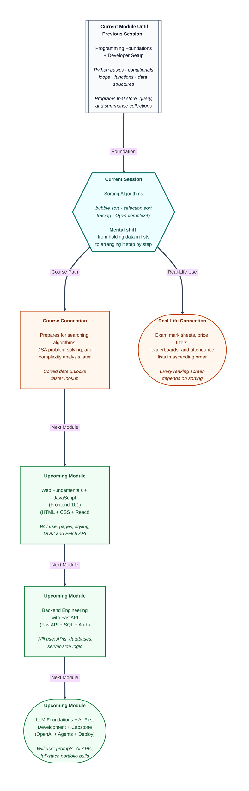

# Pre-read: Sorting Algorithms — Bubble Sort & Selection Sort

Open any **online shopping app** and tap **"Price: Low to High."** Within a second, hundreds of products rearrange themselves — cheapest first, costliest last. Open a **college result portal** and switch to **"Marks: High to Low."** The same list of students reshuffles into a clean leaderboard.

Nobody sits behind the screen manually comparing every price with every other price. Yet somewhere, a program is doing exactly that kind of work — comparing values, deciding order, and producing a neat arranged list. That process has a name: **sorting**.

In the previous session, you learned how to **store** many values together using lists, dictionaries, and other data structures. You also met Python's built-in **`sorted()`** helper, which can arrange a collection for you in one line. That is useful — but it hides the machinery. This session pulls back the curtain and asks: **how does sorting actually work when you build it yourself, step by step?**

---

## Context of This Session in the Course

---

## When arranging by hand stops working

Picture a **class teacher** with forty exam marks scribbled on separate chits — 78, 45, 92, 61, and so on. She needs a rank list from lowest to highest for the notice board. For four chits, she can eyeball the order. For forty, she starts comparing pairs, swapping positions, checking again. For four hundred, the job becomes exhausting — and one missed comparison means the whole list is wrong.

**What if** a computer had to do the same job — not with a magic one-line command, but with clear, repeatable steps you could trace on paper like a maths problem? That is what **sorting algorithms** are: step-by-step recipes for arranging data in a chosen order, usually smallest to largest or A to Z.

Every sorting algorithm boils down to two basic actions repeated many times: **compare** two values ("is this one bigger?") and **swap** their positions when they are in the wrong order. The difference between algorithms is *how* they choose which pairs to compare and when to stop.

---

## Two beginner-friendly ways to sort

### Bubbles rising to the surface

Imagine students standing in a line for a **height-check**. The supervisor walks left to right, comparing each pair of neighbours. If the taller student stands before the shorter one, they swap places. One full walk from start to end is called a **pass**. After the first pass, the tallest student has "bubbled" all the way to the right end — like a bubble rising in water. After the next pass, the second-tallest settles into place. Repeat until the whole line is sorted.

That is **Bubble Sort** — in simple words, a method that compares **neighbouring** values and slowly pushes the larger ones toward the end. It is easy to understand and satisfying to trace on paper, because you can watch big numbers drift rightward one pass at a time.

### Picking the smallest, one seat at a time

Now imagine arranging **currency notes** from smallest denomination to largest on a table. You scan all the notes, pick the smallest one, and place it in the first slot. Then you scan the remaining notes, pick the next smallest, and place it in the second slot. You never compare neighbours — you always hunt for the **best candidate** for the next open position.

That is **Selection Sort** — in simple words, a method that finds the **smallest remaining value** each round and puts it in the next correct spot. The left side of the list becomes sorted one position at a time, while the right side is still "unsorted territory."

Both algorithms solve the same problem but think differently: Bubble Sort **pushes big values out**; Selection Sort **pulls small values in**.

| Idea | Bubble Sort | Selection Sort |
|------|-------------|----------------|
| Main move | Compare neighbours, swap if wrong | Find smallest in unsorted part, place it |
| Sorted part grows from… | The **right** (largest values settle last) | The **left** (smallest values settle first) |
| Swaps per pass | Can swap many times | Usually one swap per pass |

---

## Tracing before trusting the computer

Before running any sorting logic, skilled programmers **trace** — they dry-run the steps on paper with a small list like four marks. They write the starting list, mark which part is sorted, note every comparison and swap, and write the list after each pass. Tracing is like checking every step of a maths answer before submitting — it builds confidence and catches mistakes early.

When you trace Bubble Sort on `[5, 3, 4, 1]`, you watch `5` and `3` swap, then `5` and `4`, then `5` and `1` — and suddenly `5` sits at the end after Pass 1. When you trace Selection Sort on the same list, Pass 1 finds `1` as the smallest, swaps it into the first position, and the left side is already correct.

This manual habit connects directly to the code you will write — nested loops that mirror the passes and comparisons you traced by hand.

---

## Why small lists feel fine but big lists struggle

Both Bubble Sort and Selection Sort use **nested loops** — a loop inside another loop. For a list of **n** items, the outer loop runs roughly **n** times, and the inner loop also runs roughly **n** times. That gives roughly **n × n** comparisons — which programmers describe as **O(n²)** time complexity. In plain words: when the list doubles in size, the work roughly **quadruples**.

| List size | Rough comparisons (n × n) |
|-----------|---------------------------|
| 5 items | ~25 |
| 10 items | ~100 |
| 100 items | ~10,000 |
| 1,000 items | ~1,000,000 |

For a class of forty students, that is manageable. For a shopping catalogue of fifty thousand products, it becomes painfully slow. That is why real apps use highly optimised built-in sorting — but understanding O(n²) helps you recognise when a nested-loop approach will not scale.

Both algorithms also use **O(1) extra space** — in simple words, they rearrange items on the **same shelf** without needing a second copy of the entire list. Only a few temporary variables are needed during swaps.

---

## Built-in sorting vs building your own

You already know Python can sort with **`sorted()`**, which returns a **new arranged copy** and leaves the original untouched — like photocopying your notebook pages in order while keeping the messy original safe. **`list.sort()`** rearranges the **same list in place** and gives nothing useful back if you try to print its result.

Custom Bubble Sort and Selection Sort produce the same final order on small lists — but they teach you **how** the arrangement happens. In real projects, you reach for the built-in tools because they are far faster. In learning, you build the algorithms yourself so that when a ranking screen loads or a search needs sorted data, you understand what happened behind the scenes.

---

**In this pre-read, you'll discover:**

- Why **sorting** is everywhere — from exam rank lists to price filters — and what **compare** and **swap** mean as the two core actions.
- How **Bubble Sort** pushes larger values toward the end by comparing neighbours, pass after pass.
- How **Selection Sort** places the smallest remaining value into the next open position, growing a sorted section from the left.
- Why tracing on paper builds confidence before coding — and why both algorithms are **O(n²)**, meaning work grows quickly as lists get longer.
- How custom sorts relate to Python's built-in **`sorted()`** and **`list.sort()`** — same goal, very different speed.

---

## After this session, you'll be able to

- Explain **Bubble Sort** and **Selection Sort** step by step and trace each on small lists by hand.
- Implement both algorithms in Python using nested loops, comparisons, and swaps.
- Count comparisons manually and connect nested loops to **O(n²)** time and **O(1)** extra space.
- Compare your custom sorts with **`sorted()`** and **`list.sort()`** — knowing when built-in sorting is the practical choice and when building your own teaches the idea.

These skills prepare you for **searching algorithms** in upcoming lessons, where sorted data unlocks much faster lookup — and for the broader habit of choosing the right algorithm for the size of the problem.

---

## Questions we will solve together in the live class

1. **A teacher has the marks `[7, 2, 5, 1]` and traces Bubble Sort on paper.** After Pass 1, which value has settled at the last position — and how many neighbour comparisons happened in that single pass? What changes in Pass 2, and why does the inner loop not need to check the last position again?

2. **The same marks list is sorted with Selection Sort instead.** In Pass 1, which value gets selected as the smallest and swapped into the first position? How is this different from Bubble Sort's approach — and why does Selection Sort typically swap only **once** per pass?

3. **Three tools — custom Bubble Sort, custom Selection Sort, and Python's built-in `sorted()` — all receive `[8, 3, 5, 2]`.** They all produce `[2, 3, 5, 8]`, but one leaves the original list unchanged, one rearranges it in place, and the custom versions teach you every comparison. Which tool behaves which way — and when would you trust the built-in sort over writing your own?

Bring a pencil and curiosity. The live session turns exam mark chits, height-check queues, and currency-note piles into sorting algorithms you can trace, code, and explain with confidence.
